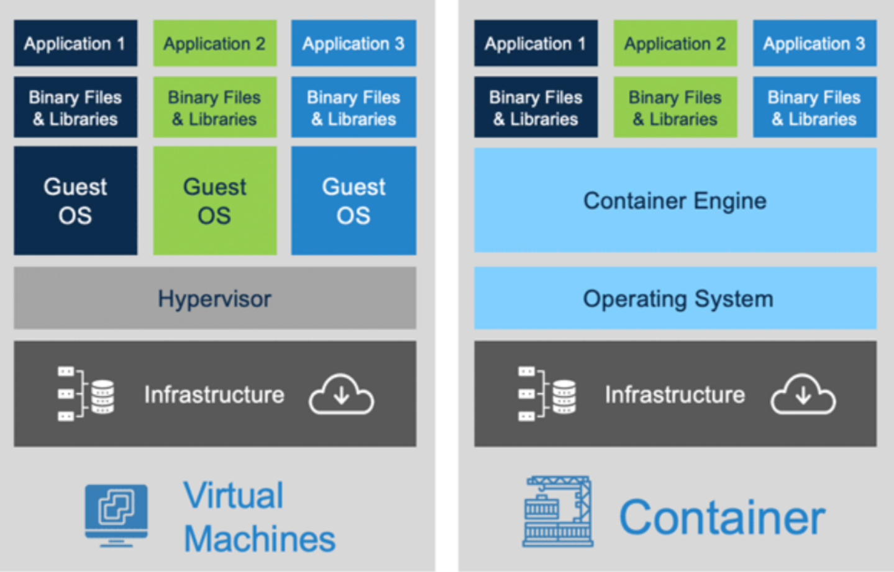
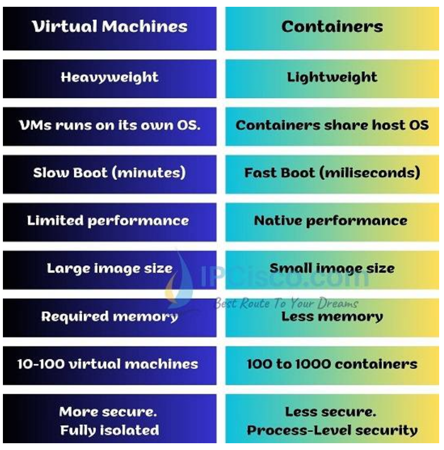
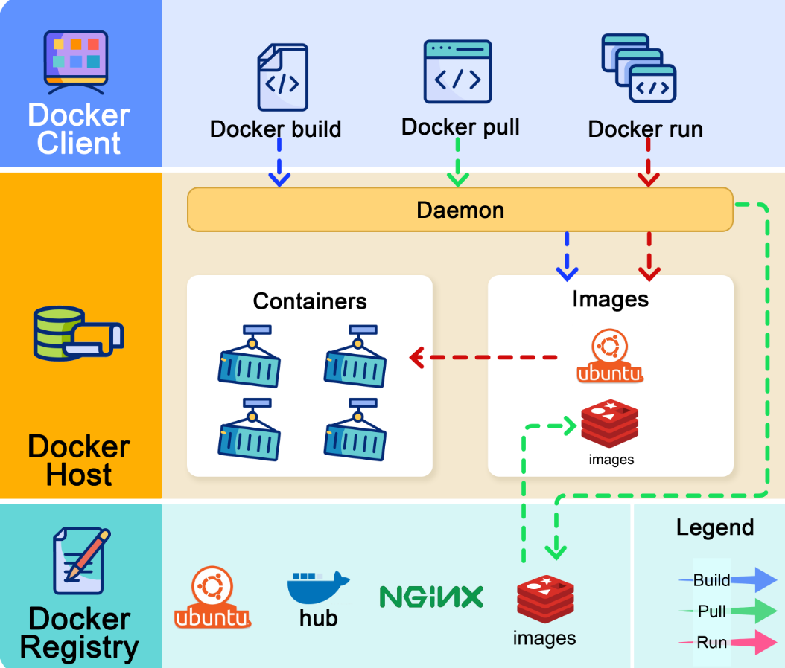
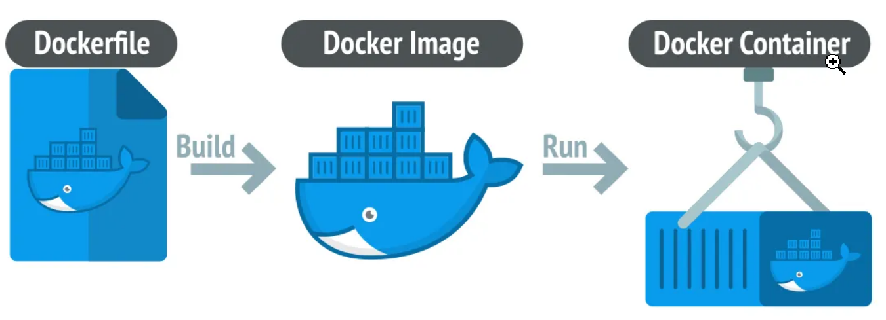
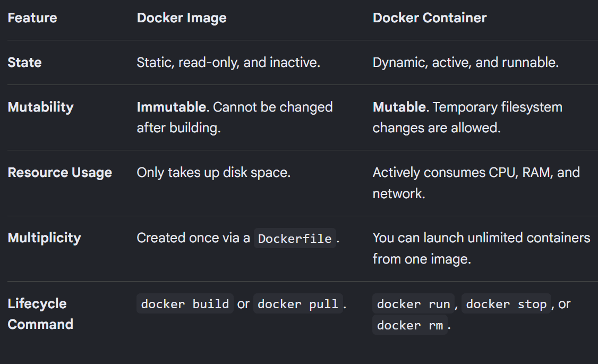
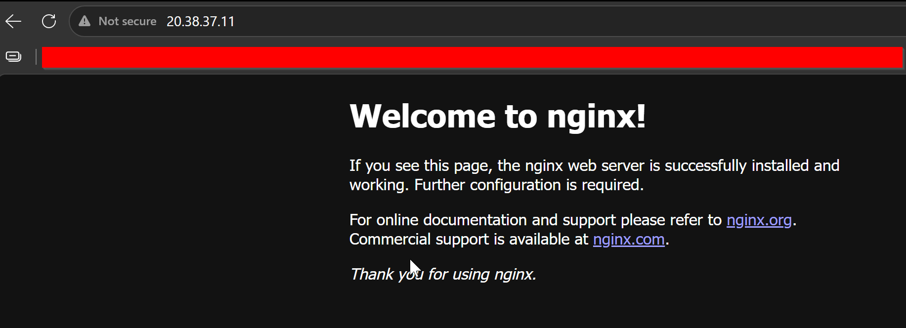
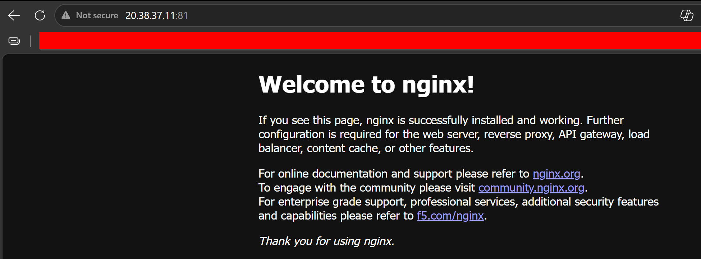

# Day 29 – Introduction to Docker

## Challenge Tasks

### Task 1: What is Docker?
Research and write short notes on:
- What is a container and why do we need them? \

Containers are a way to address the challenges of hardware-level virtualization, where another OS is installed on top of the existing host OS through a hypervisor, with fixed allocations of memory and CPU in the virtualized environment.

This makes VMs slower and heavier. On top of that, when a developer builds an environment on their own machine and the same app later has to run on someone else's machine, it often leads to the “it works on my machine” problem.

Containers package an application along with its code, libraries, and dependencies into a single lightweight executable package. They share memory and CPU from the host OS instead of relying on fixed allocations, which makes them faster and more efficient. They are built with the bare minimum bins and libs needed to behave like a certain OS and use most of the resources from the host OS.

- Containers vs Virtual Machines — what's the real difference?





- What is the Docker architecture? (daemon, client, images, containers, registry) Draw or describe the Docker architecture in your own words.



There are 3 components in Docker architecture:
1. **Docker client**
-> The docker client talks to the Docker daemon.

2. **Docker host** -> The Docker daemon listens for Docker API requests and manages Docker objects such as images, containers, networks, and volumes.

3. **Docker registry** -> A Docker registry stores Docker images. Docker Hub is a public registry that anyone can use.

Let’s take the “docker run” command as an example.

1. Docker pulls the image from the registry.
2. Docker creates a new container.
3. Docker allocates a read-write filesystem to the container.
4. Docker creates a network interface to connect the container to the default network.
5. Docker starts the container.



**Image:** immutable (unchangeable), standalone package that contains everything needed to execute an application. \
Images are built using a series of stacked, read-only filesystem layers defined by a Dockerfile. Each instruction adds a new layer.

**Container:** is the dynamic, runtime execution environment of an image. Containers are isolated from the host machine and other containers, sharing only the host's OS kernel to stay lightweight



---

### Task 2: Install Docker
1. Install Docker on your machine (or use a cloud instance)

```bash
sudo apt install docker.io
sudo usermod -aG docker $USER
```

2. Verify the installation

```bash
docker -v
Docker version 29.1.3, build 29.1.3-0ubuntu3~24.04.2


systemctl status docker
● docker.service - Docker Application Container Engine
     Loaded: loaded (/usr/lib/systemd/system/docker.service; enabled; preset: enabled)
     Active: active (running) since Sat 2026-08-01 12:44:23 UTC; 1min 14s ago
TriggeredBy: ● docker.socket
       Docs: https://docs.docker.com
   Main PID: 1098 (dockerd)
      Tasks: 9
     Memory: 111.7M (peak: 112.2M)
        CPU: 377ms
     CGroup: /system.slice/docker.service
             └─1098 /usr/bin/dockerd -H fd:// --containerd=/run/containerd/containerd.sock

Aug 01 12:44:21 aish-ubuntu-tws dockerd[1098]: time="2026-08-01T12:44:21.624701109Z" level=info msg="Restoring containers: start."
Aug 01 12:44:21 aish-ubuntu-tws dockerd[1098]: time="2026-08-01T12:44:21.635533281Z" level=info msg="Deleting nftables IPv4 rules" error="exit status 1"
Aug 01 12:44:21 aish-ubuntu-tws dockerd[1098]: time="2026-08-01T12:44:21.644882865Z" level=info msg="Deleting nftables IPv6 rules" error="exit status 1"
lines 1-15

systemctl enable docker
```

3. Run the `hello-world` container

```bash
docker run -itd hello-world

aishuser@aish-ubuntu-tws:~$ docker run -itd hello-world
Unable to find image 'hello-world:latest' locally
latest: Pulling from library/hello-world
4f55086f7dd0: Pull complete 
d5e71e642bf5: Download complete 
Digest: sha256:c3cbe1cc1aa588a64951ac6286e0df7b27fe2e6324b1001c619bb358770c0178
Status: Downloaded newer image for hello-world:latest
0f874fac5512c54ed1bcb077f6509b28f5c533da71f483dcef6cf269e32ca861
aishuser@aish-ubuntu-tws:~$ docker ps
CONTAINER ID   IMAGE     COMMAND   CREATED   STATUS    PORTS     NAMES
aishuser@aish-ubuntu-tws:~$ docker ps -a
CONTAINER ID   IMAGE         COMMAND    CREATED          STATUS                      PORTS     NAMES
0f874fac5512   hello-world   "/hello"   24 seconds ago   Exited (0) 22 seconds ago             vigorous_wilson

aishuser@aish-ubuntu-tws:~$ docker logs vigorous_wilson

Hello from Docker!
This message shows that your installation appears to be working correctly.

To generate this message, Docker took the following steps:
 1. The Docker client contacted the Docker daemon.
 2. The Docker daemon pulled the "hello-world" image from the Docker Hub.
    (amd64)
 3. The Docker daemon created a new container from that image which runs the
    executable that produces the output you are currently reading.
 4. The Docker daemon streamed that output to the Docker client, which sent it
    to your terminal.

To try something more ambitious, you can run an Ubuntu container with:
 $ docker run -it ubuntu bash

Share images, automate workflows, and more with a free Docker ID:
 https://hub.docker.com/

For more examples and ideas, visit:
 https://docs.docker.com/get-started/
```

4. Read the output carefully — it explains what just happened

```bash
Tried to find the image locally. if not found then
It pulls the image from dockerhub to local machine
And creates the container
```

---

### Task 3: Run Real Containers
1. Run an **Nginx** container and access it in your browser

```bash
aishuser@aish-ubuntu-tws:~$ docker run -itd --name nginx-c1 nginx
Unable to find image 'nginx:latest' locally
latest: Pulling from library/nginx
062e450697fa: Pull complete 
b6698f04e005: Pull complete 
d26f27cc8c41: Pull complete 
2bedaf25031a: Pull complete 
82454cdbf456: Pull complete 
3c7ab7949321: Pull complete 
cacfcdd01f30: Pull complete 
6c496f5b5050: Download complete 
ea1d76ccc2c6: Download complete 
Digest: sha256:5a88c9c45479443d7be2eadc894b4ed0a9801bae03d97a5760ae13b5c2005942
Status: Downloaded newer image for nginx:latest
762061b7506fe061a182a539c9fa297bfb9655ba7971ab5065d56d8fc30456fe
aishuser@aish-ubuntu-tws:~$ docker ps
CONTAINER ID   IMAGE     COMMAND                  CREATED         STATUS         PORTS     NAMES
762061b7506f   nginx     "/docker-entrypoint.…"   6 seconds ago   Up 3 seconds   80/tcp    nginx-c1
```


2. Run an **Ubuntu** container in interactive mode — explore it like a mini Linux machine
```bash
aishuser@aish-ubuntu-tws:~$ docker run -it --name c1  ubuntu bash
root@d1a50d430135:/# pwd
/
root@d1a50d430135:/# whoami
root
root@d1a50d430135:/# ps
    PID TTY          TIME CMD
      1 pts/0    00:00:00 bash
     11 pts/0    00:00:00 ps
root@d1a50d430135:/# touch file1.txt
root@d1a50d430135:/# ls file1.txt 
file1.txt
```
3. List all running containers
```bash
aishuser@aish-ubuntu-tws:~$ docker ps
CONTAINER ID   IMAGE     COMMAND                  CREATED         STATUS         PORTS     NAMES
762061b7506f   nginx     "/docker-entrypoint.…"   9 minutes ago   Up 9 minutes   80/tcp    nginx-c1
```
4. List all containers (including stopped ones)
```bash
aishuser@aish-ubuntu-tws:~$ docker ps -a
CONTAINER ID   IMAGE         COMMAND                  CREATED          STATUS                      PORTS     NAMES
d1a50d430135   ubuntu        "bash"                   2 minutes ago    Exited (0) 5 seconds ago              c1
762061b7506f   nginx         "/docker-entrypoint.…"   9 minutes ago    Up 9 minutes                80/tcp    nginx-c1
0f874fac5512   hello-world   "/hello"                 17 minutes ago   Exited (0) 10 minutes ago             vigorous_wilson
```
5. Stop and remove a container
```bash
docker stop <containerID>
docker rm <containerID>
aishuser@aish-ubuntu-tws:~$ docker stop c1
c1
aishuser@aish-ubuntu-tws:~$ docker rm c1
c1
```

---

### Task 4: Explore
1. Run a container in **detached mode** — what's different? \
If we run it in detached mode, the container keeps running in the background. We use -d for that.
Without -d, the containers exits immediately as we come out of the container.
```bash
docker run -itd ubuntu
```
2. Give a container a custom **name**
```bash
docker run -itd --name c1 ubuntu
```
3. Map a **port** from the container to your host
```bash
docker run -itd --name c2 -p 81:80 nginx

aishuser@aish-ubuntu-tws:~$ docker run -itd --name nginx-c2 -p 81:80 nginx
a25bc89bc47eca3a0703918ffea56128ec29bc918505445bcf6c199b632b51ab
aishuser@aish-ubuntu-tws:~$ docker ps
CONTAINER ID   IMAGE     COMMAND                  CREATED          STATUS          PORTS                                 NAMES
a25bc89bc47e   nginx     "/docker-entrypoint.…"   5 seconds ago    Up 4 seconds    0.0.0.0:81->80/tcp, [::]:81->80/tcp   nginx-c2
762061b7506f   nginx     "/docker-entrypoint.…"   13 minutes ago   Up 13 minutes   80/tcp                                nginx-c1
```


4. Check **logs** of a running container
```bash
docker logs c1

aishuser@aish-ubuntu-tws:~$ docker logs nginx-c2
/docker-entrypoint.sh: /docker-entrypoint.d/ is not empty, will attempt to perform configuration
/docker-entrypoint.sh: Looking for shell scripts in /docker-entrypoint.d/
/docker-entrypoint.sh: Launching /docker-entrypoint.d/10-listen-on-ipv6-by-default.sh
10-listen-on-ipv6-by-default.sh: info: Getting the checksum of /etc/nginx/conf.d/default.conf
10-listen-on-ipv6-by-default.sh: info: Enabled listen on IPv6 in /etc/nginx/conf.d/default.conf
/docker-entrypoint.sh: Sourcing /docker-entrypoint.d/15-local-resolvers.envsh
/docker-entrypoint.sh: Launching /docker-entrypoint.d/20-envsubst-on-templates.sh
/docker-entrypoint.sh: Launching /docker-entrypoint.d/30-tune-worker-processes.sh
/docker-entrypoint.sh: Configuration complete; ready for start up
2026/08/01 13:08:46 [notice] 1#1: using the "epoll" event method
2026/08/01 13:08:46 [notice] 1#1: nginx/1.31.3
2026/08/01 13:08:46 [notice] 1#1: built by gcc 14.2.0 (Debian 14.2.0-19) 
2026/08/01 13:08:46 [notice] 1#1: OS: Linux 6.17.0-1021-azure
2026/08/01 13:08:46 [notice] 1#1: getrlimit(RLIMIT_NOFILE): 1024:524288
2026/08/01 13:08:46 [notice] 1#1: start worker processes
2026/08/01 13:08:46 [notice] 1#1: start worker process 30
2026/08/01 13:08:46 [notice] 1#1: start worker process 31
74.162.222.27 - - [01/Aug/2026:13:10:26 +0000] "GET / HTTP/1.1" 200 896 "-" "Mozilla/5.0 (Windows NT 10.0; Win64; x64) AppleWebKit/537.36 (KHTML, like Gecko) Chrome/150.0.0.0 Safari/537.36 Edg/150.0.0.0" "-"
2026/08/01 13:10:27 [error] 31#31: *1 open() "/usr/share/nginx/html/favicon.ico" failed (2: No such file or directory), client: 74.162.222.27, server: localhost, request: "GET /favicon.ico HTTP/1.1", host: "20.38.37.11:81", referrer: "http://20.38.37.11:81/"
74.162.222.27 - - [01/Aug/2026:13:10:27 +0000] "GET /favicon.ico HTTP/1.1" 404 555 "http://20.38.37.11:81/" "Mozilla/5.0 (Windows NT 10.0; Win64; x64) AppleWebKit/537.36 (KHTML, like Gecko) Chrome/150.0.0.0 Safari/537.36 Edg/150.0.0.0" "-"
```
5. Run a command **inside** a running container
```bash
docker exec c1 bash pwd

aishuser@aish-ubuntu-tws:~$ docker exec -it nginx-c2 pwd
/
aishuser@aish-ubuntu-tws:~$ docker exec -it nginx-c2 ps
OCI runtime exec failed: exec failed: unable to start container process: exec: "ps": executable file not found in $PATH
aishuser@aish-ubuntu-tws:~$ docker exec -it nginx-c2 ls file.txt
ls: cannot access 'file.txt': No such file or directory
aishuser@aish-ubuntu-tws:~$ docker exec -it nginx-c2 touch file.txt
aishuser@aish-ubuntu-tws:~$ docker exec -it nginx-c2 ls file.txt
file.txt
```
