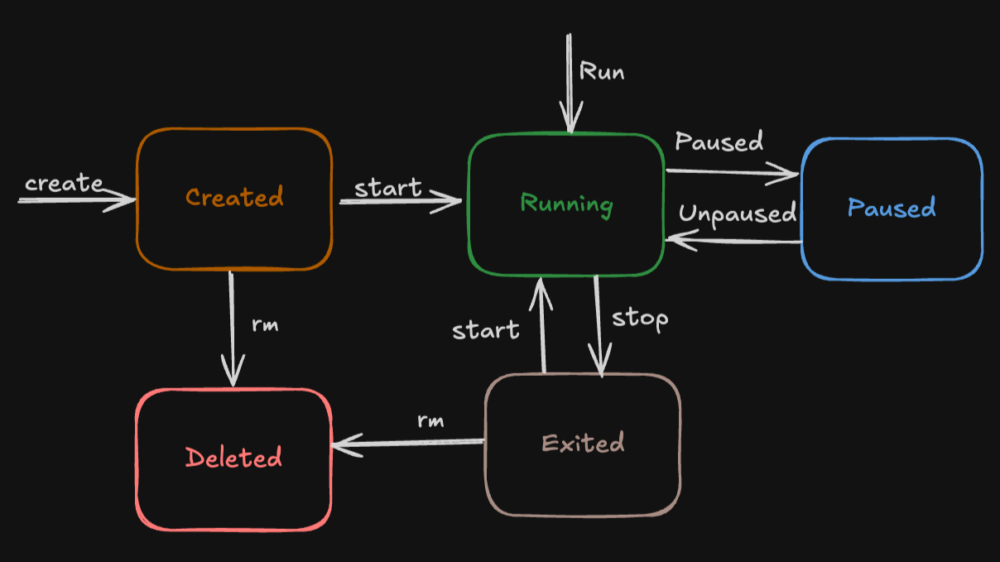
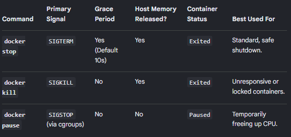

# Day 30 – Docker Images & Container Lifecycle

## Challenge Tasks

### Task 1: Docker Images
1. Pull the `nginx`, `ubuntu`, and `alpine` images from Docker Hub

```bash
docker pull nginx 

```
2. List all images on your machine — note the sizes
```bash
aishuser@aish-ubuntu-tws:~$ docker images
                                                                                                                                        i Info →   U  In Use
IMAGE                ID             DISK USAGE   CONTENT SIZE   EXTRA
alpine:latest        28bd5fe8b56d         13MB         3.93MB        
hello-world:latest   c3cbe1cc1aa5       25.9kB         9.49kB        
nginx:latest         5a88c9c45479        241MB           66MB        
ubuntu:latest        3131b4cc82a7        161MB         45.3MB
```
3. Compare `ubuntu` vs `alpine` — why is one much smaller?

Alpine is 13MB
Ubuntu is 161MB
- For a minimal application, Alpine produces dramatically smaller images. But the gap closes as you install packages and add your application code.
- Ubuntu gives you a full-featured Linux distribution with thousands of packages, extensive documentation, and broad compatibility. 
- Ubuntu has one of the largest package repositories in the Linux world. Between the main repository and PPAs, you can find almost anything.
- Alpine gives you a very small image with a minimal footprint and almost nothing pre-installed. 
- Alpine's repository is smaller but covers most common software. Where it falls short is in niche or enterprise packages.
```bash
aishuser@aish-ubuntu-tws:~$ docker image history alpine
IMAGE          CREATED       CREATED BY                                      SIZE      COMMENT
28bd5fe8b56d   6 weeks ago   CMD ["/bin/sh"]                                 0B        buildkit.dockerfile.v0
<missing>      6 weeks ago   ADD alpine-minirootfs-3.24.1-x86_64.tar.gz /…   **9.07MB**    buildkit.dockerfile.v0
aishuser@aish-ubuntu-tws:~$ docker image history ubuntu
IMAGE          CREATED       CREATED BY                                      SIZE      COMMENT
3131b4cc82a7   2 weeks ago   umoci raw add-layer --image /home/buildd/roc…   12.3kB    Add rock control metadata
<missing>      2 weeks ago   umoci config --image /home/buildd/rockcraft-…   0B        Set annotations
<missing>      2 weeks ago   umoci config --image /home/buildd/rockcraft-…   0B        Set labels
<missing>      2 weeks ago   umoci config --image /home/buildd/rockcraft-…   0B        Set default PATH for bare-based rock
<missing>      2 weeks ago   umoci config --image /home/buildd/rockcraft-…   0B        Set default commands
<missing>      2 weeks ago   umoci config --image /home/buildd/rockcraft-…   0B        Set entrypoint
<missing>      2 weeks ago   umoci raw add-layer --image /home/buildd/roc…   **115MB**     
```
4. Inspect an image — what information can you see? \
Tag details \
Sha ID \
Created date \
Config details - env var, workdir, shell \
OS details \
etc.

```bash
aishuser@aish-ubuntu-tws:~$ docker inspect alpine
[
    {
        "Id": "sha256:28bd5fe8b56d1bd048e5babf5b10710ebe0bae67db86916198a6eec434943f8b",
        "RepoTags": [
            "alpine:latest"
        ],
        "RepoDigests": [
            "alpine@sha256:28bd5fe8b56d1bd048e5babf5b10710ebe0bae67db86916198a6eec434943f8b"
        ],
        "Comment": "buildkit.dockerfile.v0",
        "Created": "2026-06-16T00:01:29.967161902Z",
        "Config": {
            "Env": [
                "PATH=/usr/local/sbin:/usr/local/bin:/usr/sbin:/usr/bin:/sbin:/bin"
            ],
            "Cmd": [
                "/bin/sh"
            ],
            "WorkingDir": "/"
        },
        "Architecture": "amd64",
        "Os": "linux",
        "Size": 3857242,
        "RootFS": {
            "Type": "layers",
            "Layers": [
                "sha256:34884abbe92863fce933ed7c39c0e045631af0ed86d5cc0dfbdf9fdca426ce3c"
            ]
        },
        "Metadata": {
            "LastTagTime": "2026-08-01T13:44:30.772845551Z"
        },
        "Descriptor": {
            "mediaType": "application/vnd.oci.image.index.v1+json",
            "digest": "sha256:28bd5fe8b56d1bd048e5babf5b10710ebe0bae67db86916198a6eec434943f8b",
            "size": 9218
        }
    }
]
```
5. Remove an image you no longer need
```bash
aishuser@aish-ubuntu-tws:~$ docker images
                                                                                                                                        i Info →   U  In Use
IMAGE                ID             DISK USAGE   CONTENT SIZE   EXTRA
alpine:latest        28bd5fe8b56d         13MB         3.93MB        
hello-world:latest   c3cbe1cc1aa5       25.9kB         9.49kB        
nginx:latest         5a88c9c45479        241MB           66MB        
ubuntu:latest        3131b4cc82a7        161MB         45.3MB        

aishuser@aish-ubuntu-tws:~$ docker rmi hello-world:latest 
Untagged: hello-world:latest
Deleted: sha256:c3cbe1cc1aa588a64951ac6286e0df7b27fe2e6324b1001c619bb358770c0178

aishuser@aish-ubuntu-tws:~$ docker images
                                                                                                                                        i Info →   U  In Use
IMAGE           ID             DISK USAGE   CONTENT SIZE   EXTRA
alpine:latest   28bd5fe8b56d         13MB         3.93MB        
nginx:latest    5a88c9c45479        241MB           66MB        
ubuntu:latest   3131b4cc82a7        161MB         45.3MB
```

---

### Task 2: Image Layers
1. Run `docker image history nginx` — what do you see?\
Shows all the layers used to build this image.
```bash
aishuser@aish-ubuntu-tws:~$ docker image history nginx
IMAGE          CREATED       CREATED BY                                      SIZE      COMMENT
5a88c9c45479   2 weeks ago   CMD ["nginx" "-g" "daemon off;"]                0B        buildkit.dockerfile.v0
<missing>      2 weeks ago   STOPSIGNAL SIGQUIT                              0B        buildkit.dockerfile.v0
<missing>      2 weeks ago   EXPOSE map[80/tcp:{}]                           0B        buildkit.dockerfile.v0
<missing>      2 weeks ago   ENTRYPOINT ["/docker-entrypoint.sh"]            0B        buildkit.dockerfile.v0
<missing>      2 weeks ago   COPY 30-tune-worker-processes.sh /docker-ent…   16.4kB    buildkit.dockerfile.v0
<missing>      2 weeks ago   COPY 20-envsubst-on-templates.sh /docker-ent…   12.3kB    buildkit.dockerfile.v0
<missing>      2 weeks ago   COPY 15-local-resolvers.envsh /docker-entryp…   12.3kB    buildkit.dockerfile.v0
<missing>      2 weeks ago   COPY 10-listen-on-ipv6-by-default.sh /docker…   12.3kB    buildkit.dockerfile.v0
<missing>      2 weeks ago   COPY docker-entrypoint.sh / # buildkit          8.19kB    buildkit.dockerfile.v0
<missing>      2 weeks ago   RUN /bin/sh -c set -x     && groupadd --syst…   87.1MB    buildkit.dockerfile.v0
<missing>      2 weeks ago   ENV DYNPKG_RELEASE=1~trixie                     0B        buildkit.dockerfile.v0
<missing>      2 weeks ago   ENV PKG_RELEASE=1~trixie                        0B        buildkit.dockerfile.v0
<missing>      2 weeks ago   ENV ACME_VERSION=0.4.1                          0B        buildkit.dockerfile.v0
<missing>      2 weeks ago   ENV NJS_RELEASE=1~trixie                        0B        buildkit.dockerfile.v0
<missing>      2 weeks ago   ENV NJS_VERSION=1.0.0                           0B        buildkit.dockerfile.v0
<missing>      2 weeks ago   ENV NGINX_VERSION=1.31.3                        0B        buildkit.dockerfile.v0
<missing>      2 weeks ago   LABEL maintainer=NGINX Docker Maintainers <d…   0B        buildkit.dockerfile.v0
<missing>      2 weeks ago   # debian.sh --arch 'amd64' out/ 'trixie' '@1…   87.4MB    debuerreotype 0.17
```
2. Each line is a **layer**. Note how some layers show sizes and some show 0B
3. Write in your notes: What are layers and why does Docker use them?\

**Layers:**
Think of a Docker image like a layered cake 🍰.

Each layer adds something new on top of the previous one:

Base layer → Ubuntu/Linux OS \
Next layer → Install Python \
Next layer → Install required packages \
Next layer → Copy your application code \
Final layer → Start the application

Docker stacks all these layers together to create the final image. Each layer contains only the changes made in that step. Docker image layers are immutable (they don't change after being created)

**Why use layers:** 
- Faster build:
Docker reuses the layers and does not rebuild that step if it has no modifications. Without layers, Docker would rebuild everything from scratch every time and that increases the build time.

- Saves storage: many images can share the same layers \
Example: \
Image A uses Ubuntu + Python + App A \
Image B uses Ubuntu + Python + App B \
Docker stores the Ubuntu and Python layers only once.

- Faster downloads:
When pulling an image, docker downloads only the layers we don't already have. This saves bandwidth and time.

---

### Task 3: Container Lifecycle
Practice the full lifecycle on one container:
1. **Create** a container (without starting it)

```bash
aishuser@aish-ubuntu-tws:~$ docker run -it --name nginx-c3 -p 81:80 nginx
/docker-entrypoint.sh: /docker-entrypoint.d/ is not empty, will attempt to perform configuration
/docker-entrypoint.sh: Looking for shell scripts in /docker-entrypoint.d/
/docker-entrypoint.sh: Launching /docker-entrypoint.d/10-listen-on-ipv6-by-default.sh
10-listen-on-ipv6-by-default.sh: info: Getting the checksum of /etc/nginx/conf.d/default.conf
10-listen-on-ipv6-by-default.sh: info: Enabled listen on IPv6 in /etc/nginx/conf.d/default.conf
/docker-entrypoint.sh: Sourcing /docker-entrypoint.d/15-local-resolvers.envsh
/docker-entrypoint.sh: Launching /docker-entrypoint.d/20-envsubst-on-templates.sh
/docker-entrypoint.sh: Launching /docker-entrypoint.d/30-tune-worker-processes.sh
/docker-entrypoint.sh: Configuration complete; ready for start up
2026/08/01 14:30:19 [notice] 1#1: using the "epoll" event method
2026/08/01 14:30:19 [notice] 1#1: nginx/1.31.3
2026/08/01 14:30:19 [notice] 1#1: built by gcc 14.2.0 (Debian 14.2.0-19) 
2026/08/01 14:30:19 [notice] 1#1: OS: Linux 6.17.0-1021-azure
2026/08/01 14:30:19 [notice] 1#1: getrlimit(RLIMIT_NOFILE): 1024:524288
2026/08/01 14:30:19 [notice] 1#1: start worker processes
2026/08/01 14:30:19 [notice] 1#1: start worker process 28
2026/08/01 14:30:19 [notice] 1#1: start worker process 29
^C2026/08/01 14:30:40 [notice] 28#28: signal 2 (SIGINT) received, exiting
2026/08/01 14:30:40 [notice] 1#1: signal 2 (SIGINT) received, exiting
2026/08/01 14:30:40 [notice] 28#28: exiting
2026/08/01 14:30:40 [notice] 28#28: exit
2026/08/01 14:30:40 [notice] 29#29: signal 2 (SIGINT) received, exiting
2026/08/01 14:30:40 [notice] 29#29: exiting
2026/08/01 14:30:40 [notice] 29#29: exit
2026/08/01 14:30:40 [notice] 1#1: signal 17 (SIGCHLD) received from 29
2026/08/01 14:30:40 [notice] 1#1: worker process 28 exited with code 0
2026/08/01 14:30:40 [notice] 1#1: worker process 29 exited with code 0
2026/08/01 14:30:40 [notice] 1#1: exit
aishuser@aish-ubuntu-tws:~$ docker ps 
CONTAINER ID   IMAGE     COMMAND   CREATED   STATUS    PORTS     NAMES
aishuser@aish-ubuntu-tws:~$ docker ps -a
CONTAINER ID   IMAGE     COMMAND                  CREATED          STATUS                      PORTS     NAMES
95e550a3dc86   nginx     "/docker-entrypoint.…"   32 seconds ago   Exited (0) 10 seconds ago             nginx-c3
aishuser@aish-ubuntu-tws:~$ 
```

2. **Start** the container
```bash
aishuser@aish-ubuntu-tws:~$ docker start nginx-c3
nginx-c3
aishuser@aish-ubuntu-tws:~$ docker ps -a
CONTAINER ID   IMAGE     COMMAND                  CREATED              STATUS         PORTS                                 NAMES
95e550a3dc86   nginx     "/docker-entrypoint.…"   About a minute ago   Up 7 seconds   0.0.0.0:81->80/tcp, [::]:81->80/tcp   nginx-c3
```
3. **Pause** it and check status

```bash
aishuser@aish-ubuntu-tws:~$ docker pause nginx-c3
nginx-c3
aishuser@aish-ubuntu-tws:~$ docker ps 
CONTAINER ID   IMAGE     COMMAND                  CREATED         STATUS                       PORTS                                 NAMES
95e550a3dc86   nginx     "/docker-entrypoint.…"   2 minutes ago   Up About a minute (Paused)   0.0.0.0:81->80/tcp, [::]:81->80/tcp   nginx-c3
```
4. **Unpause** it

```bash
aishuser@aish-ubuntu-tws:~$ docker unpause nginx-c3
nginx-c3
aishuser@aish-ubuntu-tws:~$ docker ps
CONTAINER ID   IMAGE     COMMAND                  CREATED         STATUS         PORTS                                 NAMES
95e550a3dc86   nginx     "/docker-entrypoint.…"   3 minutes ago   Up 2 minutes   0.0.0.0:81->80/tcp, [::]:81->80/tcp   nginx-c3
```
5. **Stop** it

```bash
aishuser@aish-ubuntu-tws:~$ docker stop nginx-c3
nginx-c3
aishuser@aish-ubuntu-tws:~$ docker ps -a
CONTAINER ID   IMAGE     COMMAND                  CREATED         STATUS                     PORTS     NAMES
95e550a3dc86   nginx     "/docker-entrypoint.…"   3 minutes ago   Exited (0) 4 seconds ago             nginx-c3
```
6. **Restart** it

```bash
aishuser@aish-ubuntu-tws:~$ docker restart nginx-c3
nginx-c3
aishuser@aish-ubuntu-tws:~$ docker ps
CONTAINER ID   IMAGE     COMMAND                  CREATED         STATUS         PORTS                                 NAMES
95e550a3dc86   nginx     "/docker-entrypoint.…"   4 minutes ago   Up 5 seconds   0.0.0.0:81->80/tcp, [::]:81->80/tcp   nginx-c3
```
7. **Kill** it

```bash
aishuser@aish-ubuntu-tws:~$ docker kill nginx-c3
nginx-c3
aishuser@aish-ubuntu-tws:~$ docker ps
CONTAINER ID   IMAGE     COMMAND   CREATED   STATUS    PORTS     NAMES
aishuser@aish-ubuntu-tws:~$ docker ps -a
CONTAINER ID   IMAGE     COMMAND                  CREATED         STATUS                       PORTS     NAMES
95e550a3dc86   nginx     "/docker-entrypoint.…"   4 minutes ago   Exited (137) 8 seconds ago             nginx-c3
```
8. **Remove** it

```bash
aishuser@aish-ubuntu-tws:~$ docker rm nginx-c3
nginx-c3
aishuser@aish-ubuntu-tws:~$ docker ps -a
CONTAINER ID   IMAGE     COMMAND   CREATED   STATUS    PORTS     NAMES
```

Check `docker ps -a` after each step — observe the state changes.



**Docker Container States**
- Created: The container is set up and ready, but the main app has not started yet.
- Running: The app inside the container is actively working and using system resources.
- Paused: The app's processes are frozen, but its memory and state are kept safe.
- Restarting: The container is in the middle of a reboot due to a stop or crash.
- Exited (Stopped): The app has finished its work or stopped running.
- Dead: The system tried to stop the container, but failed because of a busy resource or error.

**Difference between docker stop, kill and pause:** \
docker stop - safely shuts down a container gracefully, \
docker kill - forces an immediate shutdown, and \
docker pause - freezes the container's state in memory without shutting it down at all.



---

### Task 4: Working with Running Containers
1. Run an Nginx container in detached mode
```bash
aishuser@aish-ubuntu-tws:~$ docker run -itd --name nginx -p 81:80 nginx
2e9109d5fd02f5529246e2430ba7353dfb8d1e20149247928243abaec436ba99
```
2. View its **logs**
```bash
aishuser@aish-ubuntu-tws:~$ docker logs nginx
/docker-entrypoint.sh: /docker-entrypoint.d/ is not empty, will attempt to perform configuration
/docker-entrypoint.sh: Looking for shell scripts in /docker-entrypoint.d/
/docker-entrypoint.sh: Launching /docker-entrypoint.d/10-listen-on-ipv6-by-default.sh
10-listen-on-ipv6-by-default.sh: info: Getting the checksum of /etc/nginx/conf.d/default.conf
10-listen-on-ipv6-by-default.sh: info: Enabled listen on IPv6 in /etc/nginx/conf.d/default.conf
/docker-entrypoint.sh: Sourcing /docker-entrypoint.d/15-local-resolvers.envsh
/docker-entrypoint.sh: Launching /docker-entrypoint.d/20-envsubst-on-templates.sh
/docker-entrypoint.sh: Launching /docker-entrypoint.d/30-tune-worker-processes.sh
/docker-entrypoint.sh: Configuration complete; ready for start up
2026/08/01 14:50:56 [notice] 1#1: using the "epoll" event method
2026/08/01 14:50:56 [notice] 1#1: nginx/1.31.3
2026/08/01 14:50:56 [notice] 1#1: built by gcc 14.2.0 (Debian 14.2.0-19) 
2026/08/01 14:50:56 [notice] 1#1: OS: Linux 6.17.0-1021-azure
2026/08/01 14:50:56 [notice] 1#1: getrlimit(RLIMIT_NOFILE): 1024:524288
2026/08/01 14:50:56 [notice] 1#1: start worker processes
2026/08/01 14:50:56 [notice] 1#1: start worker process 31
2026/08/01 14:50:56 [notice] 1#1: start worker process 32
```
3. View **real-time logs** (follow mode)
```bash
docker logs -f nginx
```
The -f or --follow flag keeps the terminal session open and live-streams new log entries as they are generated by the container

4. **Exec** into the container and look around the filesystem
```bash
aishuser@aish-ubuntu-tws:~$ docker exec -it nginx bash
root@2e9109d5fd02:/#
root@2e9109d5fd02:/# ls
bin  boot  dev  docker-entrypoint.d  docker-entrypoint.sh  etc  home  lib  lib64  media  mnt  opt  proc  root  run  sbin  srv  sys  tmp  usr  var
```
5. Run a single command inside the container without entering it
```bash
aishuser@aish-ubuntu-tws:~$ docker exec -it nginx ls
bin  boot  dev  docker-entrypoint.d  docker-entrypoint.sh  etc  home  lib  lib64  media  mnt  opt  proc  root  run  sbin  srv  sys  tmp  usr  var
```
6. **Inspect** the container — find its IP address, port mappings, and mounts
```bash
"PortBindings": {
                "80/tcp": [
                    {
                        "HostIp": "",
                        "HostPort": "81"
                    }
                ]
            },
"Mounts": [],
"Volumes": null
"IPAddress": "172.17.0.2"
---
aishuser@aish-ubuntu-tws:~$ curl 172.17.0.2
<!DOCTYPE html>
<html>
<head>
<title>Welcome to nginx!</title>
<style>
html { color-scheme: light dark; }
body { width: 35em; margin: 0 auto;
font-family: Tahoma, Verdana, Arial, sans-serif; }
</style>
</head>
<body>
<h1>Welcome to nginx!</h1>
<p>If you see this page, nginx is successfully installed and working.
Further configuration is required for the web server, reverse proxy, 
API gateway, load balancer, content cache, or other features.</p>
</body>
</html>
```
---

### Task 5: Cleanup
1. Stop all running containers in one command
```bash
docker stop $(docker ps -a -q)

aishuser@aish-ubuntu-tws:~$ docker ps -a
CONTAINER ID   IMAGE     COMMAND                  CREATED          STATUS          PORTS                                 NAMES
59efa9bee467   ubuntu    "/bin/bash"              13 seconds ago   Up 12 seconds                                         xenodochial_booth
57ed60436112   ubuntu    "/bin/bash"              19 seconds ago   Up 18 seconds                                         goofy_sanderson
2e9109d5fd02   nginx     "/docker-entrypoint.…"   18 minutes ago   Up 18 minutes   0.0.0.0:81->80/tcp, [::]:81->80/tcp   nginx
aishuser@aish-ubuntu-tws:~$ docker ps -a -q
59efa9bee467
57ed60436112
2e9109d5fd02
aishuser@aish-ubuntu-tws:~$ docker stop $(docker ps -a -q)
59efa9bee467
57ed60436112
2e9109d5fd02
aishuser@aish-ubuntu-tws:~$ docker ps -a
CONTAINER ID   IMAGE     COMMAND                  CREATED              STATUS                        PORTS     NAMES
59efa9bee467   ubuntu    "/bin/bash"              About a minute ago   Exited (137) 14 seconds ago             xenodochial_booth
57ed60436112   ubuntu    "/bin/bash"              About a minute ago   Exited (137) 14 seconds ago             goofy_sanderson
2e9109d5fd02   nginx     "/docker-entrypoint.…"   19 minutes ago       Exited (0) 24 seconds ago               nginx
```
2. Remove all stopped containers in one command
```bash
docker rm $(docker ps -a -q)

aishuser@aish-ubuntu-tws:~$ docker rm $(docker ps -a -q)
59efa9bee467
57ed60436112
2e9109d5fd02
aishuser@aish-ubuntu-tws:~$ docker ps -a
CONTAINER ID   IMAGE     COMMAND   CREATED   STATUS    PORTS     NAMES
```

3. Remove unused images
```bash
docker rmi $(docker images -q)

aishuser@aish-ubuntu-tws:~$ docker images
                                                                                                                                                                                                                                                                                                                          i Info →   U  In Use
IMAGE           ID             DISK USAGE   CONTENT SIZE   EXTRA
alpine:latest   28bd5fe8b56d         13MB         3.93MB        
nginx:latest    5a88c9c45479        241MB           66MB        
ubuntu:latest   3131b4cc82a7        161MB         45.3MB        
aishuser@aish-ubuntu-tws:~$ docker images -q
5a88c9c45479
3131b4cc82a7
28bd5fe8b56d
aishuser@aish-ubuntu-tws:~$ docker rmi $(docker images -q)
Untagged: nginx:latest
Deleted: sha256:5a88c9c45479443d7be2eadc894b4ed0a9801bae03d97a5760ae13b5c2005942
Untagged: ubuntu:latest
Deleted: sha256:3131b4cc82a783df6c9df078f86e01819a13594b865c2cad47bd1bca2b7063bb
Untagged: alpine:latest
Deleted: sha256:28bd5fe8b56d1bd048e5babf5b10710ebe0bae67db86916198a6eec434943f8b

aishuser@aish-ubuntu-tws:~$ docker images
                                                                                                                                                                                                                                                                                                                          i Info →   U  In Use
IMAGE   ID             DISK USAGE   CONTENT SIZE   EXTRA
```

4. Check how much disk space Docker is using
```bash
aishuser@aish-ubuntu-tws:~$ docker system df
TYPE            TOTAL     ACTIVE    SIZE      RECLAIMABLE
Images          0         0         0B        0B
Containers      0         0         0B        0B
Local Volumes   0         0         0B        0B
Build Cache     0         0         0B        0B
```