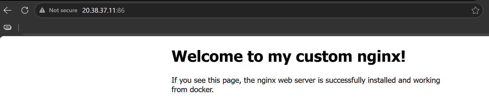

# Day 31 – Dockerfile: Build Your Own Images

## Challenge Tasks

### Task 1: Your First Dockerfile
1. Create a folder called `my-first-image`
2. Inside it, create a `Dockerfile` that:
   - Uses `ubuntu` as the base image
   - Installs `curl`
   - Sets a default command to print `"Hello from my custom image!"`
3. Build the image and tag it `my-ubuntu:v1`
4. Run a container from your image

**Verify:** The message prints on `docker run`

```bash
aishuser@aish-ubuntu-tws:~/my-first-image$ cat Dockerfile 
FROM ubuntu
RUN apt-get update && apt-get install -y curl
CMD ["echo", "Hello from my custom image!"]

aishuser@aish-ubuntu-tws:~/my-first-image$ docker run my-ubuntu:v1
Hello from my custom image!

aishuser@aish-ubuntu-tws:~/my-first-image$ docker logs quizzical_galileo 
Hello from my custom image!

aishuser@aish-ubuntu-tws:~/my-first-image$ docker ps -a
CONTAINER ID   IMAGE          COMMAND                   CREATED          STATUS                      PORTS     NAMES
5849d3ed35a4   my-ubuntu:v1   "echo 'Hello from my…"    9 seconds ago    Exited (0) 8 seconds ago              quizzical_galileo
```

> Why is the container in stopped state 

- Docker containers stay alive only while their main process (PID 1) is running. When that process ends, the container stops. 
- It does not keep the container alive. If the command inside the container finishes, the container exits even in detached mode. 
- If we just have echo in our image then, it prints the message and exits immediately with exit code 0.

```bash
aishuser@aish-ubuntu-tws:~/my-first-image$ docker inspect c2 --format='{{.State.ExitCode}}'
0
```
---

### Task 2: Dockerfile Instructions
Create a new Dockerfile that uses **all** of these instructions:
- `FROM` — base image
- `RUN` — execute commands during build
- `COPY` — copy files from host to image
- `WORKDIR` — set working directory
- `EXPOSE` — document the port
- `CMD` — default command

Build and run it. Understand what each line does.

```bash
aishuser@aish-ubuntu-tws:~/my-first-image$ cat Dockerfile 
FROM ubuntu
RUN apt-get update && apt install -y nginx
WORKDIR /var/www/html/
COPY ./index.html .
EXPOSE 80
CMD ["nginx", "-g", "daemon off;"]

aishuser@aish-ubuntu-tws:~/my-first-image$ docker build . -t my-nginx:v4
DEPRECATED: The legacy builder is deprecated and will be removed in a future release.
            Install the buildx component to build images with BuildKit:
            https://docs.docker.com/go/buildx/

Sending build context to Docker daemon  3.072kB
Step 1/6 : FROM ubuntu
 ---> 3131b4cc82a7
Step 2/6 : RUN apt-get update && apt install -y nginx
 ---> Using cache
 ---> 095d30cf7cd3
Step 3/6 : WORKDIR /var/www/html/
 ---> Running in 75da900081ec
 ---> Removed intermediate container 75da900081ec
 ---> ad462b300e69
Step 4/6 : COPY ./index.html .
 ---> 1d6c30295d54
Step 5/6 : EXPOSE 80
 ---> Running in cc462d9aeeb6
 ---> Removed intermediate container cc462d9aeeb6
 ---> 6b794815e691
Step 6/6 : CMD ["nginx", "-g", "daemon off;"]
 ---> Running in 17d26fdfedf2
 ---> Removed intermediate container 17d26fdfedf2
 ---> 51c0b259ce72
Successfully built 51c0b259ce72
Successfully tagged my-nginx:v4

aishuser@aish-ubuntu-tws:~/my-first-image$ docker run -itd --name nginx-c1 -p 86:80 my-nginx:v4
d2fcb7672fd3c9423e86c5110c93fb24ce1afcf0c7e77d0a630abfe47f138f49
```

---

### Task 3: CMD vs ENTRYPOINT
1. Create an image with `CMD ["echo", "hello"]` — run it, then run it with a custom command. What happens?

- CMD = Default command/arguments
- Can be overridden when running the container.
- Think:"If the user doesn't specify anything, run this."
- Any commad during container runtime completely replaces the CMD.

```bash
FROM ubuntu
RUN apt-get update
CMD ["echo", "hello"]

aishuser@aish-ubuntu-tws:~/project2$ docker run cmd-image
hello
aishuser@aish-ubuntu-tws:~/project2$ docker run cmd-image echo 'hello world'
hello world
```
2. Create an image with `ENTRYPOINT ["echo"]` — run it, then run it with additional arguments. What happens?

- ENTRYPOINT = Fixed main command
- Always runs when the container starts.
- User-provided arguments get appended to it.
- Think:"This container is built to run this program."
- Any argument passed during container runtime will be appended as arg to the Entrypoint command. Entrypoint will be the main command.

```bash
FROM ubuntu
RUN apt-get update
ENTRYPOINT ["echo"]

aishuser@aish-ubuntu-tws:~/project2$ docker run entrypoint-image

aishuser@aish-ubuntu-tws:~/project2$ docker run entrypoint-image Hello, World!
Hello, World!
```
3. Write in your notes: When would you use CMD vs ENTRYPOINT?

**CMD:** When we want to provide the default command/argument but we expect users might change them. So, use CMD when flexibility is important. 

**Entrypoint:** Use ENTRYPOINT when the container should always run the same application. And only arguments are expected to pass during runtime.


---

### Task 4: Build a Simple Web App Image
1. Create a small static HTML file (`index.html`) with any content
2. Write a Dockerfile that:
   - Uses `nginx:alpine` as base
   - Copies your `index.html` to the Nginx web directory
3. Build and tag it `my-website:v1`
4. Run it with port mapping and access it in your browser

```bash
aishuser@aish-ubuntu-tws:~/my-first-image$ cat Dockerfile 
FROM nginx:alpine
WORKDIR /usr/share/nginx/html/
COPY ./index.html .
EXPOSE 80
CMD ["nginx", "-g", "daemon off;"]

aishuser@aish-ubuntu-tws:~/my-first-image$ docker build . -t my-website:v1
Sending build context to Docker daemon  3.072kB
Step 1/5 : FROM nginx:alpine
 ---> 4a73073bd557
Step 2/5 : WORKDIR /usr/share/nginx/html/
 ---> Running in 30f128459e5f
 ---> Removed intermediate container 30f128459e5f
 ---> 16a6c33caae1
Step 3/5 : COPY ./index.html .
 ---> f1d86729436b
Step 4/5 : EXPOSE 80
 ---> Running in e655b6a8221d
 ---> Removed intermediate container e655b6a8221d
 ---> 1dada21960f1
Step 5/5 : CMD ["nginx", "-g", "daemon off;"]
 ---> Running in 1549947616b5
 ---> Removed intermediate container 1549947616b5
 ---> 18f2bd385be3
Successfully built 18f2bd385be3
Successfully tagged my-website:v1

aishuser@aish-ubuntu-tws:~/my-first-image$ docker run -itd --name alpine-nginx -p 86:80 my-website:v1
6f44944c93937fa4fda719ca5ac1e1dbe6740ea7babd479f101fb040f983ea1d
aishuser@aish-ubuntu-tws:~/my-first-image$ docker ps
CONTAINER ID   IMAGE           COMMAND                  CREATED         STATUS         PORTS                                 NAMES
6f44944c9393   my-website:v1   "/docker-entrypoint.…"   4 seconds ago   Up 3 seconds   0.0.0.0:86->80/tcp, [::]:86->80/tcp   alpine-nginx
```

---

### Task 5: .dockerignore
1. Create a `.dockerignore` file in one of your project folders
2. Add entries for: `node_modules`, `.git`, `*.md`, `.env`
3. Build the image — verify that ignored files are not included

```bash
aishuser@aish-ubuntu-tws:~/my-first-image$ cat .dockerignore 
Dockerfile
node_modules
.git
*.md
.env

Dockerfile
FROM nginx:alpine
WORKDIR /usr/share/nginx/html/
COPY . .
EXPOSE 80
CMD ["nginx", "-g", "daemon off;"]

aishuser@aish-ubuntu-tws:~/my-first-image$ ls
Dockerfile  index.html  sample.md

aishuser@aish-ubuntu-tws:~/my-first-image$ docker run -itd --name alpine-c -p 87:80 my-alpine:v2
62e2839940e64bf6408bfd1d35a7d3ee8a4e3f1864da3062db74a9647ee0b4b0
aishuser@aish-ubuntu-tws:~/my-first-image$ docker exec -it alpine-c ls /usr/share/nginx/html/
50x.html    index.html
```
Since we added 'Dockerfile' and '*.md' in the '.dockerignore', the 'COPY . .' command did not copy the Dockerfile and sample.md file from source to container.

---

### Task 6: Build Optimization
1. Build an image, then change one line and rebuild — notice how Docker uses **cache**

```bash
aishuser@aish-ubuntu-tws:~/my-first-image$ docker build . -t my-alpine:v2
Sending build context to Docker daemon  4.096kB
Step 1/5 : FROM nginx:alpine
 ---> 4a73073bd557
Step 2/5 : WORKDIR /usr/share/nginx/html/
 ---> Using cache
 ---> 16a6c33caae1
Step 3/5 : COPY . .
 ---> 973cae120dbc
Step 4/5 : EXPOSE 80
 ---> Running in fb39c07a20b5
 ---> Removed intermediate container fb39c07a20b5
 ---> 9eeb3130ad8a
Step 5/5 : CMD ["nginx", "-g", "daemon off;"]
 ---> Running in fd0a227d12ab
 ---> Removed intermediate container fd0a227d12ab
 ---> b31dcc6d3c6c
Successfully built b31dcc6d3c6c
Successfully tagged my-alpine:v2
```

The first 2 steps came from cache as the previous build has already built it.
The 3rd step was changed so step 3, 4 and 5 were new.

2. Reorder your Dockerfile so that frequently changing lines come **last**

Best practice
FROM ...

RUN ...

WORKDIR ...

COPY ...

EXPOSE ...

CMD ...

3. Write in your notes: Why does layer order matter for build speed?
- nDocker builds a Dockerfile from top to bottom.
- Each instruction creates a layer.
- Docker caches each layer. If a layer hasn't changed, Docker reuses it instead of rebuilding it.
- As soon as a layer changes, Docker invalidates the cache for that layer and every layer after it.

**Rule of thumb**
- Things that change rarely at the top
- Things that change frequently at the bottom
- This maximizes cache reuse and reduces rebuild work.