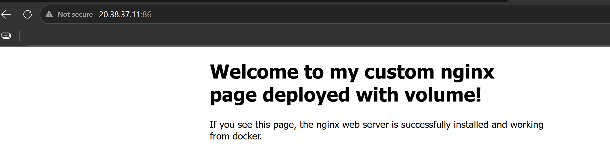

# Day 32 – Docker Volumes & Networking

## Challenge Tasks

### Task 1: The Problem
1. Run a Postgres or MySQL container
2. Create some data inside it (a table, a few rows — anything)
3. Stop and remove the container
4. Run a new one — is your data still there?

Write what happened and why.

```bash
commands -
docker run -itd --name mysql-c -p 3306:3306 -e MYSQL_ROOT_PASSWORD=my-secret-pw -e MYSQL_DATABASE=my_db mysql:latest
docker exec -it mysql-c bash
mysql
mysql -u root -p
show databases;

mysql> CREATE TABLE users (
    ->     id INT AUTO_INCREMENT PRIMARY KEY,
    ->     username VARCHAR(50) NOT NULL,
    ->     email VARCHAR(100),
    ->     created_at TIMESTAMP DEFAULT CURRENT_TIMESTAMP
    -> );
Query OK, 0 rows affected (0.067 sec)

mysql> show tables;
+-----------------+
| Tables_in_my_db |
+-----------------+
| users           |
+-----------------+
1 row in set (0.001 sec)

mysql> DESCRIBE users;
+------------+--------------+------+-----+-------------------+-------------------+
| Field      | Type         | Null | Key | Default           | Extra             |
+------------+--------------+------+-----+-------------------+-------------------+
| id         | int          | NO   | PRI | NULL              | auto_increment    |
| username   | varchar(50)  | NO   |     | NULL              |                   |
| email      | varchar(100) | YES  |     | NULL              |                   |
| created_at | timestamp    | YES  |     | CURRENT_TIMESTAMP | DEFAULT_GENERATED |
+------------+--------------+------+-----+-------------------+-------------------+
4 rows in set (0.002 sec)
```

As this container does not have persistent volume so whatever we will create inside it will be lost if we delete it.
The data has existence till the container is alive.

```bash
aishuser@aish-ubuntu-tws:~/docker$ docker run -itd --name mysql-c1 -p 3306:3306 -e MYSQL_ROOT_PASSWORD=my-secret-pw -e MYSQL_DATABASE=my_db mysql:latest

aishuser@aish-ubuntu-tws:~/docker$ docker ps 
CONTAINER ID   IMAGE          COMMAND                  CREATED              STATUS         PORTS     NAMES
c5f38494a7d3   mysql:latest   "docker-entrypoint.s…"   About a minute ago   Up 5 seconds             mysql-c1

aishuser@aish-ubuntu-tws:~/docker$ docker exec -it mysql-c1 bash
bash-5.1# mysql -u root -p
Enter password: 
Welcome to the MySQL monitor.  Commands end with ; or \g.
Your MySQL connection id is 9

mysql> show databases;
+--------------------+
| Database           |
+--------------------+
| information_schema |
| my_db              |
| mysql              |
| performance_schema |
| sys                |
+--------------------+
5 rows in set (0.003 sec)

mysql> use my_db;
Database changed
mysql> describe users;
ERROR 1146 (42S02): Table 'my_db.users' doesn't exist
```
---

### Task 2: Named Volumes
1. Create a named volume
2. Run the same database container, but this time **attach the volume** to it
3. Add some data, stop and remove the container
4. Run a brand new container with the **same volume**
5. Is the data still there?

**Verify:** `docker volume ls`, `docker volume inspect`
```bash
docker volume create vol1

aishuser@aish-ubuntu-tws:~/docker$ sudo ls /var/lib/docker
buildkit  containers  engine-id  network  nuke-graph-directory.sh  plugins  rootfs  runtimes  swarm  tmp  volumes
aishuser@aish-ubuntu-tws:~/docker$ sudo ls /var/lib/docker/volumes
0c8c7b64fba739b63fe6c18fd16e32600ab765746b79b890851048cbf73f4542  backingFsBlockDev  vol1

docker run -itd --name mysql-c1 -p 3306:3306 -v vol1:/var/lib/mysql -e MYSQL_ROOT_PASSWORD=my-secret-pw -e MYSQL_DATABASE=my_db mysql:latest
>> Created table - users
docker run -itd --name mysql-c2 -p 3306:3306 -v vol1:/var/lib/mysql -e MYSQL_ROOT_PASSWORD=my-secret-pw -e MYSQL_DATABASE=my_db mysql:latest
>> describe users
mysql> describe users;
+------------+--------------+------+-----+-------------------+-------------------+
| Field      | Type         | Null | Key | Default           | Extra             |
+------------+--------------+------+-----+-------------------+-------------------+
| id         | int          | NO   | PRI | NULL              | auto_increment    |
| username   | varchar(50)  | NO   |     | NULL              |                   |
| email      | varchar(100) | YES  |     | NULL              |                   |
| created_at | timestamp    | YES  |     | CURRENT_TIMESTAMP | DEFAULT_GENERATED |
+------------+--------------+------+-----+-------------------+-------------------+
4 rows in set (0.002 sec)

Table exists due to persistent volume.
```

---

### Task 3: Bind Mounts
1. Create a folder on your host machine with an `index.html` file
2. Run an Nginx container and **bind mount** your folder to the Nginx web directory
3. Access the page in your browser
4. Edit the `index.html` on your host — refresh the browser

Write in your notes: What is the difference between a named volume and a bind mount? \
**Named volume:** Volume maintained by docker. \
**Bind mount:** binding a host directory to a container directory.

```bash
aishuser@aish-ubuntu-tws:~/docker$ docker run -itd --name nginx-c1 -p 86:80 -v /home/aishuser/dockervol:/usr/share/nginx/html nginx:latest
c9976ddbc85fcf7c52ba7b69d6bd5d73ad1313b134f5c3242a6d6842b7985ec1
```


```bash
aishuser@aish-ubuntu-tws:~/docker$ vim ../dockervol/index.html 
```


---

### Task 4: Docker Networking Basics
1. List all Docker networks on your machine
2. Inspect the default `bridge` network
3. Run two containers on the default bridge — can they ping each other by **name**? -> **NO**
4. Run two containers on the default bridge — can they ping each other by **IP**? **YES**

```bash
aishuser@aish-ubuntu-tws:~/docker$ docker network ls
NETWORK ID     NAME      DRIVER    SCOPE
af2afa80dd68   bridge    bridge    local
7deed43b499a   host      host      local
f3b9e9aeb2d0   none      null      local

docker inspect bridge
[
    {
        "Name": "bridge",
        "Id": "af2afa80dd68b2c5af5952c8c95241a803af6c8ea6171197045cfeb09dde5490",
        "Created": "2026-08-02T16:40:56.326477149Z",
        "Scope": "local",
        "Driver": "bridge",
        "EnableIPv4": true,
        "EnableIPv6": false,
        "IPAM": {
            "Driver": "default",
            "Options": null,
            "Config": [
                {
                    "Subnet": "172.17.0.0/16",
                    "IPRange": "",
                    "Gateway": "172.17.0.1"
                }
            ]
        },
        "Internal": false,
        "Attachable": false,
        "Ingress": false,
        "ConfigFrom": {
            "Network": ""
        },
        "ConfigOnly": false,
        "Options": {
            "com.docker.network.bridge.default_bridge": "true",
            "com.docker.network.bridge.enable_icc": "true",
            "com.docker.network.bridge.enable_ip_masquerade": "true",
            "com.docker.network.bridge.host_binding_ipv4": "0.0.0.0",
            "com.docker.network.bridge.name": "docker0",
            "com.docker.network.driver.mtu": "1500"
        },
        "Labels": {},
        "Containers": {},
        "Status": {
            "IPAM": {
                "Subnets": {
                    "172.17.0.0/16": {
                        "IPsInUse": 3,
                        "DynamicIPsAvailable": 65533
                    }
                }
            }
        }
    }
]
```
```bash
docker run -itd --name c1 --network bridge alpine:latest
docker run -itd --name c2 --network bridge alpine:latest

docker inspect bridge
"Containers": {
            "427a02294cf31712e3ef42beb7f762a5084185ff92c8b84a0212ded5d26340ff": {
                "Name": "c2",
                "EndpointID": "f87db1033c4a062db0f6b3b9a87d4fd7cfe430c1db44f1298c5833ea4c4c47cc",
                "MacAddress": "fa:5c:36:d8:20:2d",
                "IPv4Address": "172.17.0.3/16",
                "IPv6Address": ""
            },
            "cb449c335318700bdf278206724fcc24d1a10251ae93ae308cb713b76ca330d8": {
                "Name": "c1",
                "EndpointID": "c9cf8d160ba3f4536c3fa9d15860c3d09c0a496937c8d31d52b1eb16b1dbe914",
                "MacAddress": "c6:b4:a2:8e:dc:60",
                "IPv4Address": "172.17.0.2/16",
                "IPv6Address": ""
            }
        }

aishuser@aish-ubuntu-tws:~/docker$ docker exec -it c1 ping c2
ping: bad address 'c2'
aishuser@aish-ubuntu-tws:~/docker$ docker exec -it c2 ping c1
ping: bad address 'c1'

aishuser@aish-ubuntu-tws:~/docker$ docker exec -it c2 ping 172.17.0.2
PING 172.17.0.2 (172.17.0.2): 56 data bytes
64 bytes from 172.17.0.2: seq=0 ttl=64 time=0.112 ms
64 bytes from 172.17.0.2: seq=1 ttl=64 time=0.046 ms
64 bytes from 172.17.0.2: seq=2 ttl=64 time=0.057 ms
^C
--- 172.17.0.2 ping statistics ---
3 packets transmitted, 3 packets received, 0% packet loss
round-trip min/avg/max = 0.046/0.071/0.112 ms
aishuser@aish-ubuntu-tws:~/docker$ docker exec -it c1 ping 172.17.0.3
PING 172.17.0.3 (172.17.0.3): 56 data bytes
64 bytes from 172.17.0.3: seq=0 ttl=64 time=0.078 ms
64 bytes from 172.17.0.3: seq=1 ttl=64 time=0.049 ms
^C
--- 172.17.0.3 ping statistics ---
2 packets transmitted, 2 packets received, 0% packet loss
round-trip min/avg/max = 0.049/0.063/0.078 ms
```
---

### Task 5: Custom Networks
1. Create a custom bridge network called `my-app-net`
2. Run two containers on `my-app-net`
3. Can they ping each other by **name** now?
4. Write in your notes: Why does custom networking allow name-based communication but the default bridge doesn't?

```bash
docker network create my-app-net --driver bridge
docker run -itd --name c3 --network my-app-net alpine:latest
docker run -itd --name c4 --network my-app-net alpine:latest

docker exec -it c3 ping c4
docker exec -it c4 ping c3

aishuser@aish-ubuntu-tws:~/docker$ docker network create my-app-net --driver bridge
d622e27b1e65d41bc27c7a7b2a836bc57103a93c1d3cae58062627b221bfd060
aishuser@aish-ubuntu-tws:~/docker$ docker run -itd --name c3 --network my-app-net alpine:latest
e04afb4d4e8e6721486f12fcccbd4e4dc5033ca405bbda8d1e7b7d99cef4df33
aishuser@aish-ubuntu-tws:~/docker$ docker run -itd --name c4 --network my-app-net alpine:latest
744321985cdc2444cf3fbcca5418ee642f0a4646be8d0421c56c068a68f41798
aishuser@aish-ubuntu-tws:~/docker$ docker exec -it c3 ping c4
PING c4 (172.18.0.3): 56 data bytes
64 bytes from 172.18.0.3: seq=0 ttl=64 time=0.064 ms
64 bytes from 172.18.0.3: seq=1 ttl=64 time=0.061 ms
^C
--- c4 ping statistics ---
2 packets transmitted, 2 packets received, 0% packet loss
round-trip min/avg/max = 0.061/0.062/0.064 ms
aishuser@aish-ubuntu-tws:~/docker$ docker exec -it c4 ping c3
PING c3 (172.18.0.2): 56 data bytes
64 bytes from 172.18.0.2: seq=0 ttl=64 time=0.057 ms
64 bytes from 172.18.0.2: seq=1 ttl=64 time=0.054 ms
^C
--- c3 ping statistics ---
2 packets transmitted, 2 packets received, 0% packet loss
round-trip min/avg/max = 0.054/0.055/0.057 ms
```

**Default Bridge Network:** Named bridge out-of-the-box, requires communication via internal IP addresses, and does not support automatic DNS.

**Named Bridge Network:** Created manually by the user, provides automatic built-in DNS name resolution, and offers better multi-container isolation.

---

### Task 6: Put It Together
1. Create a custom network
2. Run a **database container** (MySQL/Postgres) on that network with a volume for data
3. Run an **app container** (use any image) on the same network
4. Verify the app container can reach the database by container name

```bash
docker network create my-app-net2 --driver bridge

docker run -itd --name mysql-c1 -p 3306:3306 -v vol1:/var/lib/mysql --network my-app-net2 -e MYSQL_ROOT_PASSWORD=my-secret-pw -e MYSQL_DATABASE=my_db mysql:latest

docker run -itd --name nginx-c1 -p 86:80 -v /home/ubuntu/vol:/usr/share/nginx/html --network my-app-net2 nginx:latest

docker exec -it nginx-c1 ping mysql-c1
```