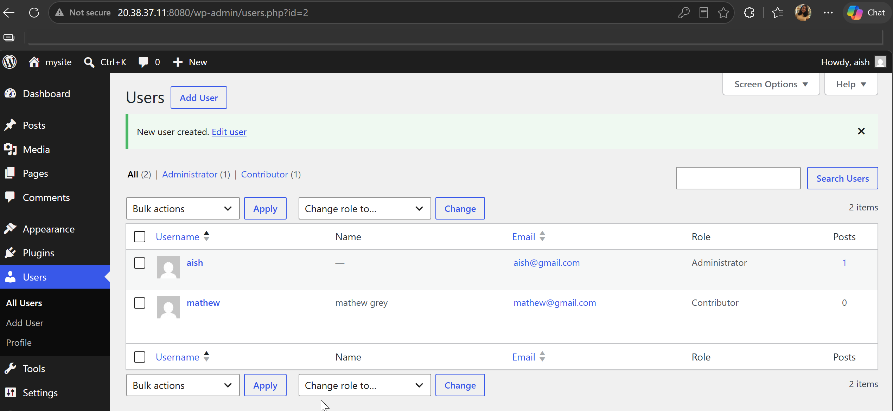
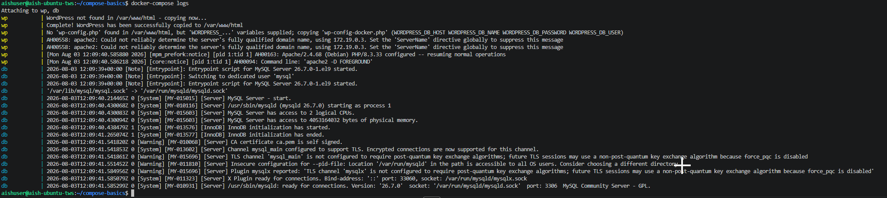

# Day 33 – Docker Compose: Multi-Container Basics

## Challenge Tasks

### Task 1: Install & Verify
1. Check if Docker Compose is available on your machine
2. Verify the version

```bash
aishuser@aish-ubuntu-tws:~$ docker-compose -v
Command 'docker-compose' not found,
aishuser@aish-ubuntu-tws:~$ sudo apt  install docker-compose
aishuser@aish-ubuntu-tws:~$ docker-compose -v
docker-compose version 1.29.2, build unknown
```

---

### Task 2: Your First Compose File
1. Create a folder `compose-basics`
2. Write a `docker-compose.yml` that runs a single **Nginx** container with port mapping
3. Start it with `docker compose up`
4. Access it in your browser
5. Stop it with `docker compose down`

```bash

aishuser@aish-ubuntu-tws:~/compose-basics$ docker-compose up -d
Creating nginx_web ... done
aishuser@aish-ubuntu-tws:~/compose-basics$ docker ps
CONTAINER ID   IMAGE          COMMAND                  CREATED         STATUS         PORTS                                 NAMES
d150fd4961bc   nginx:latest   "/docker-entrypoint.…"   6 seconds ago   Up 5 seconds   0.0.0.0:86->80/tcp, [::]:86->80/tcp   nginx_web
aishuser@aish-ubuntu-tws:~/compose-basics$ docker-compose down
Stopping nginx_web ... done
Removing nginx_web ... done
Removing network compose-basics_default
```


---

### Task 3: Two-Container Setup
Write a `docker-compose.yml` that runs:
- A **WordPress** container
- A **MySQL** container

They should:
- Be on the same network (Compose does this automatically)
- MySQL should have a named volume for data persistence
- WordPress should connect to MySQL using the service name

```bash
services:
  MYSQL:
    image: mysql:latest
    container_name: db
    environment:
      MYSQL_USER: exampleuser
      MYSQL_PASSWORD: examplepass
      MYSQL_DATABASE: my_db
      MYSQL_RANDOM_ROOT_PASSWORD: '1'
    ports:
      - "3306:3306"
    volumes:
      - vol2:/var/lib/mysql

  WordPress:
    image: wordpress
    container_name: wp
    ports:
      - 8080:80
    environment:
      WORDPRESS_DB_HOST: MYSQL
      WORDPRESS_DB_USER: exampleuser
      WORDPRESS_DB_PASSWORD: examplepass
      WORDPRESS_DB_NAME: my_db

volumes:
  vol2:
```
```bash
aishuser@aish-ubuntu-tws:~/compose-basics$ docker exec -it bfd getent hosts db
172.19.0.2      db

aishuser@aish-ubuntu-tws:~/compose-basics$ docker-compose down
Stopping compose-basics_WordPress_1 ... done
Stopping db                         ... done
Removing compose-basics_WordPress_1 ... done
Removing db                         ... done
Removing network compose-basics_default
```


Start it, access WordPress in your browser, and set it up.

```bash
aishuser@aish-ubuntu-tws:~/compose-basics$ docker-compose up -d
Creating network "compose-basics_default" with the default driver
Creating wp ... done
Creating db ... done
```
**Verify:** Stop and restart with `docker compose down` and `docker compose up` — is your WordPress data still there?
> The data is still there.

---

### Task 4: Compose Commands
Practice and document these:
1. Start services in **detached mode**
> docker-compose up -d
2. View running services
> docker-compose ps
```bash
aishuser@aish-ubuntu-tws:~/compose-basics$ docker-compose ps
Name              Command               State                          Ports                       
---------------------------------------------------------------------------------------------------
db     docker-entrypoint.sh mysqld      Up      0.0.0.0:3306->3306/tcp,:::3306->3306/tcp, 33060/tcp
wp     docker-entrypoint.sh apach ...   Up      0.0.0.0:8080->80/tcp,:::8080->80/tcp
```
3. View **logs** of all services
> docker-compose logs


4. View logs of a **specific** service
> find the dns name using inspect that will be the service name
"DNSNames": [
                        "db",
                        "81148259b4b1",
                        "MYSQL"
> docker-compose logs MYSQL
5. **Stop** services without removing
```bash
aishuser@aish-ubuntu-tws:~/compose-basics$ docker-compose stop
Stopping wp ... done
Stopping db ... done
aishuser@aish-ubuntu-tws:~/compose-basics$ docker-compose ps -a
Name              Command               State    Ports
------------------------------------------------------
db     docker-entrypoint.sh mysqld      Exit 0        
wp     docker-entrypoint.sh apach ...   Exit 0
```
6. **Remove** everything (containers, networks)
> docker-compose down -v --rmi all --remove-orphans

```bash
aishuser@aish-ubuntu-tws:~/compose-basics$ docker-compose down -v --rmi all --remove-orphans
Removing wp ... done
Removing db ... done
Removing network compose-basics_default
Removing volume compose-basics_vol2
Removing image mysql:latest
Removing image wordpress
```

7. **Rebuild** images if you make a change
> docker-compose build \
docker compose up --build \
docker compose up --build <service_name> \
docker compose build --no-cache     # bypass the cache for completely clean rebuild

---

### Task 5: Environment Variables
1. Add environment variables directly in your `docker-compose.yml`
2. Create a `.env` file and reference variables from it in your compose file
3. Verify the variables are being picked up
```bash
services:
 MYSQL:
    image: mysql:latest
    container_name: db
    environment:
      MYSQL_DATABASE: ${MYSQL_DATABASE}
      MYSQL_USER: ${MYSQL_USER}
      MYSQL_PASSWORD: ${MYSQL_PASSWORD}
      MYSQL_ROOT_PASSWORD: ${MYSQL_ROOT_PASSWORD}
    ports:
      - "3306:3306"
    volumes:
      - vol2:/var/lib/mysql

  WordPress:
    image: wordpress
    container_name: wp
    ports:
      - 8080:80
    environment:
      WORDPRESS_DB_HOST: db
      WORDPRESS_DB_USER: ${MYSQL_USER}
      WORDPRESS_DB_PASSWORD: ${MYSQL_PASSWORD}
      WORDPRESS_DB_NAME: ${MYSQL_DATABASE}

volumes:
  vol2:

.env file
MYSQL_USER=exampleuser
MYSQL_PASSWORD=examplepass
MYSQL_DATABASE=my_db
MYSQL_ROOT_PASSWORD=my_pswd

aishuser@aish-ubuntu-tws:~/compose-basics$ docker-compose config
services:
  MYSQL:
    container_name: db
    environment:
      MYSQL_DATABASE: my_db
      MYSQL_PASSWORD: examplepass
      MYSQL_ROOT_PASSWORD: my_pswd
      MYSQL_USER: exampleuser
    image: mysql:latest
    ports:
    - published: 3306
      target: 3306
    volumes:
    - vol2:/var/lib/mysql:rw
  WordPress:
    container_name: wp
    environment:
      WORDPRESS_DB_HOST: db
      WORDPRESS_DB_NAME: my_db
      WORDPRESS_DB_PASSWORD: examplepass
      WORDPRESS_DB_USER: exampleuser
    image: wordpress
    ports:
    - published: 8080
      target: 80
version: '3.9'
volumes:
  vol2: {}
```

> check variables are picked up
```bash
aishuser@aish-ubuntu-tws:~/compose-basics$ docker exec -it db env
PATH=/usr/local/sbin:/usr/local/bin:/usr/sbin:/usr/bin:/sbin:/bin
HOSTNAME=eedc81d3934a
TERM=xterm
MYSQL_DATABASE=my_db
MYSQL_USER=exampleuser
MYSQL_PASSWORD=examplepass
MYSQL_ROOT_PASSWORD=my_pswd
GOSU_VERSION=1.19
MYSQL_MAJOR=innovation
MYSQL_VERSION=26.7.0-1.el9
MYSQL_SHELL_VERSION=26.7.0-1.el9
HOME=/root
```
---