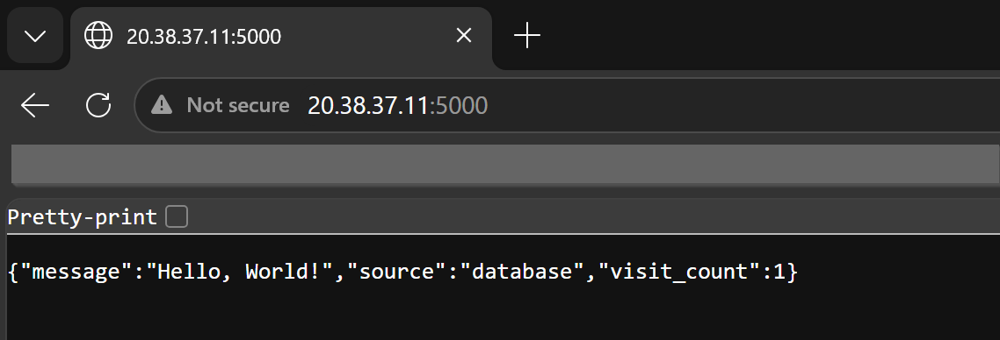

# Day 34 – Docker Compose: Real-World Multi-Container Apps

## Challenge Tasks

### Task 1: Build Your Own App Stack
Create a `docker-compose.yml` for a 3-service stack:
- A **web app** (use Python Flask, Node.js, or any language you know)
- A **database** (Postgres or MySQL)
- A **cache** (Redis)

Write a simple Dockerfile for the web app. The app doesn't need to be complex — even a "Hello World" that connects to the database is enough.

```bash
services:
  mysql:
    container_name: db
    environment:
      MYSQL_DATABASE: redis
      MYSQL_PASSWORD: mypassword
      MYSQL_RANDOM_ROOT_PASSWORD: '1'
      MYSQL_USER: appuser
    image: mysql:8.0
    ports:
    - published: 3306
      target: 3306
    volumes:
    - dbvol:/var/lib/mysql:rw
  redis:
    container_name: redis
    image: redis:7-alpine
    ports:
    - published: 6379
      target: 6379
  webapp:
    build:
      context: /home/aishuser/mini-project
    container_name: webapp
    environment:
      CACHE_TTL_SECONDS: '10'
      DB_HOST: mysqp
      DB_NAME: redis
      DB_PASSWORD: mypassword
      DB_PORT: '3306'
      DB_USER: appuser
      PORT: '5000'
      REDIS_DB: '0'
      REDIS_HOST: localhost
      REDIS_PORT: '6379'
    ports:
    - published: 5000
      target: 5000
    stop_signal: SIGINT
version: '3.9'
volumes:
  dbvol: {}

```

```bash
aishuser@aish-ubuntu-tws:~/mini-project$ docker-compose up -d
Creating network "mini-project_default" with the default driver
Creating db     ... done
Creating redis  ... done
Creating webapp ... done
aishuser@aish-ubuntu-tws:~/mini-project$ docker-compose ps
 Name               Command               State                          Ports                       
-----------------------------------------------------------------------------------------------------
db       docker-entrypoint.sh mysqld      Up      0.0.0.0:3306->3306/tcp,:::3306->3306/tcp, 33060/tcp
redis    docker-entrypoint.sh redis ...   Up      0.0.0.0:6379->6379/tcp,:::6379->6379/tcp           
webapp   python app.py gunicorn --b ...   Up      0.0.0.0:5000->5000/tcp,:::5000->5000/tcp
```

Error:
```bash
aishuser@aish-ubuntu-tws:~/mini-project$ docker logs webapp
WARNING:__main__:DB not ready at startup, will not block boot: (2003, "Can't connect to MySQL server on 'mysql' ([Errno 111] Connection refused)")
 * Serving Flask app 'app'
 * Debug mode: off
INFO:werkzeug:WARNING: This is a development server. Do not use it in a production deployment. Use a production WSGI server instead.
 * Running on all addresses (0.0.0.0)
 * Running on http://127.0.0.1:5000
 * Running on http://172.19.0.2:5000
```

This could not connect to DB as it was not ready. So we will add heathcheck and depends_on.

---

### Task 2: depends_on & Healthchecks
1. Add `depends_on` to your compose file so the app starts **after** the database
2. Add a **healthcheck** on the database service
3. Use `depends_on` with `condition: service_healthy` so the app waits for the database to be truly ready, not just started

**Test:** Bring everything down and up — does the app wait for the DB?

```bash
services:
  mysql:
    image: mysql:8.0
    container_name: db
    environment:
      MYSQL_USER: ${DB_USER}
      MYSQL_PASSWORD: ${DB_PASSWORD}
      MYSQL_DATABASE: ${DB_NAME}
      MYSQL_RANDOM_ROOT_PASSWORD: '1'
    healthcheck:
      test: ["CMD", "mysqladmin", "ping", "-h", "localhost", "-u", "${DB_USER}", "-p${DB_PASSWORD}"]
      interval: 10s
      timeout: 5s
      retries: 5
      
    ports:
      - "3306:${DB_PORT}"
    volumes:
      - dbvol:/var/lib/mysql
  
  redis:
    image: redis:7-alpine
    container_name: redis
    ports:
      - "6379:${REDIS_PORT}"
    healthcheck:
      test: ["CMD", "redis-cli", "ping"]
      interval: 5s
      timeout: 5s
      retries: 10
  webapp:
    build: .
    container_name: webapp
    ports:
      - "5000:${PORT}"
    env_file:
      - .env
    stop_signal: SIGINT
    depends_on:
      mysql:
        condition: service_healthy
      redis:
        condition: service_healthy
volumes:
  dbvol:  
```

**New Error:**
```sh
ishuser@aish-ubuntu-tws:~/mini-project$ docker logs webapp -f
WARNING:__main__:DB not ready at startup, will not block boot: (1044, "Access denied for user 'appuser'@'%' to database 'appdb'")
 * Serving Flask app 'app'
 * Debug mode: off
```

> This is because of a stale named volume so we need to recreate the volume. The first time it starts with an empty data directory. If you started the db container once already — even if it failed or you changed .env values afterward — Docker persisted that first (possibly broken/incomplete) state into a named volume. Every restart since then, MySQL sees existing data and skips init entirely, ignoring your env vars.

```bash
docker-compose down -v
docker-compose build --no-cache webapp
docker-compose up -d --force-recreate

docker-compose ps
 Name               Command                  State                              Ports                       
------------------------------------------------------------------------------------------------------------
db       docker-entrypoint.sh mysqld      Up (healthy)   0.0.0.0:3306->3306/tcp,:::3306->3306/tcp, 33060/tcp
redis    docker-entrypoint.sh redis ...   Up (healthy)   0.0.0.0:6379->6379/tcp,:::6379->6379/tcp           
webapp   /bin/sh -c gunicorn --bind ...   Up             0.0.0.0:5000->5000/tcp,:::5000->5000/tcp
```



---

### Task 3: Restart Policies
1. Add `restart: always` to your database service
2. Manually kill the database container — does it come back?
3. Try `restart: on-failure` — how is it different?
4. Write in your notes: When would you use each restart policy?

```bash
aishuser@aish-ubuntu-tws:~/mini-project$ docker inspect db | grep -A5 RestartPolicy
            "RestartPolicy": {
                "Name": "always",
                "MaximumRetryCount": 0
            },
            "AutoRemove": false,
            "VolumeDriver": "",

aishuser@aish-ubuntu-tws:~/mini-project$ docker top db
UID                 PID                 PPID                C                   STIME               TTY                 TIME                CMD
mdatp               13869               13845               2                   15:49               ?                   00:00:00            mysqld

aishuser@aish-ubuntu-tws:~/mini-project$ sudo kill -9 13869
aishuser@aish-ubuntu-tws:~/mini-project$ docker ps
CONTAINER ID   IMAGE                 COMMAND                  CREATED          STATUS                           PORTS                                                    NAMES
311ffa720eec   mini-project_webapp   "/bin/sh -c 'gunicor…"   16 minutes ago   Up 16 minutes                    
3ed7206c286d   redis:7-alpine        "docker-entrypoint.s…"   16 minutes ago   Up 16 minutes (healthy)          
e7b843ed58a1   mysql:8.0             "docker-entrypoint.s…"   16 minutes ago   Up 1 second (health: starting)

```

so killing the mysqld process immediately restarts the container.
Same happened with restart policy : on failure
```bash
aishuser@aish-ubuntu-tws:~/mini-project$ docker inspect db | grep -A5 RestartPolicy
            "RestartPolicy": {
                "Name": "on-failure",
                "MaximumRetryCount": 0
            },
            "AutoRemove": false,
            "VolumeDriver": "",
aishuser@aish-ubuntu-tws:~/mini-project$ docker inspect db --format '{{.RestartCount}}'
1
```
**on-failure[:max-retries]**	Restart the container if it exits due to an error, which manifests as a non-zero exit code. Optionally, limit the number of times the Docker daemon attempts to restart the container using the :max-retries option. The on-failure policy only prompts a restart if the container exits with a failure. It doesn't restart the container if the daemon restarts.

**always**	Always restart the container if it stops. If it's manually stopped, it's restarted only when Docker daemon restarts or the container itself is manually restarted. 
---

### Task 4: Custom Dockerfiles in Compose
1. Instead of using a pre-built image for your app, use `build:` in your compose file to build from a Dockerfile
2. Make a code change in your app
3. Rebuild and restart with one command

```bash
docker compose build --no-cache webapp
docker compose up -d --force-recreate

Dockerfile
FROM python:3.12-slim as builder

WORKDIR /app

COPY requirements.txt .

RUN pip install --no-cache-dir -r requirements.txt

COPY . .

ENV PORT=5000

EXPOSE 5000

CMD gunicorn --bind 0.0.0.0:$PORT --workers 3 app:app
```

---

### Task 5: Named Networks & Volumes
1. Define **explicit networks** in your compose file instead of relying on the default
2. Define **named volumes** for database data
3. Add **labels** to your services for better organization

Labels:
key-value metadata tags you attach to containers, images, volumes, and networks. They don’t affect runtime behavior directly, but they unlock automation, organization, observability, and governance. \

You can write labels in Docker Compose using either a dictionary (map) syntax or a list syntax.

Added network as well

```bash
aishuser@aish-ubuntu-tws:~/mini-project$ docker-compose up -d
Creating network "mini-project_mynetwork" with driver "bridge"
Creating db    ... done
Creating redis ... done
Creating webapp ... done

```
---

### Task 6: Scaling (Bonus)
1. Try scaling your web app to 3 replicas using `docker compose up --scale`
2. What happens? What breaks?
3. Write in your notes: Why doesn't simple scaling work with port mapping?

```bash
aishuser@aish-ubuntu-tws:~/mini-project$ docker-compose up --scale webapp=3
redis is up-to-date
db is up-to-date
WARNING: The "webapp" service is using the custom container name "webapp". Docker requires each container to have a unique name. Remove the custom name to scale the service.
WARNING: The "webapp" service specifies a port on the host. If multiple containers for this service are created on a single host, the port will clash.
Creating webapp ... error
Creating webapp ... 

ERROR: for webapp  Cannot create container for service webapp: Conflict. The container name "/webapp" is already in use by container "c4bb257f52af95d401ae8cf0b335cf1b69cd406c69f34188c3db9be46ba39569". You have to remove (or rename) that container to be able to reuse that name.

ERROR: for webapp  Cannot create container for service webapp: Conflict. The container name "/webapp" is already in use by container "c4bb257f52af95d401ae8cf0b335cf1b69cd406c69f34188c3db9be46ba39569". You have to remove (or rename) that container to be able to reuse that name.
ERROR: Encountered errors while bringing up the project.
```

If you map a container to a fixed host port (e.g., ports: - "8080:80"), scaling will fail because multiple containers cannot bind to the exact same host port simultaneously.

We need random host ports and don't mention container_name as well.

```bash
ports:
  - "80" 
```
