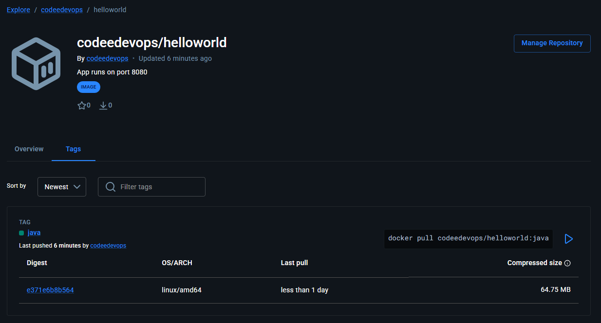
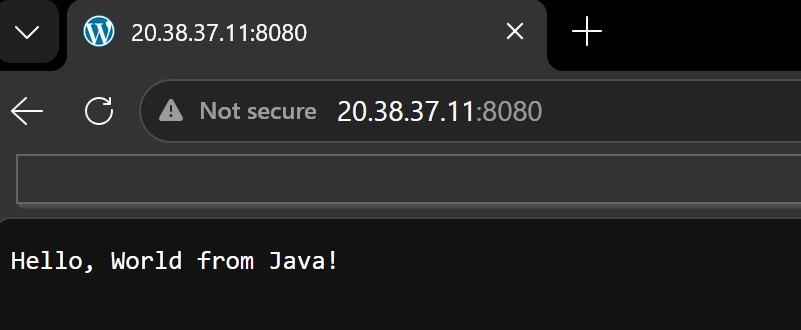
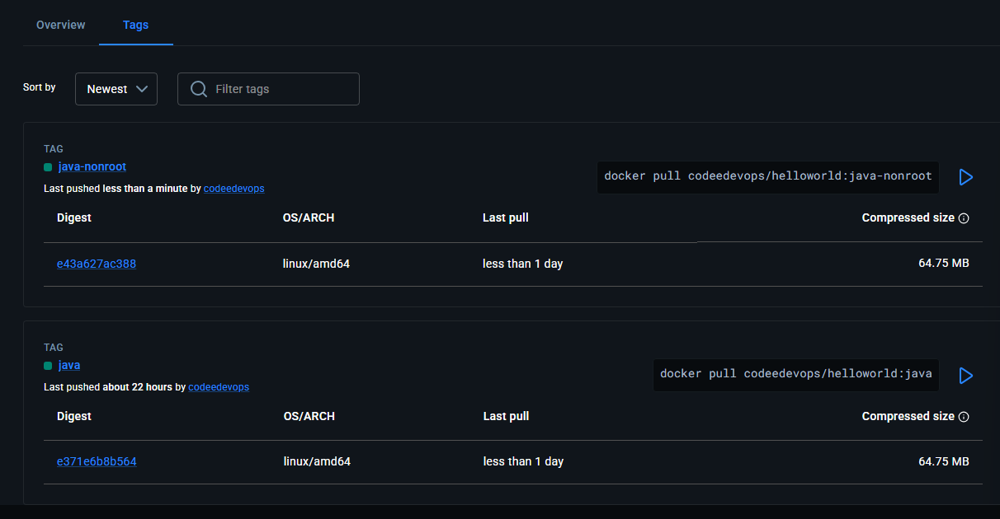

# Day 35 – Multi-Stage Builds & Docker Hub

## Challenge Tasks

### Task 1: The Problem with Large Images
1. Write a simple Go, Java, or Node.js app (even a "Hello World" is fine)
2. Create a Dockerfile that builds and runs it in a **single stage**
3. Build the image and check its **size**

Note down the size — you'll compare it later.

```bash
Dockerfile
---
From maven:3.9-eclipse-temurin-17

WORKDIR /app

COPY . .

RUN mvn clean package

EXPOSE 8080

CMD ["java", "-jar", "target/app.jar"]

---
aishuser@aish-ubuntu-tws:~/java-project$ docker images helloworld
IMAGE                ID             DISK USAGE   CONTENT SIZE   EXTRA
helloworld:java-v1   16305960505f        805MB          249MB    U  
```
---

### Task 2: Multi-Stage Build
1. Rewrite the Dockerfile using **multi-stage build**:
   - Stage 1: Build the app (install dependencies, compile)
   - Stage 2: Copy only the built artifact into a minimal base image (`alpine`, `distroless`, or `scratch`)
2. Build the image and check its size again
3. Compare the two sizes

Write in your notes: Why is the multi-stage image so much smaller?

```bash
Dockerfile-multistage
---
# Stage 1 - build the application
FROM maven:3.9-eclipse-temurin-17 as builder

WORKDIR /app

COPY . .

RUN mvn clean package

# Stage 2 - run the application
FROM eclipse-temurin:17-jre-alpine

WORKDIR /app

COPY --from=builder /app/target/*.jar app.jar

ENV PORT=8080

EXPOSE 8080

CMD ["java", "-jar", "app.jar"]
---

aishuser@aish-ubuntu-tws:~/java-project$ docker images helloworld
IMAGE                ID             DISK USAGE   CONTENT SIZE   EXTRA
helloworld:java-v1   16305960505f        805MB          249MB    U   
helloworld:java-v2   e371e6b8b564        256MB         67.9MB 
```

The multistage build creates much smaller image because, whatever the dependecy we installed for building the package are not copied in the final image. And the base image used for final image is also already very small as we used Alpine image.

> maven:3.9-eclipse-temurin-17    4015718012bb        772MB          238MB \
eclipse-temurin:17-jre-alpine   02320dd4ce20        257MB         68.8MB 
---

### Task 3: Push to Docker Hub
1. Create a free account on [Docker Hub](https://hub.docker.com) (if you don't have one)
2. Log in from your terminal
3. Tag your image properly: `yourusername/image-name:tag`
4. Push it to Docker Hub
5. Pull it on a different machine (or after removing locally) to verify

```bash
aishuser@aish-ubuntu-tws:~/java-project$ docker tag helloworld:java-v2 codeedevops/helloworld:java
aishuser@aish-ubuntu-tws:~/java-project$ docker push codeedevops/helloworld:java
The push refers to repository [docker.io/codeedevops/helloworld]
33155d10cbc7: Mounted from library/eclipse-temurin 
1e2a2f574cbc: Mounted from library/eclipse-temurin 
4f9b826e5580: Mounted from library/eclipse-temurin 
bb5bb06f25c5: Mounted from library/eclipse-temurin 
faa39612d4aa: Pushed 
e6f31ffc071e: Mounted from library/eclipse-temurin 
2b5a4c9058a1: Pushed 
java: digest: sha256:e371e6b8b56447671c92a6489c704c29224b21cac4f1da6fb94c65181fe51481 size: 1832

Removed the image from local and then pulled from my dockerhub repo
aishuser@aish-ubuntu-tws:~/java-project$ docker images
                                                                                                             i Info →   U  In Use
IMAGE   ID             DISK USAGE   CONTENT SIZE   EXTRA
aishuser@aish-ubuntu-tws:~/java-project$ docker pull codeedevops/helloworld:java
java: Pulling from codeedevops/helloworld
Digest: sha256:e371e6b8b56447671c92a6489c704c29224b21cac4f1da6fb94c65181fe51481
Status: Downloaded newer image for codeedevops/helloworld:java
docker.io/codeedevops/helloworld:java
```
---

### Task 4: Docker Hub Repository
1. Go to Docker Hub and check your pushed image
2. Add a **description** to the repository
3. Explore the **tags** tab — understand how versioning works
4. Pull a specific tag vs `latest` — what happens?



---

### Task 5: Image Best Practices
Apply these to one of your images and rebuild:
1. Use a **minimal base image** (alpine vs ubuntu — compare sizes)
2. **Don't run as root** — add a non-root USER in your Dockerfile

> If you don’t set a USER in your Dockerfile, the user will default to root.

[Understanding the Docker USER Instruction](https://www.docker.com/blog/understanding-the-docker-user-instruction/)

[Dockerfile with non root user](Dockerfile_nonroot)

3. Combine `RUN` commands to **reduce layers**
4. Use **specific tags** for base images (not `latest`)

Check the size before and after.

```bash
Step 5/11 : FROM eclipse-temurin:17-jre-alpine
 ---> 02320dd4ce20
Step 6/11 : RUN addgroup -g 1234 appgroup &&     adduser -u 1234 -G appgroup -s /sbin/nologin -D appuser
 ---> Running in b46849e84a86
 ---> Removed intermediate container b46849e84a86
 ---> efb17a703b1b
Step 7/11 : WORKDIR /app
 ---> Running in b523244812f9
 ---> Removed intermediate container b523244812f9
 ---> b7aecdade27f
Step 8/11 : COPY --from=builder --chown=appuser:appgroup /app/target/*.jar app.jar
 ---> 1262027aa546
Step 9/11 : USER appuser
 ---> Running in 98ef5f79c906
 ---> Removed intermediate container 98ef5f79c906
 ---> 96c675c4cbe3
Step 10/11 : EXPOSE 8080
 ---> Running in 80d6ccb9e97d
 ---> Removed intermediate container 80d6ccb9e97d
 ---> b06e43e07a66
Step 11/11 : CMD ["java", "-jar", "app.jar"]
 ---> Running in 709efa47dfff
 ---> Removed intermediate container 709efa47dfff
 ---> e43a627ac388
Successfully built e43a627ac388
Successfully tagged helloworld:java-nonroot


helloworld:java-nonroot         e43a627ac388        256MB         67.9MB 

aishuser@aish-ubuntu-tws:~/java-project$ docker run -itd -p 8080:8080 helloworld:java-nonroot 
e2dec6494df3650a6741ae83fa5448a34d974495d422f607d3178faf4c87fb4a
aishuser@aish-ubuntu-tws:~/java-project$ docker exec -it e2d id
uid=1234(appuser) gid=1234(appgroup) groups=1234(appgroup)
```


```bash
aishuser@aish-ubuntu-tws:~/java-project$ docker tag helloworld:java-nonroot codeedevops/helloworld:java-nonroot
aishuser@aish-ubuntu-tws:~/java-project$ docker push codeedevops/helloworld:java-nonroot
```

