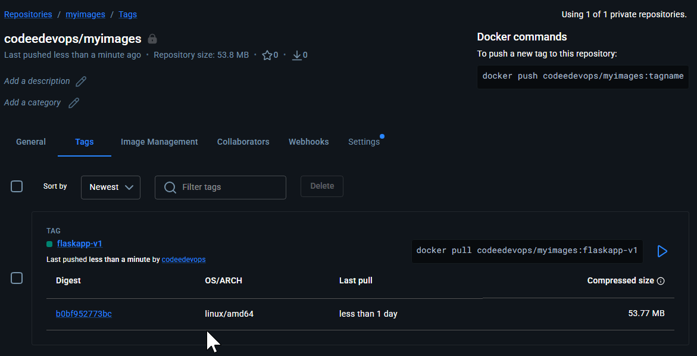
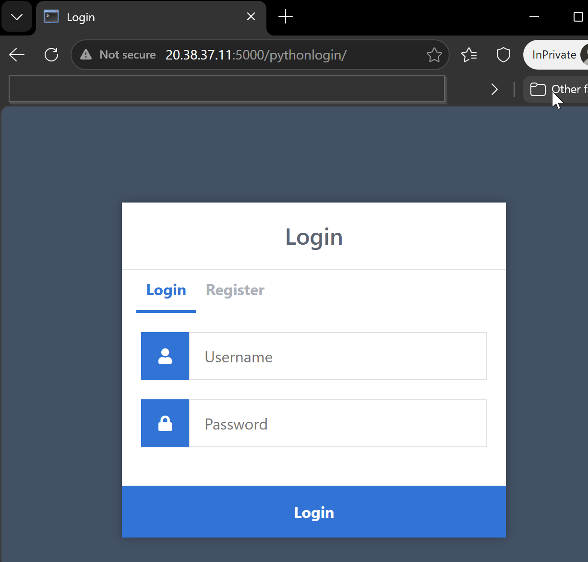

# Day 36 – Docker Project: Dockerize a Full Application

## Challenge Tasks

### Task 1: Pick Your App
Choose **one** of these (or use your own project):
- A **Python Flask/Django** app with a database
- A **Node.js Express** app with MongoDB
- A **static website** served by Nginx with a backend API
- Any app from your GitHub that doesn't have Docker yet

If you don't have an app, clone a simple open-source one and Dockerize it.

---

### Task 2: Write the Dockerfile
1. Create a Dockerfile for your application
2. Use a **multi-stage build** if applicable
3. Use a **non-root user**
4. Keep the image **small** — use alpine or slim base images
5. Add a `.dockerignore` file

Build and test it locally.

---

### Task 3: Add Docker Compose
Write a `docker-compose.yml` that includes:
1. Your **app** service (built from Dockerfile)
2. A **database** service (Postgres, MySQL, MongoDB — whatever your app needs)
3. **Volumes** for database persistence
4. A **custom network**
5. **Environment variables** for configuration (use `.env` file)
6. **Healthchecks** on the database

Run `docker compose up` and verify everything works together.

[Dcoekrfile - multistage, with non root user and healthchek](Dockerfile) \
[docker compose file](docker-compose.yml)

---

### Task 4: Ship It
1. Tag your app image
2. Push it to Docker Hub
3. Share the Docker Hub link
4. Write a `README.md` in your project with:
   - What the app does
   - How to run it with Docker Compose
   - Any environment variables needed


[Docker hub image link](https://hub.docker.com/repository/docker/codeedevops/myimages/tags)

---

### Task 5: Test the Whole Flow
1. Remove all local images and containers
2. Pull from Docker Hub and run using only your compose file
3. Does it work fresh? If not — fix it until it does

```bash
aishuser@aish-ubuntu-tws:~/Login-System-with-Python-Flask-and-MySQL$ docker-compose up -d
Creating network "login-system-with-python-flask-and-mysql_default" with the default driver
Creating volume "login-system-with-python-flask-and-mysql_dbvol" with default driver
Pulling webapp (codeedevops/myimages:flaskapp-v2)...
flaskapp-v2: Pulling from codeedevops/myimages
704b64e3eca2: Pull complete
Digest: sha256:f42132a6a5130f6661662aed9be7d1d1eed6c7fef921a638c53e68e6498d76ef
Status: Downloaded newer image for codeedevops/myimages:flaskapp-v2
Creating db ... done
Creating webapp ... done

aishuser@aish-ubuntu-tws:~/Login-System-with-Python-Flask-and-MySQL$ docker ps
CONTAINER ID   IMAGE                              COMMAND                  CREATED          STATUS                    PORTS                                                    NAMES
da31902d8b4b   codeedevops/myimages:flaskapp-v2   "/bin/sh -c 'python …"   4 seconds ago    Up 3 seconds              0.0.0.0:5000->5000/tcp, [::]:5000->5000/tcp              webapp
dc6e56216273   mysql:8.0                          "docker-entrypoint.s…"   35 seconds ago   Up 34 seconds (healthy)   0.0.0.0:3306->3306/tcp, [::]:3306->3306/tcp, 33060/tcp   db
```
