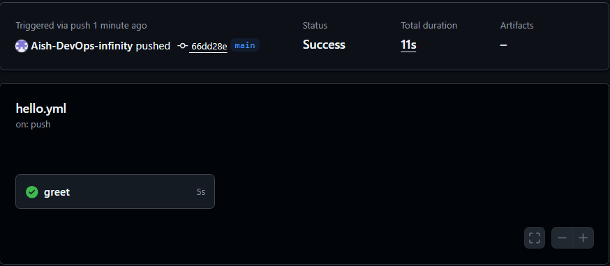
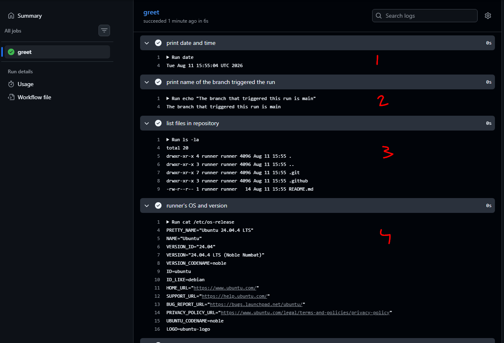
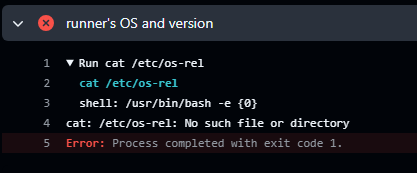

# Day 40 – Your First GitHub Actions Workflow

## Challenge Tasks

### Task 1: Set Up
1. Create a new **public** GitHub repository called `github-actions-practice`
2. Clone it locally
3. Create the folder structure: `.github/workflows/`

```bash
Directory: C:\Workspace\repos\github-actions\.github

Mode                 LastWriteTime         Length Name
----                 -------------         ------ ----
d----           8/11/2026  8:43 PM                workflows
```

---

### Task 2: Hello Workflow
Create `.github/workflows/hello.yml` with a workflow that:
1. Triggers on every `push`
2. Has one job called `greet`
3. Runs on `ubuntu-latest`
4. Has two steps:
   - Step 1: Check out the code using `actions/checkout`
   - Step 2: Print `Hello from GitHub Actions!`

Push it. Go to the **Actions** tab on GitHub and watch it run.

**Verify:** Is it green? Click into the job and read every step.



```yml
name: simple hello
on:
  push: 
    branches: [main]

jobs:
  greet:
    runs-on: ubuntu-latest
    steps:
    - name: Checkout self repository
      uses: actions/checkout@v6

    - name: print
      run: echo "Hello from Github Actions!"
```

---

### Task 3: Understand the Anatomy
Look at your workflow file and write in your notes what each key does:
- `on:` -> define on which event the pipeline should trigger
- `jobs:` -> group of steps
- `runs-on:` -> Which runner should run the pipeline
- `steps:` -> tasks to run for the pipeline
- `uses:` -> Which predefined tasks it utilises
- `run:` -> run a script (inline or file)
- `name:` (on a step) -> name of the step

---

### Task 4: Add More Steps
Update `hello.yml` to also:
1. Print the current date and time
2. Print the name of the branch that triggered the run (hint: GitHub provides this as a variable)
3. List the files in the repo
4. Print the runner's operating system

```yml
name: simple hello
on:
  push: 
    branches: [main]

jobs:
  greet:
    runs-on: ubuntu-latest
    steps:
    - name: Checkout self repository
      uses: actions/checkout@v6

    - name: print
      run: echo "Hello from Github Actions!"

    - name: print date and time
      run: date

    - name: print name of the branch triggered the run
      run: echo "The branch that triggered this run is ${{ github.ref_name }}"

    - name: list files in repository
      run: ls -la
    
    - name: runner's OS and version
      run: cat /etc/os-release

```

Push again — watch the new run.



---

### Task 5: Break It On Purpose
1. Add a step that runs a command that will **fail** (e.g., `exit 1` or a misspelled command)
2. Push and observe what happens in the Actions tab
3. Fix it and push again

Write in your notes: What does a failed pipeline look like? How do you read the error?



```bash
cat /etc/os-rel
  shell: /usr/bin/bash -e {0}
cat: /etc/os-rel: No such file or directory
Error: Process completed with exit code 1.
```
logs say that the directory or file name is incorrect. So we modified that.
