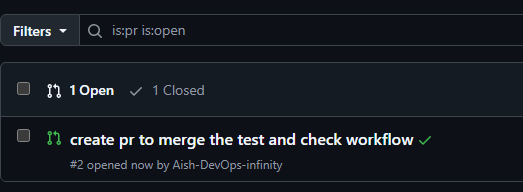
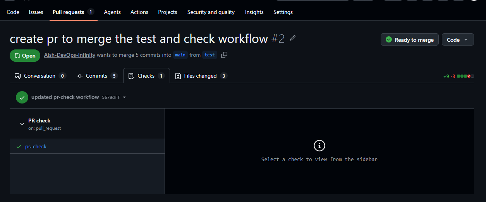
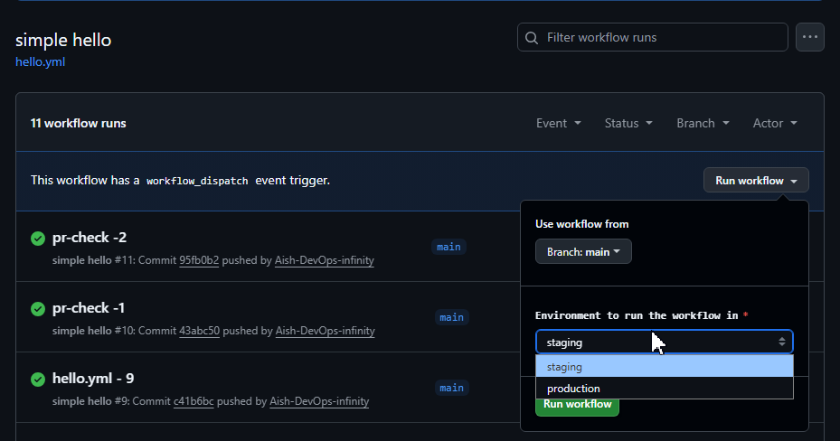
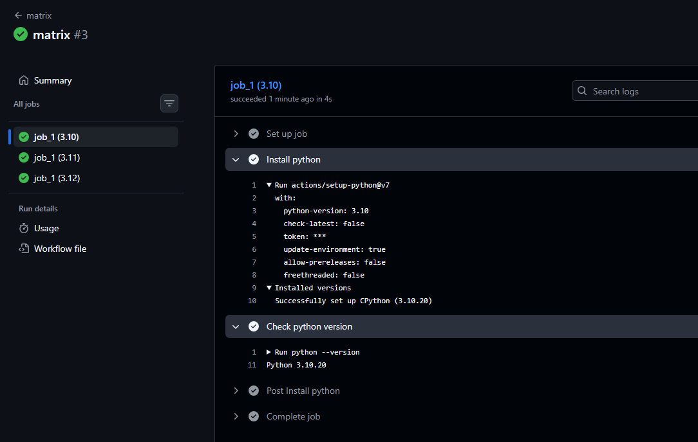
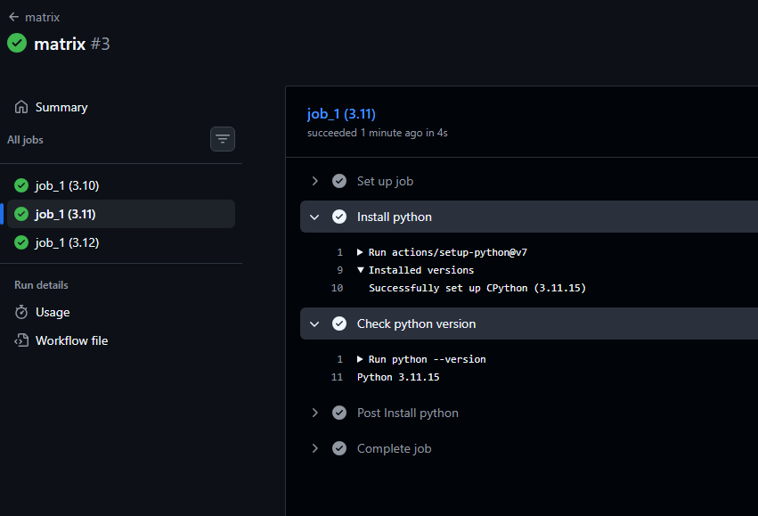
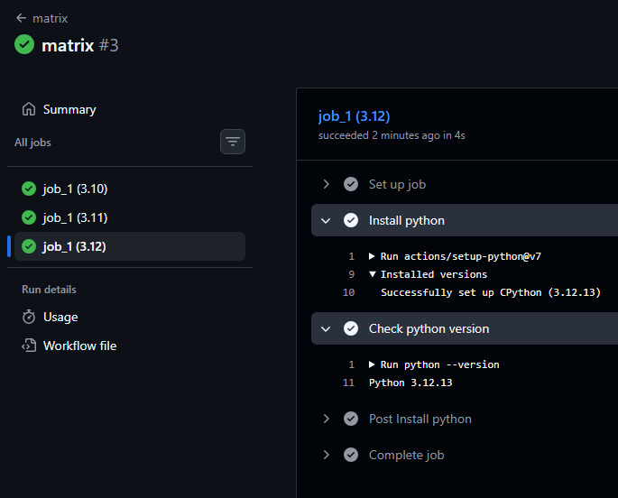
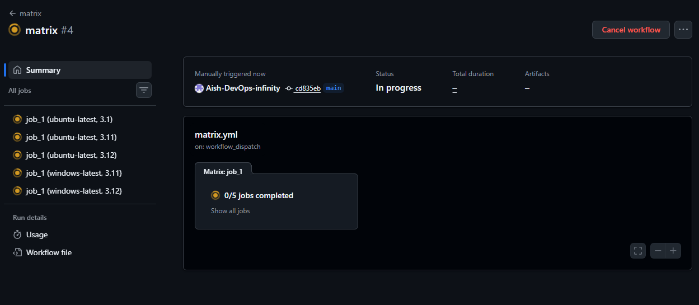
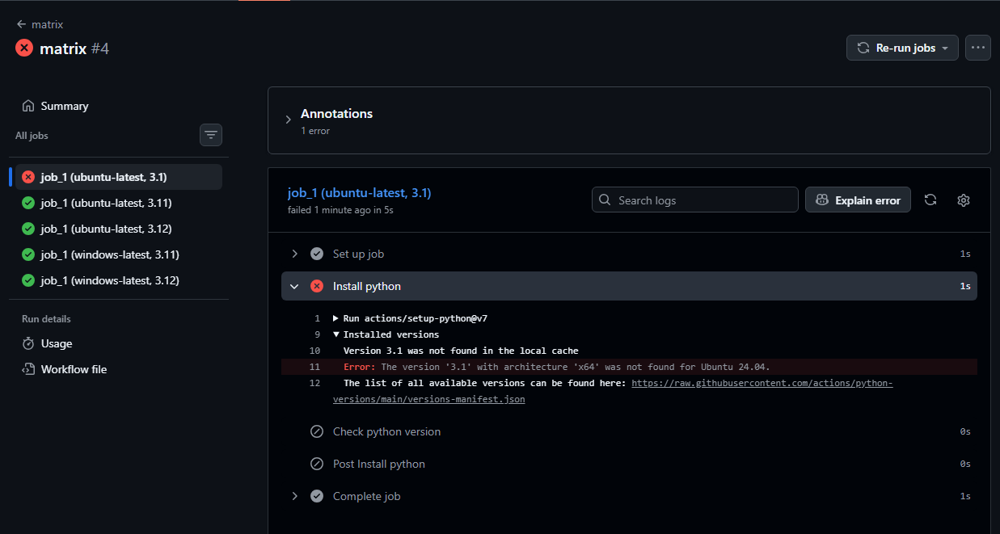
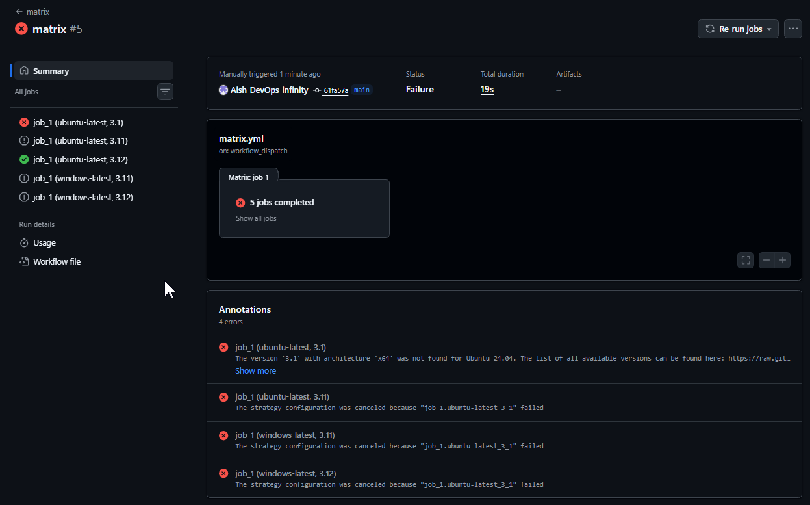

# Day 41 – Triggers & Matrix Builds

## Challenge Tasks

### Task 1: Trigger on Pull Request
1. Create `.github/workflows/pr-check.yml`
2. Trigger it only when a pull request is **opened or updated** against `main`
3. Add a step that prints: `PR check running for branch: <branch name>`
4. Create a new branch, push a commit, and open a PR
5. Watch the workflow run automatically

```yml
name: PR check
on: 
  pull_request:
    types: [opened, edited, synchronize, reopened]
    branches: [main]

jobs:
  ps-check:
    runs-on: ubuntu-latest
    - name: check branch
      run: echo "PR check running for branch ${{ github.ref_name }}"
  
```

**Verify:** Does it show up on the PR page?



```
 echo "PR check running for branch 2/merge"
  shell: /usr/bin/bash -e {0}
PR check running for branch 2/merge
```

refs/remotes/pull/2/merge: GitHub automatically creates this hidden reference for Pull Request #2. It represents the simulated result of merging your PR branch into the target branch (e.g., main)

---

### Task 2: Scheduled Trigger
1. Add a `schedule:` trigger to any workflow using cron syntax
2. Set it to run every day at midnight UTC
3. Write in your notes: What is the cron expression for every Monday at 9 AM?

```bash
*  *  *  *  *  /path/to/command
│  │  │  │  │
│  │  │  │  └─── Day of the week (0 - 6) (0 is Sunday, 6 is Saturday)
│  │  │  ─────── Month (1 - 12)
│  │  ────────── Day of the month (1 - 31)
│  ───────────── Hour (0 - 23)
└──────────────── Minute (0 - 59)

0 9 * * 1 -> every Monday at 9 AM
0 0 * * * -> every day at midnight UTC
```
```yml
on:
  schedule:
  - cron: '0 9 * * 1' # Runs every Monday at 9:00 AM UTC
  - cron: '6 18 * * 2' # Runs every Tuesday at 6:06 PM UTC

```
---

### Task 3: Manual Trigger
1. Create `.github/workflows/manual.yml` with a `workflow_dispatch:` trigger
2. Add an **input** that asks for an `environment` name (staging/production)
3. Print the input value in a step
4. Go to the **Actions** tab → find the workflow → click **Run workflow**

**Verify:** Can you trigger it manually and see your input printed?



```yml
on:
    Workflow_dispatch:
       inputs:
         environment:
           description: 'Environment to run the workflow in'
           required: true
           type: choice 
           options:
             - staging
             - production
```

---

### Task 4: Matrix Builds
Create `.github/workflows/matrix.yml` that:
1. Uses a matrix strategy to run the same job across:
   - Python versions: `3.10`, `3.11`, `3.12`
2. Each job installs Python and prints the version
3. Watch all 3 run in parallel

Then extend the matrix to also include 2 operating systems — how many total jobs run now?

```yml
jobs:
  job_1:
    runs-on: ubuntu-latest
    strategy:
      matrix:
        py_version: ["3.10", "3.11", "3.12"]
    steps:
    - name: Install python
      uses: actions/setup-python@v7
      with:
        python-version: ${{ matrix.py_version }}
      
    - name: Check python version
      run: python --version
```





---

### Task 5: Exclude & Fail-Fast
1. In your matrix, **exclude** one specific combination (e.g., Python 3.10 on Windows)
2. Set `fail-fast: false` — trigger a failure in one job and observe what happens to the rest
3. Write in your notes: What does `fail-fast: true` (the default) do vs `false`?

```yml
obs:
  job_1:
    runs-on: ${{ matrix.os }}
    strategy:
      fail-fast: true
      matrix:
        os: [ubuntu-latest, windows-latest]
        py_version: [3.10, 3.11, 3.12]
        exclude:
        - os: windows-latest
          py_version: 3.10
```



When fail fast is set to false the other jobs run, even if one fails.


When fail fast set to true, the jobs were cancelled because one job failed. Since the execution starts parallelly, one job previous to failed was succeeded. But other cancelled so the execution does not continue.



