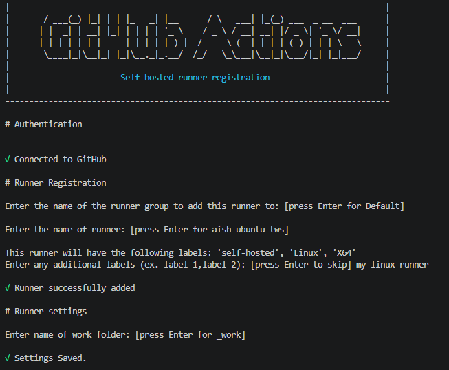
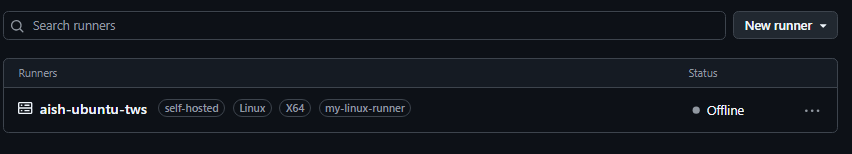
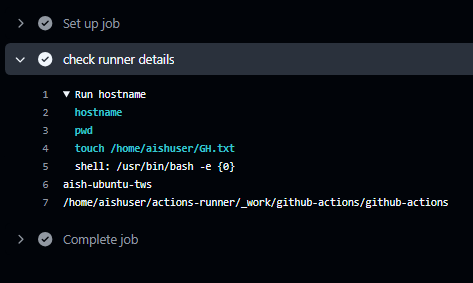

# Day 42 – Runners: GitHub-Hosted & Self-Hosted

## Challenge Tasks

### Task 1: GitHub-Hosted Runners
1. Create a workflow with 3 jobs, each on a different OS:
   - `ubuntu-latest`
   - `windows-latest`
   - `macos-latest`
2. In each job, print:
   - The OS name
   - The runner's hostname
   - The current user running the job
3. Watch all 3 run in parallel

Write in your notes: What is a GitHub-hosted runner? Who manages it?
> Runner provided by Github which is managed by Github in their infra. We dont have access to it and cannot modify it's hardware configuration.

```yml
name: check hosted runner
on:
    workflow_dispatch:

jobs:
    job:
        runs-on: ${{ matrix.os }}
        strategy:
            matrix:
                os: [ubuntu-latest, windows-latest, macos-latest]

        steps:
        - name: check runner details
          run: |
            cat etc/os-release | grep NAME
            hostname
            whoami
```
---

### Task 2: Explore What's Pre-installed
1. On the `ubuntu-latest` runner, run a step that prints:
   - Docker version
   - Python version
   - Node version
   - Git version
2. Look up the GitHub docs for the full list of pre-installed software on `ubuntu-latest`

Write in your notes: Why does it matter that runners come with tools pre-installed?

---

### Task 3: Set Up a Self-Hosted Runner
1. Go to your GitHub repo → Settings → Actions → Runners → **New self-hosted runner**
2. Choose Linux as the OS
3. Follow the instructions to download and configure the runner on:
   - Your local machine, OR
   - A cloud VM (EC2, Utho, or any VPS)
4. Start the runner — verify it shows as **Idle** in GitHub

**Verify:** Your runner appears in the Runners list with a green dot.




```bash
We need to install the svc.sh to start teh agent servcie
Usage:
./svc.sh [install, start, stop, status, uninstall]

aishuser@aish-ubuntu-tws:~/actions-runner$ sudo ./svc.sh status

not installed

aishuser@aish-ubuntu-tws:~/actions-runner$ sudo ./svc.sh install
Creating launch runner in /etc/systemd/system/actions.runner.Aish-DevOps-Org.aish-ubuntu-tws.service
Run as user: aishuser
Run as uid: 1000
gid: 1000
Created symlink /etc/systemd/system/multi-user.target.wants/actions.runner.Aish-DevOps-Org.aish-ubuntu-tws.service → /etc/systemd/system/actions.runner.Aish-DevOps-Org.aish-ubuntu-tws.service.

aishuser@aish-ubuntu-tws:~/actions-runner$ sudo ./svc.sh start

/etc/systemd/system/actions.runner.Aish-DevOps-Org.aish-ubuntu-tws.service
● actions.runner.Aish-DevOps-Org.aish-ubuntu-tws.service - GitHub Actions Runner (Aish-DevOps-Org.aish-ubuntu-tws)
     Loaded: loaded (/etc/systemd/system/actions.runner.Aish-DevOps-Org.aish-ubuntu-tws.service; enabled; preset: enabled)
     Active: active (running) since Thu 2026-08-13 16:20:34 UTC; 10ms ago
   Main PID: 4562 ((unsvc.sh))
      Tasks: 1 (limit: 4599)
     Memory: 1.7M (peak: 1.7M)
        CPU: 6ms
     CGroup: /system.slice/actions.runner.Aish-DevOps-Org.aish-ubuntu-tws.service
             └─4562 "(unsvc.sh)"
```


---

### Task 4: Use Your Self-Hosted Runner
1. Create `.github/workflows/self-hosted.yml`
2. Set `runs-on: self-hosted`
3. Add steps that:
   - Print the hostname of the machine (it should be YOUR machine/VM)
   - Print the working directory
   - Create a file and verify it exists on your machine after the run
4. Trigger it and watch it run on your own hardware

**Verify:** Check your machine — is the file there?



```bash
aishuser@aish-ubuntu-tws:~$ ls -lrta GH.txt 
-rw-r--r-- 1 aishuser aishuser 0 Aug 13 16:29 GH.txt
```

---

### Task 5: Labels
1. Add a **label** to your self-hosted runner (e.g., `my-linux-runner`)
2. Update your workflow to use `runs-on: [self-hosted, my-linux-runner]`
3. Trigger it — does it still pick up the job?

Write in your notes: Why are labels useful when you have multiple self-hosted runners?

> It picked the job.
When we have multiple agents, we can add label to use those labels in the pipeline for choosing specific agent to run the workflow.

---

### Task 6: GitHub-Hosted vs Self-Hosted
Fill this in your notes:

| | GitHub-Hosted | Self-Hosted |
|---|---|---|
| Who manages it? | github | User |
| Cost | [pricing](https://docs.github.com/en/billing/reference/actions-runner-pricing) | Free |
| Pre-installed tools | Yes | Whatever we  installed in our VM |
| Good for | Best for standard web projects, open-source repositories, fast setups, and teams that want to avoid infrastructure upkeep | Best for heavy builds needing custom hardware, tight compliance/privacy needs, or jobs requiring access to internal private networks |
| Security concern | provide built-in security through a defense-in-depth, zero-trust approach.  isolated and ephemeral per job | shift security responsibility entirely to you, requiring management of network, infrastructure, images, containers, and caches |
