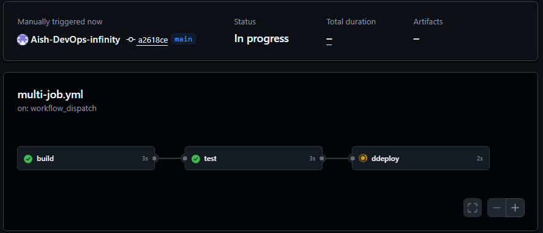
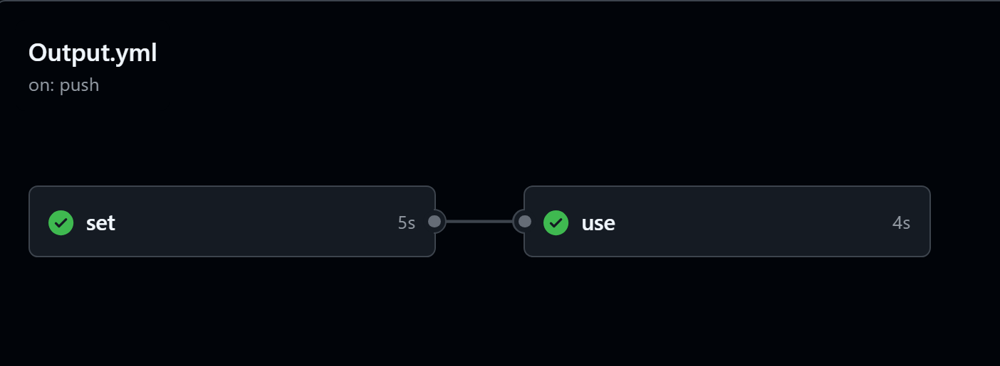
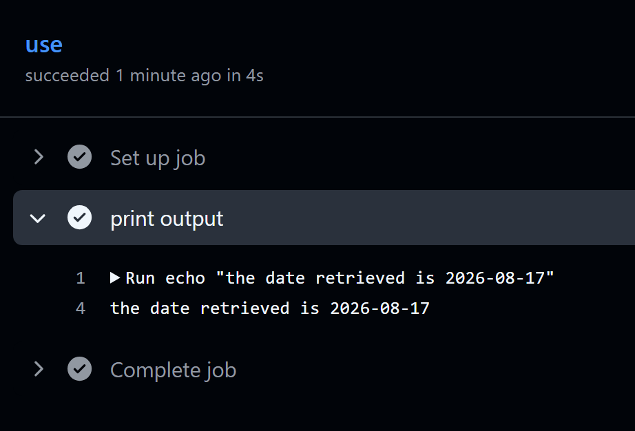
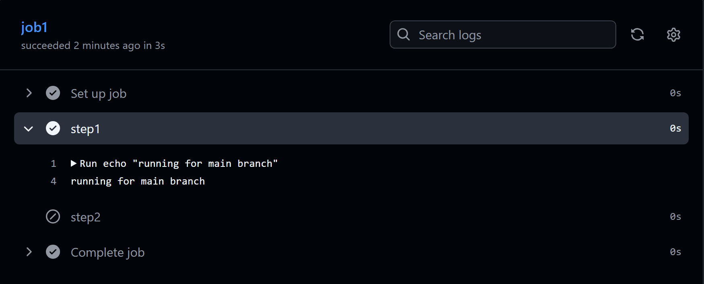
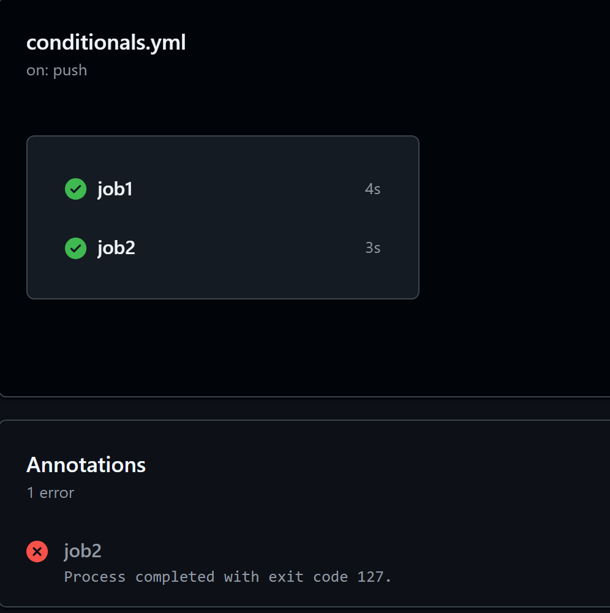
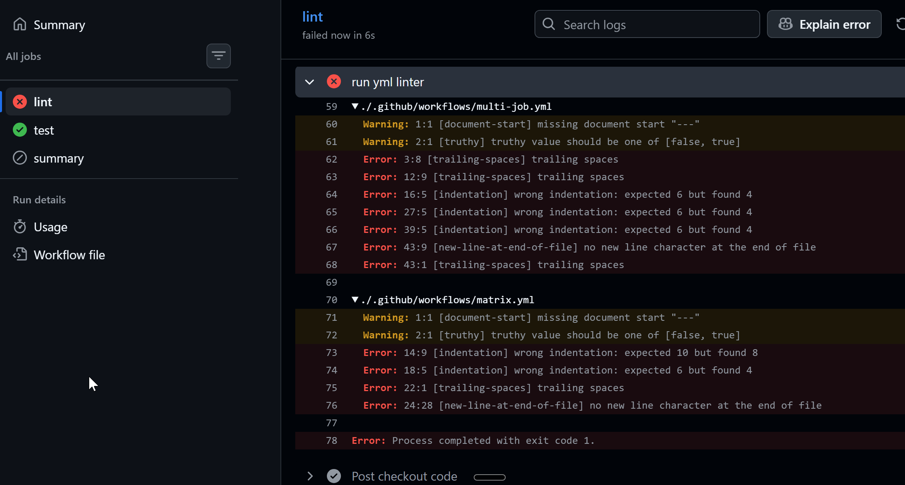

# Day 43 – Jobs, Steps, Env Vars & Conditionals

## Challenge Tasks

### Task 1: Multi-Job Workflow
Create `.github/workflows/multi-job.yml` with 3 jobs:
- `build` — prints "Building the app"
- `test` — prints "Running tests"
- `deploy` — prints "Deploying"

Make `test` run only **after** `build` succeeds.
Make `deploy` run only **after** `test` succeeds.

**Verify:** Check the workflow graph in the Actions tab — does it show the dependency chain?
> Needs: Use jobs.<job_id>.needs to identify any jobs that must complete successfully before this job will run. It can be a string or array of strings. If a job fails or is skipped, all jobs that need it are skipped unless the jobs use a conditional expression that causes the job to continue. 



```bash
Pipeline log shows:

Run echo "Building the app"
Building the app

Run echo "Running tests"
Running tests

Run echo "Deploying"
Deploying
```

---

### Task 2: Environment Variables
In a new workflow, use environment variables at 3 levels:
1. **Workflow level** — `APP_NAME: myapp`
2. **Job level** — `ENVIRONMENT: staging`
3. **Step level** — `VERSION: 1.0.0`

Print all three in a single step and verify each is accessible.

Then use a **GitHub context variable** — print the commit SHA and the actor (who triggered the run).

```yml
name: multi job workflow
on:
  push: 
    branches: main
    paths: "**/multi-job.yml"
env:
  APP_NAME: 'myapp'

jobs:
  build:
    runs-on: my-linux-runner
    env: 
      ENVIRONMENT: 'staging'

    steps:
    - name: print
      env:
        VERSION: '1.0.0'
      run: |
        echo "Workflow level env is $APP_NAME"
        echo "Job level env is $ENVIRONMENT"
        echo "step level env is $VERSION"

    test:
    runs-on: my-linux-runner
    needs: build
    steps:
    - name: print
      run: |
        echo "Running tests"
        echo "Workflow level env is $APP_NAME"
        echo "SHA ${{github.sha}}"
        echo "actor ${{github.actor}}"
```

It is accessible -
> Run echo "Workflow level env is $APP_NAME"\
Workflow level env is myapp\
Job level env is staging\
step level env is 1.0.0

Github context var output
> Run echo "Running tests"\
Running tests\
Workflow level env is myapp\
SHA 938aa8fdcc6fac82a8af557795f3c15a98573fa5\
actor Aish-DevOps-infinity

---

### Task 3: Job Outputs
1. Create a job that **sets an output** — e.g., today's date as a string
2. Create a second job that **reads that output** and prints it
3. Pass the value using `outputs:` and `needs.<job>.outputs.<name>`

Write in your notes: Why would you pass outputs between jobs?
> When we are running something and the output has some metadata which needs to be consumed by other job then we can pass the outputs.

> steps.<id>.outputs uses the step ID, not the step name




```yml
jobs:
    set:
      runs-on: ubuntu-latest
      outputs: 
        output1: ${{ steps.setup_output.outputs.today }}
      steps:
      - name: setup_output
        id: setup_output
        run: |
          # Calculate the date string
          DATE_STR=$(date +'%Y-%m-%d')
          
          # Write to the GITHUB_OUTPUT environment file
          echo "today=$DATE_STR" >> $GITHUB_OUTPUT

    use:
      runs-on: ubuntu-latest
      needs: set
      steps:
      - name: print output
        run: echo "the date retrieved is ${{ needs.set.outputs.output1 }}"
```

---

### Task 4: Conditionals
In a workflow, add:
1. A step that only runs when the branch is `main`
2. A step that only runs when the previous step **failed**
3. A job that only runs on **push** events, not on pull requests
4. A step with `continue-on-error: true` — what does this do?
> GitHub Actions marks the step as failed, but allows the job to continue and treats the job as successful

```yaml
jobs:
  job1:
    runs-on: ubuntu-latest
    steps:
    - name: step1     # step that only runs when the branch is `main`
      if: ${{ github.ref_name == 'main' }}
      run: echo "running for main branch"
    - name: step2     # step that only runs when the previous step **failed**
      if: failure()
      run: echo "running because step1 failed"
    
    
  job2:         # job that only runs on **push** events, not on pull requests
    runs-on: ubuntu-latest
    if: ${{ github.event_name == 'push' }}
    steps:
    - name: step3       # step with `continue-on-error: true`
      continue-on-error: true
      run: hostnames
```



```yml
job2:         # job that only runs on **push** events, not on pull requests
    runs-on: ubuntu-latest
    if: ${{ github.event_name == 'push' }}
    steps:
    - name: step3       # step with `continue-on-error: true`
      continue-on-error: false
      run: hostnames
    - name: step2     # step that only runs when the previous step **failed**
      if: failure()
      run: echo "running because step3 failed"
```

This now fails the step 3 and the job but step 2 runs because step 3 failed.
If we set continue-on-error: true in step 3 then step2 gets skipped because step3 is considered successful.

---

### Task 5: Putting It Together
Create `.github/workflows/smart-pipeline.yml` that:
1. Triggers on push to any branch
2. Has a `lint` job and a `test` job running in parallel
3. Has a `summary` job that runs after both, prints whether it's a `main` branch push or a feature branch push, and prints the commit message

```yaml
name: smart workflow
on:
  push: 

jobs:
  lint:
    runs-on: ubuntu-latest
    steps:
    - name: checkout code
      uses: actions/checkout@v4
    - name: run yml linter
      run: yamllint .


  test:
    runs-on: ubuntu-latest
    steps:
    - name: print branch
      run: echo "This push is from ${{github.ref_name}}"


  summary:
    runs-on: ubuntu-latest
    needs: [lint, test]
    steps:
    - name: print brnach and sha
      run: echo "This push is from ${{github.ref_name}} and the commit is ${{github.sha}}"

```

