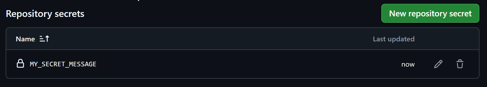
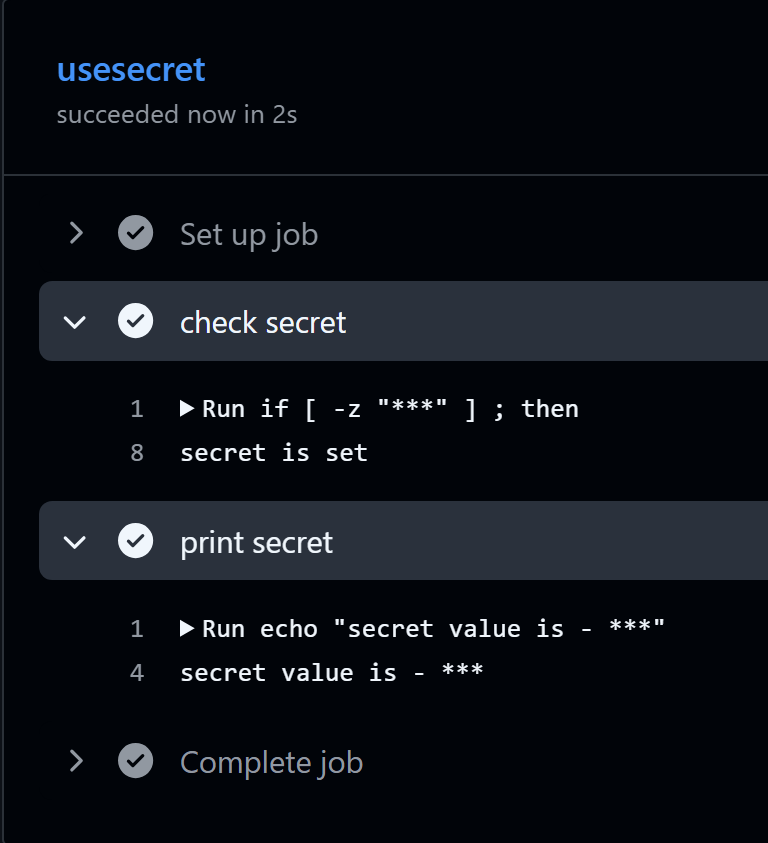
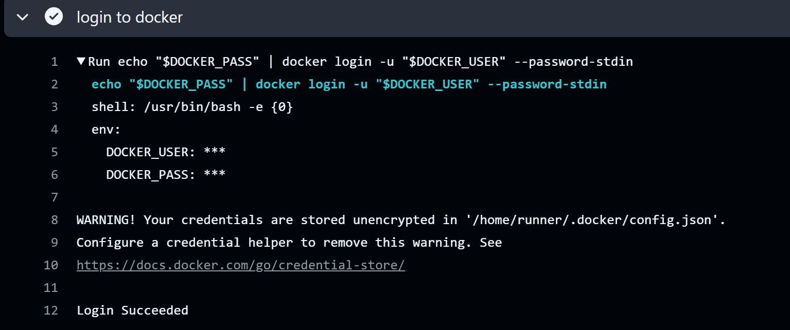
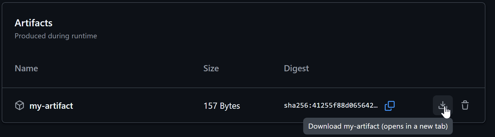
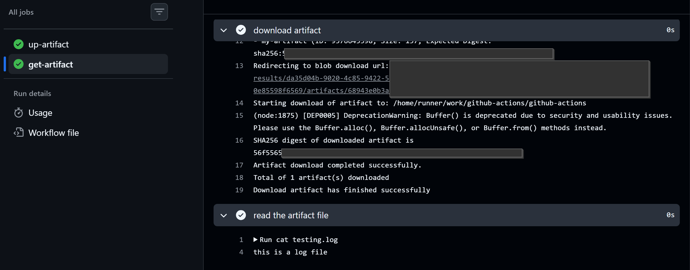
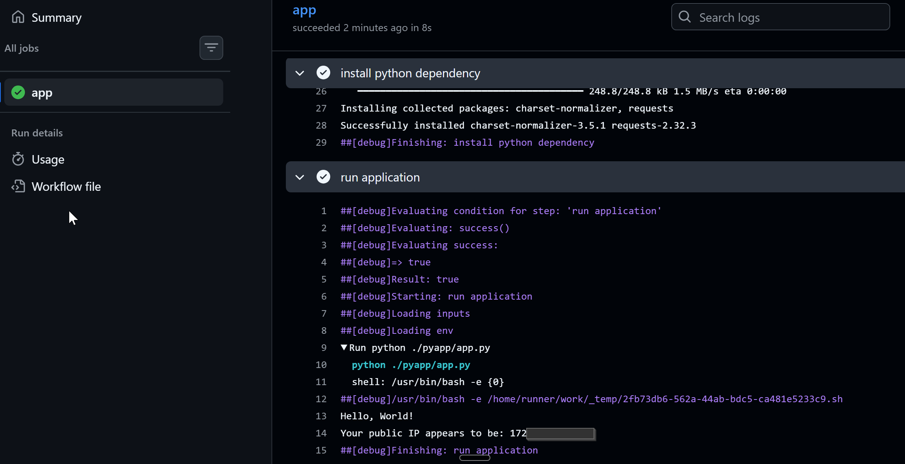
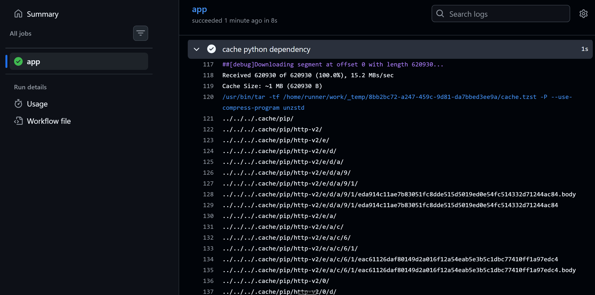
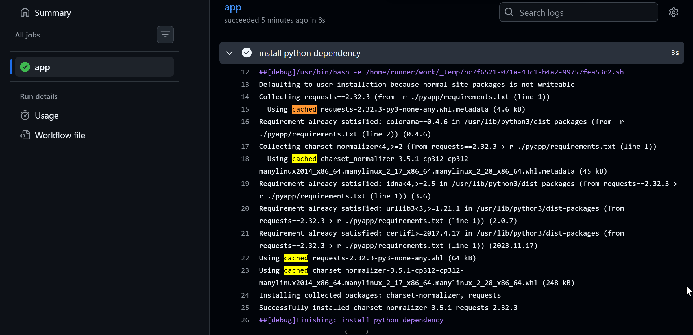
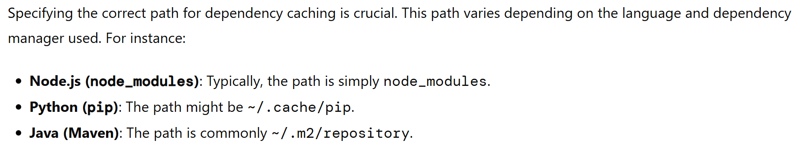

## Challenge Tasks

### Task 1: GitHub Secrets
1. Go to your repo → Settings → Secrets and Variables → Actions
2. Create a secret called `MY_SECRET_MESSAGE`
3. Create a workflow that reads it and prints: `The secret is set: true` (never print the actual value)
4. Try to print `${{ secrets.MY_SECRET_MESSAGE }}` directly — what does GitHub show?

Write in your notes: Why should you never print secrets in CI logs?

```yml
jobs:
  usesecret:
    runs-on: ubuntu-latest
    steps:
    - name: check secret
      run: |
        if [ -z "${{secrets.MY_SECRET_MESSAGE}}" ] ; then
          echo "secret is empty"
        else 
          echo "secret is set"
        fi
      
    - name: print secret
      run: echo "secret value is - ${{secrets.MY_SECRET_MESSAGE}}"
```



Github masks the secret value as it is sensitive information and if we call it by mistake then it can be exposed in the log and the secret can be compromised. So github masks it but we should also avoid printing it.

---

### Task 2: Use Secrets as Environment Variables
1. Pass a secret to a step as an environment variable
2. Use it in a shell command without ever hardcoding it
3. Add `DOCKER_USERNAME` and `DOCKER_TOKEN` as secrets (you'll need these on Day 45)

```yml
jobs:
  usesecret:
    runs-on: ubuntu-latest
    env:
      DOCKER_USER: ${{secrets.DOCKER_USERNAME}}
      DOCKER_PASS: ${{secrets.DOCKER_TOKEN}}
    steps:
    - name: login to docker
      run: |
        echo "$DOCKER_PASS" | docker login -u "$DOCKER_USER" --password-stdin

```


> To remove the WARNING -> To Remove the unencrypted credentials immediately use\
          docker logout

We can also ignore the warning as Docker writes a Base64-encoded string of token and the runners are ephermal so the files will be desroyed once the job is completed.

**Note:**
Do not use the -p or --password flag directly with an environment variable (e.g., docker login -u $USER -p $PASS). Using the flag exposes your plaintext password in your shell history files and makes it visible to other users via system process listings (such as the ps command). The --password-stdin flag prevents this exposure

---

### Task 3: Upload Artifacts
1. Create a step that generates a file — e.g., a test report or a log file
2. Use `actions/upload-artifact` to save it
3. After the workflow runs, download the artifact from the Actions tab

```yml
jobs:
  usesecret:
    runs-on: ubuntu-latest
    steps:
    - name: Checkout repository
      uses: actions/checkout@v6
    - name: generate a log file
      run: echo "this is a log file" >> testing.log
    - name: upload the artifact
      uses: actions/upload-artifact@v4
      with:
        name: my-artifact
        path: testing.log

```
**Verify:** Can you see and download it from GitHub?



---

### Task 4: Download Artifacts Between Jobs
1. Job 1: generate a file and upload it as an artifact
2. Job 2: download the artifact from Job 1 and use it (print its contents)

```yaml
get-artifact: 
    runs-on: ubuntu-latest
    needs: up-artifact
    steps: 
      - name: download artifact
        uses: actions/download-artifact@v5
        with:
          name: my-artifact
      - name: read the artifact file
        run: cat testing.log
```


Write in your notes: When would you use artifacts in a real pipeline?
> We will build our application which will create an artifact which needs to be deployed. Then this upload and download will be helpful via workflow.

---

### Task 5: Run Real Tests in CI
Take any script from your earlier days (Python or Shell) and run it in CI:
1. Add your script to the `github-actions-practice` repo
2. Write a workflow that:
   - Checks out the code
   - Installs any dependencies needed
   - Runs the script
   - Fails the pipeline if the script exits with a non-zero code
3. Intentionally break the script — verify the pipeline goes red
4. Fix it — verify it goes green again

```yml
jobs:
  app:
    runs-on: ubuntu-latest
    steps:
    - name: checkout code
      uses: actions/checkout@v5
    - name: install python dependency
      run: |
        pip install -r ./pyapp/requirements.txt
    - name: run application
      run: python ./pyapp/app.py
```


---

### Task 6: Caching
1. Add `actions/cache` to a workflow that installs dependencies
2. Run it twice — observe the time difference
3. Write in your notes: What is being cached and where is it stored?

```yml
steps:
    - name: checkout code
      uses: actions/checkout@v5
    - name: cache python dependency
      uses: actions/cache@v3
      with:
        path: ~/.cache/pip
        key: ${{ runner.os }}-pip-${{ hashFiles('**/requirements.txt') }}
        restore-keys: |
          ${{ runner.os }}-pip-
    - name: install python dependency
      run: |
        pip install -r ./pyapp/requirements.txt
    - name: run application
      run: python ./pyapp/app.py
```

On run1
```txt
Run actions/cache@v3
  with:
    path: ~/.cache/pip
    key: Linux-pip-5f8d89be13c61d1e6ad89ce58055d2427eedba331c890774f95565c54ff4d7f3
    restore-keys: Linux-pip-
  
    enableCrossOsArchive: false
    fail-on-cache-miss: false
    lookup-only: false
Cache not found for input keys: Linux-pip-5f8d89be13c61d1e6ad89ce58055d2427eedba331c890774f95565c54ff4d7f3, Linux-pip-
##[debug]Node Action run completed with exit code 0
##[debug]Save intra-action state CACHE_KEY = Linux-pip-5f8d89be13c61d1e6ad89ce58055d2427eedba331c890774f95565c54ff4d7f3
##[debug]Finishing: cache python dependency
```

And the install dependency step - downloaded all the required packages.

On Run 2
```txt
Run actions/cache@v3
  with:
    path: ~/.cache/pip
    key: Linux-pip-5f8d89be13c61d1e6ad89ce58055d2427eedba331c890774f95565c54ff4d7f3
    restore-keys: Linux-pip-
  
    enableCrossOsArchive: false
    fail-on-cache-miss: false
    lookup-only: false
##[debug]  "matched_key": "Linux-pip-5f8d89be13c61d1e6ad89ce58055d2427eedba331c890774f95565c54ff4d7f3"
##[debug]}
Cache hit for: Linux-pip-5f8d89be13c61d1e6ad89ce58055d2427eedba331c890774f95565c54ff4d7f3

Cache restored successfully
Cache restored from key: Linux-pip-5f8d89be13c61d1e6ad89ce58055d2427eedba331c890774f95565c54ff4d7f3
```


The install dependency task did not download the packages again instead it used it from the cache.


> Write in your notes: What is being cached and where is it stored?

**What:** We mention which folder to store under path like 
  with:
    path: ~/.cache/pip

~/.cache/pip stores downloaded Python package archives and wheel files on your local system or GitHub Actions runner


**Where:**
GitHub Cloud Storage: The cache is uploaded and stored in a secure, central cloud service managed directly by GitHub. It does not stay on the ephemeral runner machine after the job ends. GitHub provides up to 10 GB of total cache space per repository. Data is automatically deleted after 7 days of inactivity if it hasn't been accessed.