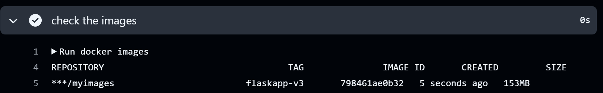
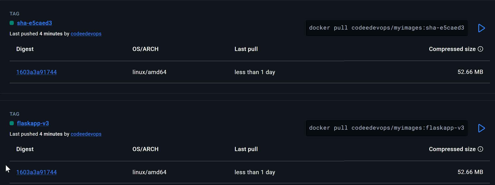
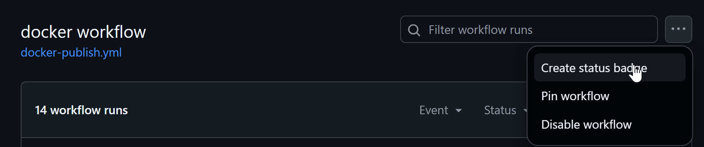
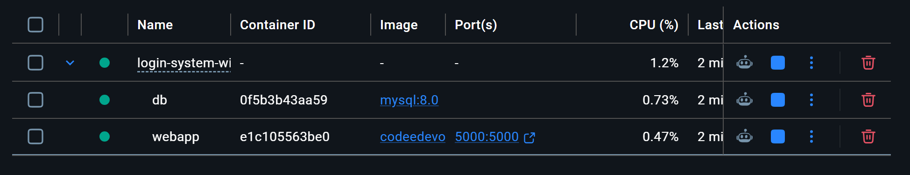
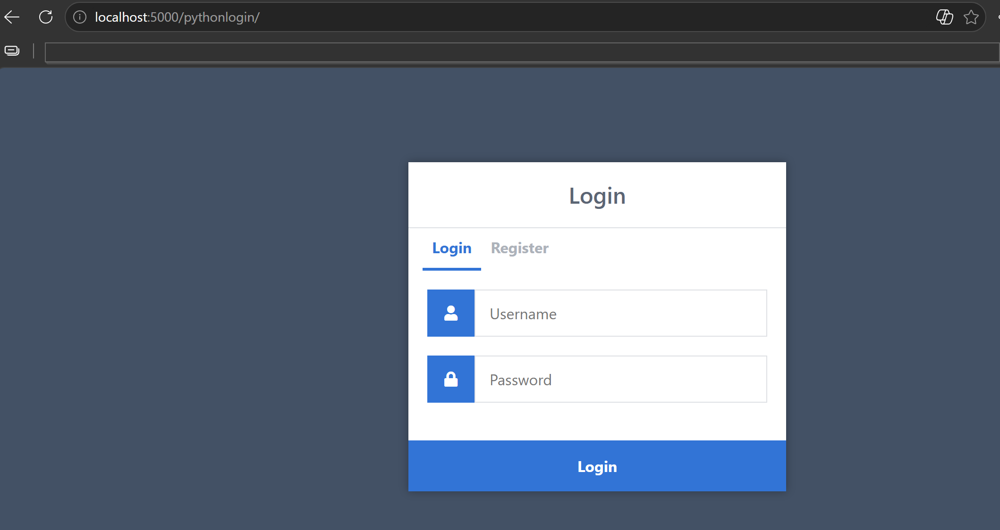

# Day 45 – Docker Build & Push in GitHub Actions

## Challenge Tasks

### Task 1: Prepare
1. Use the app you Dockerized on Day 36 (or any simple Dockerfile)
2. Add the Dockerfile to your `github-actions-practice` repo (or create a minimal one)
3. Make sure `DOCKER_USERNAME` and `DOCKER_TOKEN` secrets are set from Day 44

---

### Task 2: Build the Docker Image in CI
Create `.github/workflows/docker-publish.yml` that:
1. Triggers on push to `main`
2. Checks out the code
3. Builds the Docker image and tags it

**Verify:** Check the build step logs — does the image build successfully?

> To build and tag a Docker image in GitHub Actions without pushing it to a registry, you must explicitly set **push: false** and use **load: true** in the official docker/build-push-action.\
The load: true parameter is the critical component; it instructs BuildKit to export the finished image back to the local Docker daemon storage on the runner so it can be used in subsequent workflow steps

```yml
docker:
    runs-on: ubuntu-latest
    steps:
    # 1. Fetch your code from the repository
    - name: checkout code
      uses: actions/checkout@v5
    
    # 2. Create and boot the BuildKit builder instance
    - name: Set up Docker Buildx
      uses: docker/setup-buildx-action@v3
    
    # 3. Build and push docker image
    - name: build docker image
      uses: docker/build-push-action@v5
      with:
        file: ./Login-System-with-Python-Flask-and-MySQL-master/Dockerfile
        push: false
        load: true          
        tags: ${{secrets.DOCKER_USERNAME}}/myimages:flaskapp-v3
    
    # 4. verify the local image exists
    - name: check the images
      run: docker images
```


---

### Task 3: Push to Docker Hub
Add steps to:
1. Log in to Docker Hub using your secrets
2. Tag the image as `username/repo:latest` and also `username/repo:sha-<short-commit-hash>`
3. Push both tags

**Verify:** Go to Docker Hub — is your image there with both tags?

```yml
# 3. Authenticate to your container registry - dockerhub
    - name: Login to Docker Hub
      uses: docker/login-action@v4
      with:
        username: ${{ vars.DOCKER_USER }}
        password: ${{ secrets.DOCKER_TOKEN }}
# 4. shorten the commit sha
    - name: cut the sha
      run: |
        echo "SHORT_SHA=${GITHUB_SHA:0:7}" >> $GITHUB_ENV

# 5. Build and push docker image
    - name: build docker image
      uses: docker/build-push-action@v5
      with:
        file: ./Login-System-with-Python-Flask-and-MySQL-master/Dockerfile
        push: true
        tags: |
          ${{vars.DOCKER_USER}}/myimages:flaskapp-v3
          ${{vars.DOCKER_USER}}/myimages:sha-${{env.SHORT_SHA}}
```


---

### Task 4: Only Push on Main
Add a condition so the push step only runs on the `main` branch — not on feature branches or PRs.

Test it: push to a feature branch and verify the image is built but NOT pushed.

```yml
- name: build docker image
      uses: docker/build-push-action@v5
      with:
        file: ./Login-System-with-Python-Flask-and-MySQL-master/Dockerfile
       # Pushes ONLY if the current branch is 'main'
        push: ${{ github.ref_name == 'main' }}
        tags: |
          ${{vars.DOCKER_USER}}/myimages:sha-${{env.SHORT_SHA}}
```
It did not push for feature1 trigger.

---

### Task 5: Add a Status Badge
1. Get the badge URL for your `docker-publish` workflow from the Actions tab
2. Add it to your `README.md`
3. Push — the badge should show green



[](https://github.com/Aish-DevOps-Org/github-actions/actions/workflows/docker-publish.yml)

---

### Task 6: Pull and Run It
1. On your local machine (or a cloud server), pull the image you just pushed
2. Run it
3. Confirm it works





Write in your notes: What is the full journey from `git push` to a running container?
1. Checkout the code
2. Docker Login
3. Setup buildx
4. Docker build and push

