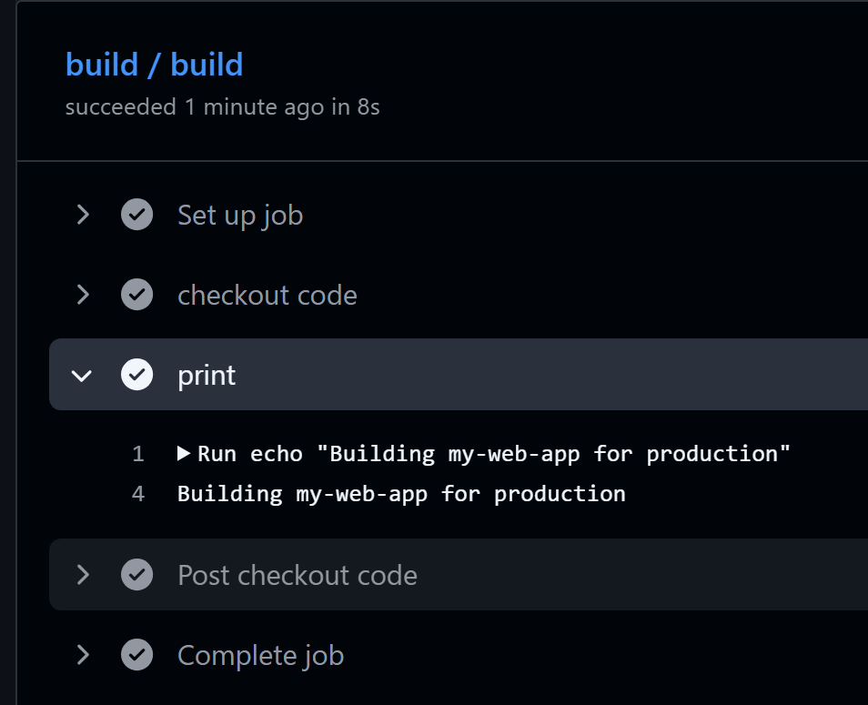
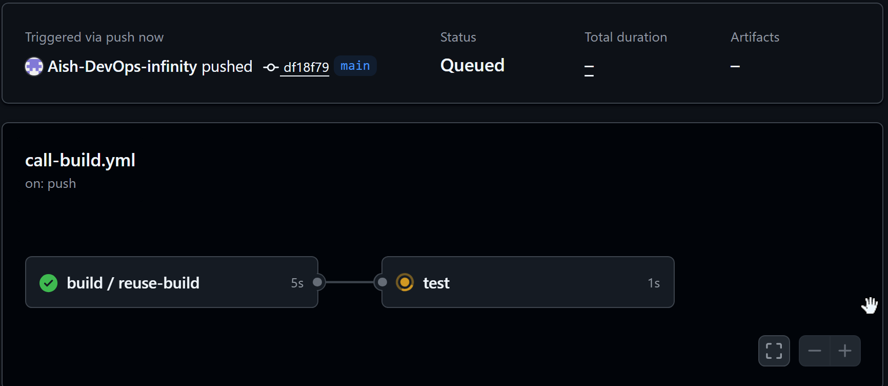
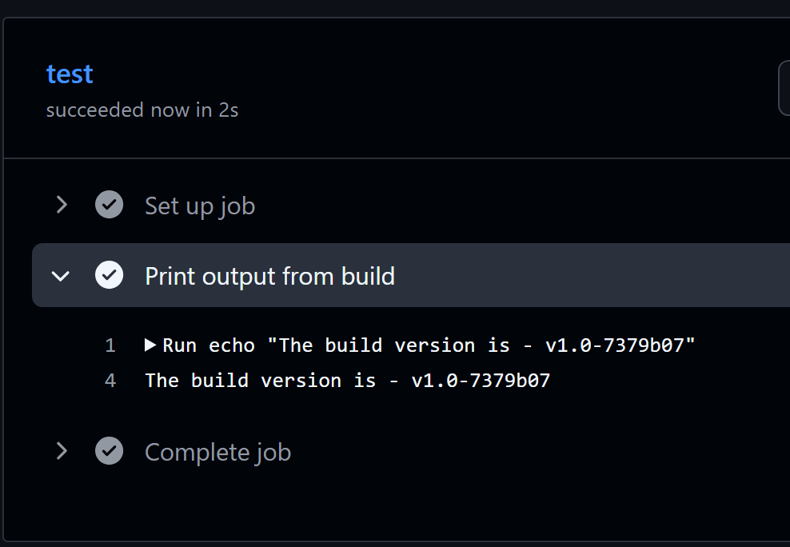

# Day 46 – Reusable Workflows & Composite Actions

## Challenge Tasks

### Task 1: Understand `workflow_call`
Before writing any code, research and answer in your notes:
1. What is a **reusable workflow**?
> Use on.workflow_call to define the inputs and outputs for a reusable workflow. You can also map the secrets that are available to the called workflow. \
**Reusable workflow:** we can create a standard workflow which we can use multiple times by just calling it in other workflows. 

2. What is the `workflow_call` trigger?
> Workflow 1 can call other workflows by using this trigger.

3. How is calling a reusable workflow different from using a regular action (`uses:`)?
> With uses we define one action, with reusable workflow we have set of actions like a template which can be called mutltiple times.

4. Where must a reusable workflow file live?
> Reusable workflows are YAML-formatted files, very similar to any other workflow file. As with other workflow files, you locate reusable workflows in the .github/workflows directory of a repository. Subdirectories of the workflows directory are not supported.

---

### Task 2: Create Your First Reusable Workflow
Create `.github/workflows/reusable-build.yml`:
1. Set the trigger to `workflow_call`
2. Add an `inputs:` section with:
   - `app_name` (string, required)
   - `environment` (string, required, default: `staging`)
3. Add a `secrets:` section with:
   - `docker_token` (required)
4. Create a job that:
   - Checks out the code
   - Prints `Building <app_name> for <environment>`
   - Prints `Docker token is set: true` (never print the actual secret)

**Verify:** This file alone won't run — it needs a caller. That's next.

```yml
name: reusable-flow
on: 
  workflow_call:
    inputs:
      app-name:
        required: true
        type: string
      environment:
        required: true
        default: 'staging'
        type: string
    secrets:
      docker_token:
        required: true
        default: ${{secrets.DOCKER_TOKEN}}

jobs:
  build:
    runs-on: ubuntu-latest
    steps:
    - name: checkout code
      uses: actions/checkout@v4
    - name: print
      run: echo "Building ${{inputs.app-name}} for ${{inputs.environment}}"
```

---

### Task 3: Create a Caller Workflow
Create `.github/workflows/call-build.yml`:
1. Trigger on push to `main`
2. Add a job that uses your reusable workflow:
   ```yaml
   jobs:
     build:
       uses: ./.github/workflows/reusable-build.yml
       with:
         app_name: "my-web-app"
         environment: "production"
       secrets:
         docker_token: ${{ secrets.DOCKER_TOKEN }}
   ```
3. Push to `main` and watch it run

**Verify:** In the Actions tab, do you see the caller triggering the reusable workflow? Click into the job — can you see the inputs printed?


---

### Task 4: Add Outputs to the Reusable Workflow
Extend `reusable-build.yml`:
1. Add an `outputs:` section that exposes a `build_version` value
2. Inside the job, generate a version string (e.g., `v1.0-<short-sha>`) and set it as output
3. In your caller workflow, add a second job that:
   - Depends on the build job (`needs:`)
   - Reads and prints the `build_version` output

```yml
Reusable-flow
name: reusable-flow
on: 
  workflow_call:
    inputs:
      app-name:
        required: true
        type: string
      environment:
        required: true
        default: 'staging'
        type: string
    secrets:
      docker_token:
        required: true
    outputs:
      build_version: 
        value: ${{ jobs.reuse-build.outputs.build_version }}

jobs:
  reuse-build:
    runs-on: ubuntu-latest
    outputs:
      build_version: ${{ steps.build_ver.outputs.build_version }}
    steps:
    - name: checkout code
      uses: actions/checkout@v4
    - name: print
      run: echo "Building ${{inputs.app-name}} for ${{inputs.environment}}"
    - name: cut sha
      run: |
        echo "SHORT_SHA=${GITHUB_SHA:0:7}" >> $GITHUB_ENV
    - name: set output value
      id: build_ver
      run:  echo "build_version=v1.0-${{ env.SHORT_SHA }}" >> $GITHUB_OUTPUT

Caller flow
  test:
    runs-on: ubuntu-latest              # printing output from reusable build job
    needs: build
    steps:
    - name: Print output from build
      run: echo "The build version is - ${{ needs.build.outputs.build_version }}"
```

**Verify:** Does the second job print the version from the reusable workflow?




**Note:**\
$GITHUB_ENV: variables written to $GITHUB_ENV are only available to subsequent steps, not within the same step.

workflow_call.outputs: Reusable workflow outputs require workflow_call.outputs. Even if the job output is correctly set, a reusable workflow must explicitly expose it via on.workflow_call.outputs.

---

### Task 5: Create a Composite Action
Create a **custom composite action** in your repo at `.github/actions/setup-and-greet/action.yml`:
1. Define inputs: `name` and `language` (default: `en`)
2. Add steps that:
   - Print a greeting in the specified language
   - Print the current date and runner OS
   - Set an output called `greeted` with value `true`
3. Use the composite action in a new workflow with `uses: ./.github/actions/setup-and-greet`

**Verify:** Does your custom action run and print the greeting?

---

### Task 6: Reusable Workflow vs Composite Action
Fill this in your notes:

| | Reusable Workflow | Composite Action |
|---|---|---|
| Triggered by | `workflow_call` | `uses:` in a step |
| What is it |  An entire workflow file (.yml) triggered by another workflow using on: workflow_call | A collection of steps bundled together into a single custom action (action.yml).|
| Choose |when you want to share a massive block of logic containing multiple jobs, distinct runner OS requirements, or native secrets management across repositories. | when you want to wrap a few sequential steps (like setting up a specific cloud CLI, building a docker image, or running internal tests) into a single reusable line inside an existing job |
| Can contain jobs? | Yes | No |
| Can contain multiple steps? | Yes | Yes |
| Lives where? | .github/workflows In a different YAML file. Runs as an entire job or set of jobs | ./.github/actions. Runs inside a step within an existing job. |
| Can accept secrets directly? | Can natively access and receive secrets. | Cannot access GitHub secrets directly. |
| Best for | Orchestrating complete, independent CI/CD pipelines, managing multi-job builds, or running tasks on different runner types. | Grouping repetitive shell commands, setting up specific environment tools, or keeping main workflow files clean and short. |
| Limitations |  You cannot add extra steps to a job that calls a reusable workflow; the call takes over the entire job block. |  Every run command inside a composite action needs an explicit shell definition, and inputs are strictly handled as strings |