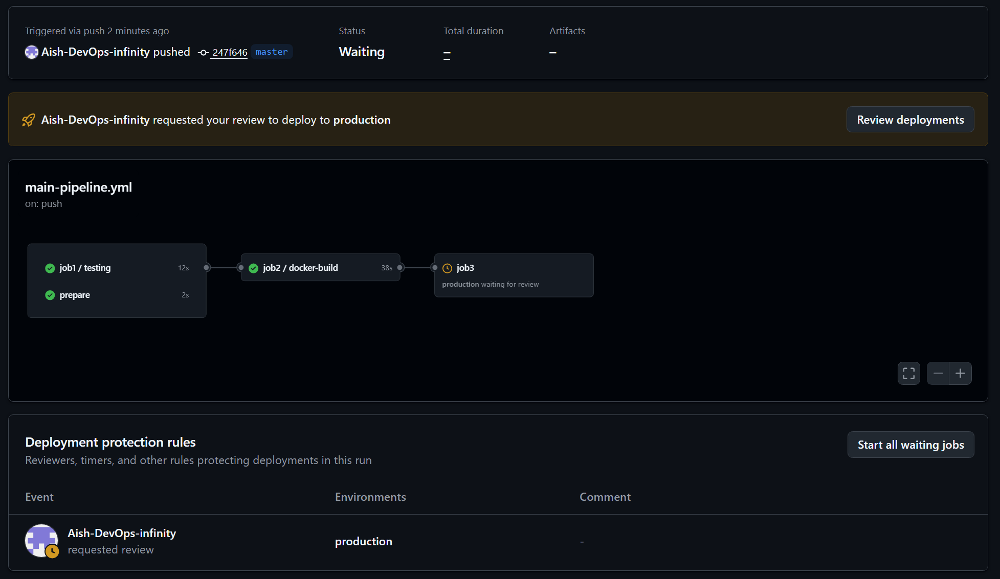
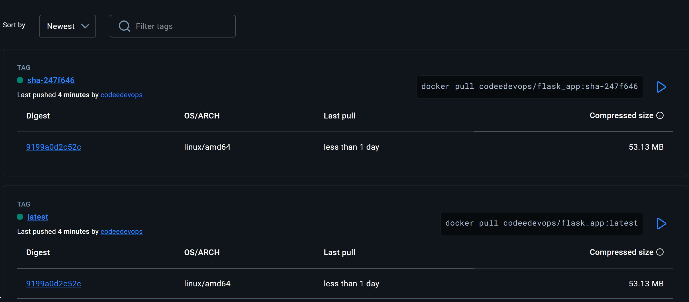
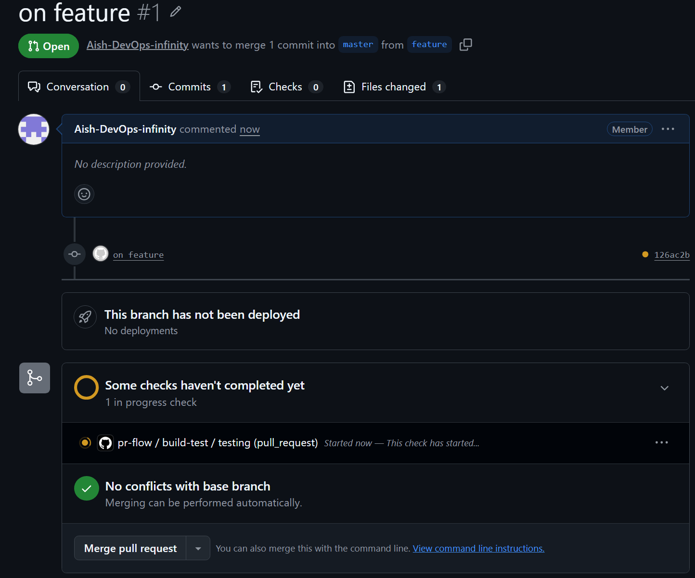
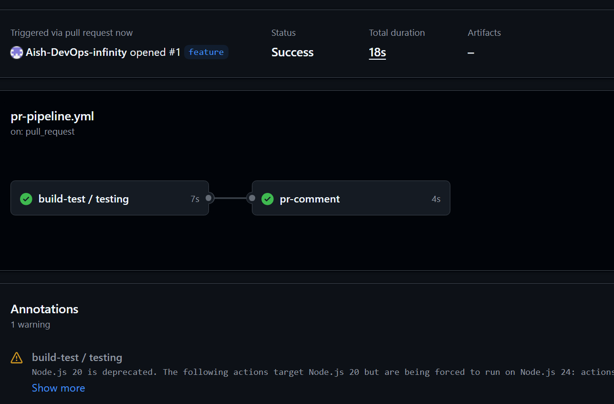
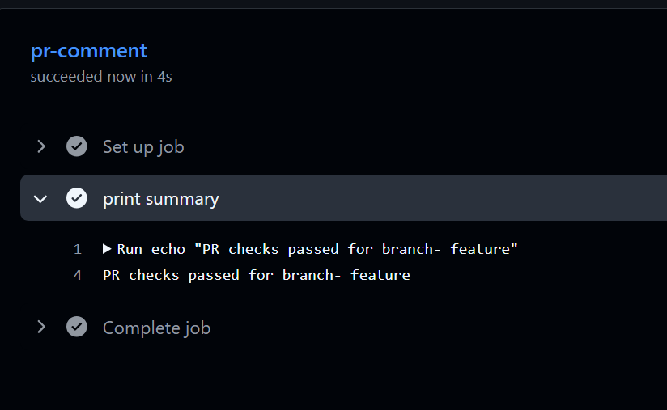
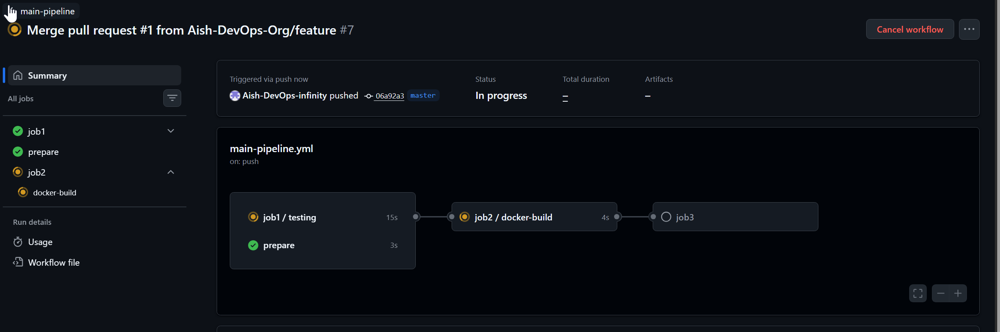
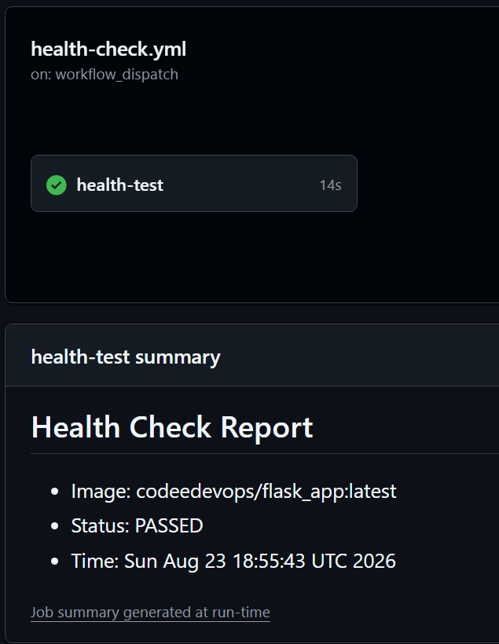
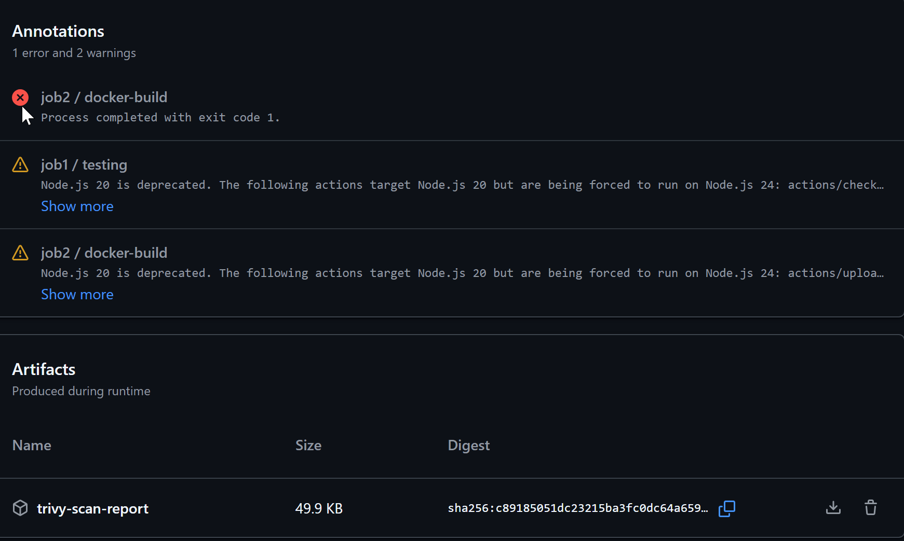

# Day 48 – GitHub Actions Project: End-to-End CI/CD Pipeline

## Challenge Tasks

**Status badge:**

[](https://github.com/Aish-DevOps-Org/Login-System-with-Python-Flask-and-MySQL/actions/workflows/main-pipeline.yml)

[](https://github.com/Aish-DevOps-Org/Login-System-with-Python-Flask-and-MySQL/actions/workflows/pr-pipeline.yml)

[](https://github.com/Aish-DevOps-Org/Login-System-with-Python-Flask-and-MySQL/actions/workflows/health-check.yml)

### Task 1: Set Up the Project Repo
1. Create a new repo called `github-actions-capstone` (or use your existing `github-actions-practice`)
2. Add a simple app — pick any one:
   - A Python Flask/FastAPI app with one endpoint
   - A Node.js Express app with one endpoint
   - Your Dockerized app from Day 36
3. Add a `Dockerfile` and a basic test (even a script that curls the health endpoint counts)
4. Add a `README.md` with a project description

[](https://github.com/Aish-DevOps-Org/Login-System-with-Python-Flask-and-MySQL/actions/workflows/main-pipeline.yml)




---

### Task 2: Reusable Workflow — Build & Test
Create `.github/workflows/reusable-build-test.yml`:
1. Trigger: `workflow_call`
2. Inputs: `python_version` (or `node_version`), `run_tests` (boolean, default: true)
3. Steps:
   - Check out code
   - Set up the language runtime
   - Install dependencies
   - Run tests (only if `run_tests` is true)
   - Set output: `test_result` with value `passed` or `failed`

This workflow does NOT deploy — it only builds and tests.

```yml
name: build-test
on:
  workflow_call:
    inputs:
      python_version:
        required: true
        type: string
      run_tests:
        type: boolean
        default: true
    outputs:
      test_result:
        value: ${{ jobs.testing.outputs.test_result }}


jobs:
  testing:
    runs-on: ubuntu-latest
    outputs:
      test_result: ${{ steps.set-result.outputs.test_result }}
    steps:
    # 1. Checkout the code
    - name: checkout code
      uses: actions/checkout@v4
    # 2. Setup python runtime version
    - name: Set up Python
      uses: actions/setup-python@v5
      with:
        python-version: ${{ inputs.python_version }}
    # 3. Install application dependecies
    - name: Install app dependencies
      run: |
        python -m pip install --upgrade pip
        pip install -r ./requirements.txt
    # 4. Run tests only in run_tests is true
    - name: Run Unittest discovery
      id: exec-tests
      if: inputs.run_tests 
      # Executes unittest discovery and captures the exit code
      run: |
        if python -m unittest discover; then
          echo "status=passed" >> $GITHUB_OUTPUT
        else
          echo "status=failed" >> $GITHUB_OUTPUT
        fi
    # 5. Get final test_result as output
    - name: Set final output
      id: set-result
      if: always()
      run: |
        RESULT=${{ steps.exec-tests.output.status }}
        if [ -z "$RESULT" ]; then
          RESULT="skipped"
        fi

        echo "test_result=$RESULT" >> $GITHUB_OUTPUT

```

---

### Task 3: Reusable Workflow — Docker Build & Push
Create `.github/workflows/reusable-docker.yml`:
1. Trigger: `workflow_call`
2. Inputs: `image_name` (string), `tag` (string)
3. Secrets: `docker_username`, `docker_token`
4. Steps:
   - Check out code
   - Log in to Docker Hub
   - Build and push the image with the given tag
   - Set output: `image_url` with the full image path

```yml
name: docker build
on:
  workflow_call:
    inputs:
      image_name:
        type: string
        required: true
      tags:
        type: string
        required: true
      DOCKER_USER:
        type: string
        default: ${{ vars.DOCKER_USER }}
    secrets:
      DOCKER_TOKEN:
        required: true
    outputs:
      image_url:
        value: ${{ jobs.docker-build.outputs.image_url }}

jobs:
  docker-build:
    runs-on: ubuntu-latest
    outputs: 
      image_url: ${{ steps.set-output.outputs.image_url }}
    steps:
    # 1. Fetch your code from the repository
    - name: checkout code
      uses: actions/checkout@v5
    
    # 2. Create and boot the BuildKit builder instance
    - name: Set up Docker Buildx
      uses: docker/setup-buildx-action@v3

    # 3. Authenticate to your container registry - dockerhub
    - name: Login to Docker Hub
      uses: docker/login-action@v4
      with:
        username: ${{ inputs.DOCKER_USER }}
        password: ${{ secrets.DOCKER_TOKEN }}

    # 4. Build and push docker image
    - name: build docker image
      id: docker-push
      uses: docker/build-push-action@v5
      with:
        context: .
       # Pushes to docker hub
        push: true
        tags: |
          ${{ inputs.tags }}
    
    # 5. Set image URL
    - name: Set image URL output
      id: set-output
      run: |
        echo "image_url=${{ vars.DOCKER_USER }}/${{ inputs.image_name }}:latest" >> $GITHUB_OUTPUT
          
```

---

### Task 4: PR Pipeline
Create `.github/workflows/pr-pipeline.yml`:
1. Trigger: `pull_request` to `main` (types: `opened`, `synchronize`)
2. Call the reusable build-test workflow:
   - Run tests: `true`
3. Add a standalone job `pr-comment` that:
   - Runs after the build-test job
   - Prints a summary: "PR checks passed for branch: `<branch>`"
4. Do **NOT** build or push Docker images on PRs

**Verify:** Open a PR — does it run tests only (no Docker push)?





```yml
name: pr-flow
on:
  pull_request:
    branches: master
    types: 
    - opened
    - synchronize

jobs:
  build-test:
    uses: ./.github/workflows/reusable-build-test.yml
    with:
      python_version: '3.12'
      run_tests: true

  pr-comment:
    needs: build-test
    runs-on: ubuntu-latest
    steps:
    - name: print summary
      run: echo "PR checks passed for branch- ${{ github.head_ref }}"

```

---

### Task 5: Main Branch Pipeline
Create `.github/workflows/main-pipeline.yml`:
1. Trigger: `push` to `main`
2. Job 1: Call the reusable build-test workflow
3. Job 2 (depends on Job 1): Call the reusable Docker workflow
   - Tag: `latest` and `sha-<short-commit-hash>`
4. Job 3 (depends on Job 2): `deploy` job that:
   - Prints "Deploying image: `<image_url>` to production"
   - Uses `environment: production` (set this up in repo Settings → Environments)
   - Requires manual approval if you've set up environment protection rules

**Verify:** Merge a PR to `main` — does it run tests → build Docker → deploy in sequence?



```yml
name: main-pipeline
on:
  push:
    branches: [master]

jobs: 
  job1:
    uses: ./.github/workflows/reusable-build-test.yml
    with:
      python_version: '3.12'
      run_tests: true

  prepare:
    runs-on: ubuntu-latest
    outputs:
      short_sha: ${{ steps.sha.outputs.short_sha }}
    steps:
      - id: sha
        run: echo "short_sha=${GITHUB_SHA::7}" >> $GITHUB_OUTPUT

  job2:
    needs: [job1, prepare]
    uses: ./.github/workflows/reusable-docker.yml
    with:
      image_name: flask_app
      tags: |
        ${{ vars.DOCKER_USER }}/flask_app:latest
        ${{ vars.DOCKER_USER }}/flask_app:sha-${{ needs.prepare.outputs.short_sha }}
    secrets:
      DOCKER_TOKEN: ${{ secrets.DOCKER_TOKEN }}

  job3:
    needs: job2
    runs-on: ubuntu-latest
    # Reference the repo settings environment here
    environment: production
    steps:
    - name: print image url
      run: echo "Deploying image - ${{ needs.job2.outputs.image_url }} to production"
      
```
---

### Task 6: Scheduled Health Check
Create `.github/workflows/health-check.yml`:
1. Trigger: `schedule` with cron `'0 */12 * * *'` (every 12 hours) + `workflow_dispatch` for manual testing
2. Steps:
   - Pull your latest Docker image
   - Run the container in detached mode
   - Wait 5 seconds, then curl the health endpoint
   - Print pass/fail based on the response
   - Stop and remove the container
3. Add a step that creates a summary using `$GITHUB_STEP_SUMMARY`:
   ```bash
   echo "## Health Check Report" >> $GITHUB_STEP_SUMMARY
   echo "- Image: myapp:latest" >> $GITHUB_STEP_SUMMARY
   echo "- Status: PASSED" >> $GITHUB_STEP_SUMMARY
   echo "- Time: $(date)" >> $GITHUB_STEP_SUMMARY
   ```

```yml
name: health-check

on:
  workflow_dispatch:

  schedule:
    - cron: '0 */12 * * *'

jobs:
  health-test:
    runs-on: ubuntu-latest

    steps:
      - name: Login to Docker Hub
        uses: docker/login-action@v3
        with:
          username: ${{ vars.DOCKER_USER }}
          password: ${{ secrets.DOCKER_TOKEN }}

      - name: Run health check
        run: |
          IMAGE="${{ vars.DOCKER_USER }}/flask_app:latest"

          echo "pulling docker image"
          docker pull "$IMAGE"

          echo "Running docker container"
          docker run -d --name flask_app -p 5000:5000 "$IMAGE"
          docker ps flask_app

          echo "wait 5s"
          sleep 5s

          echo "check the health"
          if curl -f http://localhost:5000; then
            echo "Health check PASSED"
            echo "STATUS=PASSED" >> $GITHUB_ENV
          else
            echo "Health check FAILED"
            echo "STATUS=FAILED" >> $GITHUB_ENV
            exit 1
          fi

      - name: Cleanup
        if: always()
        run: |
          docker stop flask_app || true
          docker rm flask_app || true

      - name: Create Summary
        if: always()
        run: |
          echo "## Health Check Report" >> $GITHUB_STEP_SUMMARY
          echo "- Image: ${{ vars.DOCKER_USER }}/flask_app:latest" >> $GITHUB_STEP_SUMMARY
          echo "- Status: $STATUS" >> $GITHUB_STEP_SUMMARY
          echo "- Time: $(date)" >> $GITHUB_STEP_SUMMARY
```


---

### Task 7: Add Badges & Documentation
1. Add status badges for all your workflows to the repo `README.md`
2. Add a **pipeline architecture diagram** in your notes — draw (or describe) the flow:
   ```
   PR opened → build & test → PR checks pass
   Merge to main → build & test → Docker build & push → deploy
   Every 12 hours → health check
   ```


3. Fill in your notes: What would you add next? (Slack notifications? Multi-environment? Rollback?)

---

## Brownie Points: Add Security to Your Pipeline
Want to go above and beyond? Add a **DevSecOps** step to your main pipeline:
1. Add `aquasecurity/trivy-action` after the Docker build step to scan your image for vulnerabilities
2. Fail the pipeline if any **CRITICAL** severity CVE is found
3. Upload the scan report as an artifact

This is a preview of what you'll do in depth on **Day 49**. If you get this working today, you're already thinking like a DevSecOps engineer.

```yml
# 6. Scan image vulnarability
    - name: Trivy scan
      uses: aquasecurity/trivy-action@v0.36.0
      with:
        image-ref: ${{ steps.set-output.outputs.image_url }}
        format: 'json'
        exit-code: '1'                # fails for mentioned severity
        ignore-unfixed: true
        severity: 'CRITICAL,HIGH'     # evaluates critical and high vulnarability
        output: 'trivy-report.json'
    
    # 7. upload the trivy scan report
    - name: upload the trivy report
      uses: actions/upload-artifact@v4
      with:
        name: trivy-scan-report
        path: trivy-report.json
        retention-days: 30

```

---