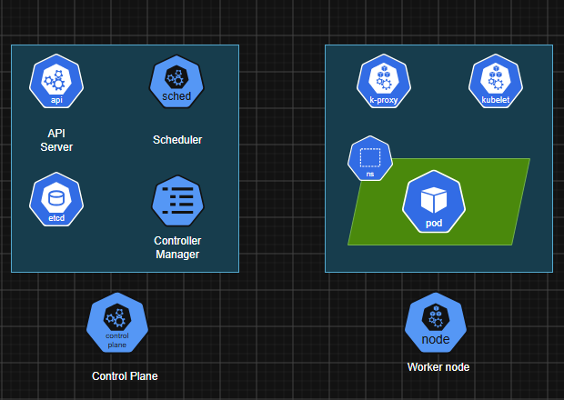
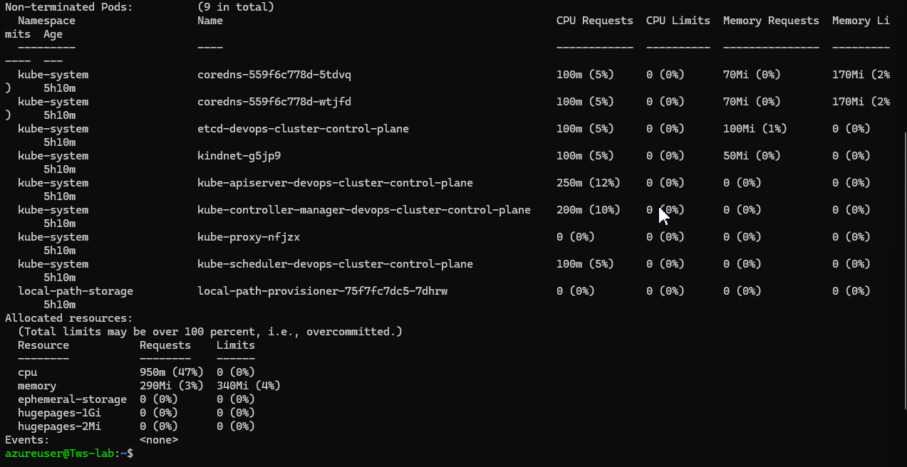

# Day 50 – Kubernetes Architecture and Cluster Setup

### Task 1: Recall the Kubernetes Story
1. Why was Kubernetes created? What problem does it solve that Docker alone cannot?
> Containers are a good way to bundle and run your applications. In a production environment, you need to manage the containers that run the applications and ensure that there is no downtime. For example, if a container goes down, another container needs to start. Wouldn't it be easier if this behavior was handled by a system?\
That's how Kubernetes comes to the rescue! Kubernetes provides you with a framework to run distributed systems resiliently. It takes care of scaling and failover for your application, provides deployment patterns, and more. For example: Kubernetes can easily manage a canary deployment for your system.

2. Who created Kubernetes and what was it inspired by?
> Kubernetes was born at Google, inspired by their internal system Borg, which managed millions of containers across thousands of servers. Google needed a way to:\
Run huge numbers of services reliably\
Automatically heal failures\
Scale up and down fast\
Update applications without downtime\
Efficiently use hardware across large fleets\
Google open-sourced a next-generation version of these ideas in 2014 — this became Kubernetes (K8s).

3. What does the name "Kubernetes" mean?
> "Kubernetes" means helmsman or pilot in Greek — a fitting metaphor for a system that steers containerized applications.

---

### Task 2: Draw the Kubernetes Architecture
From memory, draw or describe the Kubernetes architecture. Your diagram should include:

**Control Plane (Master Node):**
- API Server — the front door to the cluster, every command goes through it
- etcd — the database that stores all cluster state
- Scheduler — decides which node a new pod should run on
- Controller Manager — watches the cluster and makes sure the desired state matches reality

**Worker Node:**
- kubelet — the agent on each node that talks to the API server and manages pods
- kube-proxy — handles networking rules so pods can communicate
- Container Runtime — the engine that actually runs containers (containerd, CRI-O)


After drawing, verify your understanding:
- What happens when you run `kubectl apply -f pod.yaml`? Trace the request through each component.
1. kubectl reads kubeconfig and finds - API server address, credentials, cotext
2. kubectl sends REST API call to Kube API server - Converts YAML into JSON internally
3. Authentication - API server checks who are you using certificate/token/OIDC.
4. Autherization - Checks RBAC
5. Admission Controllers - API Server validates request.
6. Store in etcd - at this moment pod exists as metadata only coz container is not running
7. Scheduler notices pending Pod - Scheduler constantly watches API Server. And when it sees a pod status = pending, it chooses node for that pod. 
Based on -
CPU
Memory
Taints/tolerations
Affinity rules
8. Kubelet on worker node sees assignment - Kubelet watches API Server. And it sees - Run nginx pod
9. Container Runtime pulls image - Kubelet talks to runtime: containerd. Then it pulls image, creates containers, network NS, start process.
10. Pod running - Runtime reports back: container running. kubelet updates API server.

```
kubectl apply
    │
    ▼
Kubeconfig
    │
    ▼
API Server
    │
    ├─ Authentication
    ├─ Authorization
    ├─ Admission Controllers
    │
    ▼
etcd
    │
    ▼
Scheduler
    │
    ▼
Worker Node
    │
    ▼
Kubelet
    │
    ▼
Containerd
    │
    ▼
Container Running
```
- What happens if the API server goes down?
The API Server is the heart of Kubernetes. Everything talks to it
kubectl
sceduler
controller-manager
kubelets
1. Existing pods will continue running as the container runtime is already running.
2. But kubectl commands will fail - unable to connect to server
3. No new deployment works
4. Scheduler stops scheduling
5. Controllers stop reconciling - cannot create replicas
6. kubelet cannot report the status - node becomes notReady

```
API Server Down

Existing Pods        ✅ Continue
New Deployments      ❌ Fail
kubectl commands     ❌ Fail
Scheduling           ❌ Stops
Controllers          ❌ Stops
Cluster changes      ❌ Stops
```
- What happens if a worker node goes down?
1. Kubelet sends heartbeats to API server every few seconds -> stops
2. Control plane detects failure
3. Pods on that node marked unknown or terminating
4. Controller reacts - notices missing replicas if pod is managed by
Deployment
ReplicaSet
StatefulSet

If pod was created standalone then - it is lost forever. Kubernetes does not recreate it.
5. Scheduler picks another node
6. Kubelet starts replacement Pod

### Task 3: Install kubectl
`kubectl` is the CLI tool you will use to talk to your Kubernetes cluster.

Install it:
```bash
# macOS
brew install kubectl

# Linux (amd64)
curl -LO "https://dl.k8s.io/release/$(curl -L -s https://dl.k8s.io/release/stable.txt)/bin/linux/amd64/kubectl"
chmod +x kubectl
sudo mv kubectl /usr/local/bin/

# Windows (with chocolatey)
choco install kubernetes-cli
```

Verify:
```bash
kubectl version --client
```

---

### Task 4: Set Up Your Local Cluster
Choose **one** of the following. Both give you a fully functional Kubernetes cluster on your machine.

**Option A: kind (Kubernetes in Docker)**
```bash
# Install kind
# macOS
brew install kind

# Linux
curl -Lo ./kind https://kind.sigs.k8s.io/dl/latest/kind-linux-amd64
chmod +x ./kind
sudo mv ./kind /usr/local/bin/kind

# Create a cluster
kind create cluster --name devops-cluster

# Verify
kubectl cluster-info
kubectl get nodes
```

**Option B: minikube**
```bash
# Install minikube
# macOS
brew install minikube

# Linux
curl -LO https://storage.googleapis.com/minikube/releases/latest/minikube-linux-amd64
sudo install minikube-linux-amd64 /usr/local/bin/minikube

# Start a cluster
minikube start

# Verify
kubectl cluster-info
kubectl get nodes
```

Write down: Which one did you choose and why?
> K8s in docker using kind

```bash
azureuser@Tws-lab:~$ kubectl cluster-info
Kubernetes control plane is running at https://127.0.0.1:40593
CoreDNS is running at https://127.0.0.1:40593/api/v1/namespaces/kube-system/services/kube-dns:dns/proxy

To further debug and diagnose cluster problems, use 'kubectl cluster-info dump'.
azureuser@Tws-lab:~$ kubectl get nodes
NAME                           STATUS   ROLES           AGE     VERSION
devops-cluster-control-plane   Ready    control-plane   5h10m   v1.37.0
```

---

### Task 5: Explore Your Cluster
Now that your cluster is running, explore it:

```bash
# See cluster info
kubectl cluster-info

# List all nodes
kubectl get nodes

# Get detailed info about your node
kubectl describe node <node-name>

# List all namespaces
kubectl get namespaces
azureuser@Tws-lab:~$ kubectl get namespaces
NAME                 STATUS   AGE
default              Active   5h16m
kube-node-lease      Active   5h16m
kube-public          Active   5h16m
kube-system          Active   5h16m
local-path-storage   Active   5h16m

# See ALL pods running in the cluster (across all namespaces)
kubectl get pods -A
azureuser@Tws-lab:~$ kubectl get pods -A
NAMESPACE            NAME                                                   READY   STATUS    RESTARTS   AGE
kube-system          coredns-559f6c778d-5tdvq                               1/1     Running   0          5h16m
kube-system          coredns-559f6c778d-wtjfd                               1/1     Running   0          5h16m
kube-system          etcd-devops-cluster-control-plane                      1/1     Running   0          5h16m
kube-system          kindnet-g5jp9                                          1/1     Running   0          5h16m
kube-system          kube-apiserver-devops-cluster-control-plane            1/1     Running   0          5h16m
kube-system          kube-controller-manager-devops-cluster-control-plane   1/1     Running   0          5h16m
kube-system          kube-proxy-nfjzx                                       1/1     Running   0          5h16m
kube-system          kube-scheduler-devops-cluster-control-plane            1/1     Running   0          5h16m
local-path-storage   local-path-provisioner-75f7fc7dc5-7dhrw                1/1     Running   0          5h16m
```


Look at the pods running in the `kube-system` namespace:
```bash
kubectl get pods -n kube-system
azureuser@Tws-lab:~$ kubectl get pods -n kube-system
NAME                                                   READY   STATUS    RESTARTS   AGE
coredns-559f6c778d-5tdvq                               1/1     Running   0          5h17m
coredns-559f6c778d-wtjfd                               1/1     Running   0          5h17m
etcd-devops-cluster-control-plane                      1/1     Running   0          5h17m
kindnet-g5jp9                                          1/1     Running   0          5h17m
kube-apiserver-devops-cluster-control-plane            1/1     Running   0          5h17m
kube-controller-manager-devops-cluster-control-plane   1/1     Running   0          5h17m
kube-proxy-nfjzx                                       1/1     Running   0          5h17m
kube-scheduler-devops-cluster-control-plane            1/1     Running   0          5h17m
```

You should see pods like `etcd`, `kube-apiserver`, `kube-scheduler`, `kube-controller-manager`, `coredns`, and `kube-proxy`. These are the architecture components you drew in Task 2 — running as pods inside the cluster.

**Verify:** Can you match each running pod in `kube-system` to a component in your architecture diagram?

---

### Task 6: Practice Cluster Lifecycle
Build muscle memory with cluster operations:

```bash
# Delete your cluster
kind delete cluster --name devops-cluster
# (or: minikube delete)

# Recreate it
kind create cluster --name devops-cluster
# (or: minikube start)

# Verify it is back
kubectl get nodes
```

Try these useful commands:
```bash
# Check which cluster kubectl is connected to
kubectl config current-context
azureuser@Tws-lab:~$ kubectl config current-context
kind-devops-cluster

# List all available contexts (clusters)
kubectl config get-contexts
azureuser@Tws-lab:~$ kubectl config get-contexts
CURRENT   NAME                  CLUSTER               AUTHINFO              NAMESPACE
*         kind-devops-cluster   kind-devops-cluster   kind-devops-cluster

# See the full kubeconfig
kubectl config view
azureuser@Tws-lab:~$ kubectl config view
apiVersion: v1
clusters:
- cluster:
    certificate-authority-data: DATA+OMITTED
    server: https://127.0.0.1:40593
  name: kind-devops-cluster
contexts:
- context:
    cluster: kind-devops-cluster
    user: kind-devops-cluster
  name: kind-devops-cluster
current-context: kind-devops-cluster
kind: Config
users:
- name: kind-devops-cluster
  user:
    client-certificate-data: DATA+OMITTED
    client-key-data: DATA+OMITTED
```

Write down: What is a kubeconfig? Where is it stored on your machine?
```t
A kubeconfig file is the configuration file that tells kubectl:

Which Kubernetes cluster to connect to
Which API server endpoint to use
Which user credentials to use
Which namespace to use by default

Think of it like:

SSH config for Kubernetes.

Default location for kube config 
In Linux/macOS - ~/.kube/config
Windows - C:\Users\<username>\.kube\config
```