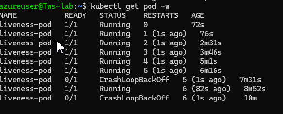

# Day 57 – Resource Requests, Limits, and Probes

### Task 1: Resource Requests and Limits
1. Write a Pod manifest with `resources.requests` (cpu: 100m, memory: 128Mi) and `resources.limits` (cpu: 250m, memory: 256Mi)

```sh
apiVersion: v1
kind: Pod
metadata:
  name: pod-lim
spec:
  containers:
  - name: nginx
    image: nginx:latest
    ports:
    - containerPort: 80
    resources:
      requests:
        memory: "128Mi"
        cpu: "100m"
      limits:
        memory: "256Mi"
        cpu: "250m"
```

2. Apply and inspect with `kubectl describe pod` — look for the Requests, Limits, and QoS Class sections
```sh
Limits:
      cpu:     250m
      memory:  256Mi
Requests:
      cpu:        100m
      memory:     128Mi
QoS Class:    Burstable
```

3. Since requests and limits differ, the QoS class is `Burstable`. If equal, it would be `Guaranteed`. If missing, `BestEffort`.

CPU is in millicores: `100m` = 0.1 CPU. Memory is in mebibytes: `128Mi`.

**Requests** = guaranteed minimum (scheduler uses this for placement). **Limits** = maximum allowed (kubelet enforces at runtime).

**Verify:** What QoS class does your Pod have? -> Burstable

---

### Task 2: OOMKilled — Exceeding Memory Limits
1. Write a Pod manifest using the `polinux/stress` image with a memory limit of `100Mi`
```sh
apiVersion: v1
kind: Pod
metadata:
  name: pod-lim
spec:
  containers:
  - name: polinux
    image: polinux/stress
    command: ["stress", "--vm", "1", "--vm-bytes", "200M", "--vm-hang", "1"]
    resources:
      limit:
        memory: "100Mi"
        cpu: "250m"
```
2. Set the stress command to allocate 200M of memory: `command: ["stress"] args: ["--vm", "1", "--vm-bytes", "200M", "--vm-hang", "1"]`
3. Apply and watch — the container gets killed immediately

```sh
azureuser@Tws-lab:~$ kubectl get po
NAME      READY   STATUS    RESTARTS   AGE
pod-lim   1/1     Running   0          6s
azureuser@Tws-lab:~$ kubectl get po
NAME      READY   STATUS      RESTARTS     AGE
pod-lim   0/1     OOMKilled   1 (9s ago)   14s
```
CPU is throttled when over limit. Memory is killed — no mercy.

Check `kubectl describe pod` for `Reason: OOMKilled` and `Exit Code: 137` (128 + SIGKILL).

**Verify:** What exit code does an OOMKilled container have?
```sh
State:          Terminated
      Reason:       OOMKilled
      Exit Code:    137
      Started:      Fri, 09 Oct 2026 18:45:51 +0000
      Finished:     Fri, 09 Oct 2026 18:45:51 +0000
    Last State:     Terminated
      Reason:       OOMKilled
      Exit Code:    137
      Started:      Fri, 09 Oct 2026 18:45:02 +0000
      Finished:     Fri, 09 Oct 2026 18:45:02 +0000
    Ready:          False
    Restart Count:  4
    Limits:
      cpu:     250m
      memory:  100Mi
    Requests:
      cpu:        250m
      memory:     100Mi

# after some time the staus changed to CrashLoopBackOff
azureuser@Tws-lab:~$ kubectl get po
NAME      READY   STATUS             RESTARTS      AGE
pod-lim   0/1     CrashLoopBackOff   5 (75s ago)   4m14s
State:          Waiting
      Reason:       CrashLoopBackOff
    Last State:     Terminated
      Reason:       OOMKilled
      Exit Code:    137
      Started:      Fri, 09 Oct 2026 18:47:15 +0000
      Finished:     Fri, 09 Oct 2026 18:47:15 +0000
```
---

### Task 3: Pending Pod — Requesting Too Much
1. Write a Pod manifest requesting `cpu: 100` and `memory: 128Gi`
```sh
apiVersion: v1
kind: Pod
metadata:
  name: pod-lim
spec:
  containers:
  - name: polinux
    image: polinux/stress
    command: ["stress", "--vm", "1", "--vm-bytes", "200M", "--vm-hang", "1"]
    resources:
      requests:
        memory: "128Gi"
        cpu: "100"
```
2. Apply and check — STATUS stays `Pending` forever
```sh
azureuser@Tws-lab:~$ kubectl get po
NAME      READY   STATUS    RESTARTS   AGE
pod-lim   0/1     Pending   0          2m50s
```
3. Run `kubectl describe pod` and read the Events — the scheduler says exactly why: insufficient resources

**Verify:** What event message does the scheduler produce?
```sh
Events:
  Type     Reason            Age    From               Message
  ----     ------            ----   ----               -------
  Warning  FailedScheduling  3m57s  default-scheduler  0/1 nodes are available: 1 Insufficient cpu, 1 Insufficient memory. preemption: 0/1 nodes are available: 1 Preemption is not helpful for scheduling
```
---

### Task 4: Liveness Probe
A liveness probe detects stuck containers. If it fails, Kubernetes restarts the container.

1. Write a Pod manifest with a busybox container that creates `/tmp/healthy` on startup, then deletes it after 30 seconds
2. Add a liveness probe using `exec` that runs `cat /tmp/healthy`, with `periodSeconds: 5` and `failureThreshold: 3`
```sh
apiVersion: v1
kind: Pod
metadata:
  name: liveness-pod
spec:
  containers:
  - name: busybox
    image: busybox:1.36
    command:
    - /bin/sh
    - -c
    - |
      touch /tmp/healthy
      sleep 30
      rm -f /tmp/healthy
      sleep 600
    livenessProbe:
      exec:
        command:
        - cat
        - /tmp/healthy
      periodSeconds: 5
      failureThreshold: 3
```
3. After the file is deleted, 3 consecutive failures trigger a restart. Watch with `kubectl get pod -w`

```sh
Events:
  Type     Reason     Age                 From               Message
  ----     ------     ----                ----               -------
  Normal   Scheduled  2m1s                default-scheduler  Successfully assigned default/liveness-pod to devops-cluster-control-plane
  Normal   Pulling    2m                  kubelet            spec.containers{busybox}: Pulling image "busybox:1.36"
  Normal   Pulled     116s                kubelet            spec.containers{busybox}: Successfully pulled image "busybox:1.36" in 4.166s (4.166s including waiting). Image size: 2217006 bytes.
  Normal   Created    45s (x2 over 116s)  kubelet            spec.containers{busybox}: Container created
  Normal   Started    45s (x2 over 116s)  kubelet            spec.containers{busybox}: Container started
  Normal   Pulled     45s                 kubelet            spec.containers{busybox}: Container image "busybox:1.36" already present on machine and can be accessed by the pod
  Warning  Unhealthy  1s (x6 over 86s)    kubelet            spec.containers{busybox}: Liveness probe failed: cat: can't open '/tmp/healthy': No such file or directory
  Normal   Killing    1s (x2 over 76s)    kubelet            spec.containers{busybox}: Container busybox failed liveness probe, will be restarted

azureuser@Tws-lab:~$ kubectl get pod -w
NAME           READY   STATUS    RESTARTS   AGE
liveness-pod   1/1     Running   0          72s
liveness-pod   1/1     Running   1 (1s ago)   76s
liveness-pod   1/1     Running   2 (1s ago)   2m31s
liveness-pod   1/1     Running   3 (1s ago)   3m46s
liveness-pod   1/1     Running   4 (1s ago)   5m1s
liveness-pod   1/1     Running   5 (1s ago)   6m16s
liveness-pod   0/1     CrashLoopBackOff   5 (1s ago)   7m31s

```
**Verify:** How many times has the container restarted? - 5

Every restart recreates /tmp/healthy, but your script always deletes it again after 30 seconds.

After Kubernetes sees repeated container failures/restarts, it starts applying a backoff before restarting the container again. That's why you eventually see: CrashLoopBackOff

CrashLoopBackOff doesn't necessarily mean your BusyBox application itself crashed.

In this case:
The liveness probe is intentionally killing/restarting the container repeatedly.

The RESTARTS value should keep increasing over repeated cycles.
So your exercise actually worked correctly. It's demonstrating exactly what happens when a container continuously becomes unhealthy according to its liveness probe.


---

### Task 5: Readiness Probe
A readiness probe controls traffic. Failure removes the Pod from Service endpoints but does NOT restart it.

1. Write a Pod manifest with nginx and a `readinessProbe` using `httpGet` on path `/` port `80`
```sh
apiVersion: v1
kind: Pod
metadata:
  name: readiness-pod
spec:
  containers:
  - name: nginx
    image: nginx:latest
    ports:
    - name: readiness-port
      containerPort: 80
    readinessProbe:
      httpGet:
        path: /
        port: readinessPort

Created container but it is failing 
  Normal   Started    62s                kubelet            spec.containers{nginx}: Container started
  Warning  Unhealthy  62s (x2 over 62s)  kubelet            spec.containers{nginx}: Readiness probe failed: Get "http://10.244.0.6:80/": dial tcp 10.244.0.6:80: connect: connection refused
```
2. Expose it as a Service: `kubectl expose pod <name> --port=80 --name=readiness-svc`
> this needs label in the pod so added label in pod manifest
labels:
  app: nginx
```sh
azureuser@Tws-lab:~$ kubectl expose pod readiness-pod --port=80 --name=readiness-svc
service/readiness-svc exposed
```
3. Check `kubectl get endpoints readiness-svc` — the Pod IP is listed
```sh
azureuser@Tws-lab:~$ kubectl get endpoints readiness-svc
Warning: v1 Endpoints is deprecated in v1.33+; use discovery.k8s.io/v1 EndpointSlice
NAME            ENDPOINTS       AGE
readiness-svc   10.244.0.7:80   66s

NAME            READY   STATUS             RESTARTS       AGE     IP           NODE                           NOMINATED NODE   READINESS GATES
readiness-pod   1/1     Running            0              2m38s   10.244.0.7   devops-cluster-control-plane   <none>           <none>
```
4. Break the probe: `kubectl exec <pod> -- rm /usr/share/nginx/html/index.html`
```sh
  Warning  Unhealthy  7s (x4 over 27s)  kubelet            spec.containers{nginx}: Readiness probe failed: HTTP probe failed with statuscode: 403

azureuser@Tws-lab:~$ kubectl get po readiness-pod -w
NAME            READY   STATUS    RESTARTS   AGE
readiness-pod   1/1     Running   0          4m19s
readiness-pod   0/1     Running   0          4m33s

# The Pod is no longer considered a ready backend for normal Service traffic so the endpoint is removed from service so the traffic os not routed to this unhealthy pod.
#This is why the exercise asks you to create the Service. Without the Service you could still observe 1/1 → 0/1, but you wouldn't get to observe how readiness affects traffic routing.

azureuser@Tws-lab:~$  kubectl get endpoints readiness-svc
Warning: v1 Endpoints is deprecated in v1.33+; use discovery.k8s.io/v1 EndpointSlice
NAME            ENDPOINTS   AGE
readiness-svc               17m
```
5. Wait 15 seconds — Pod shows `0/1` READY, endpoints are empty, but the container is NOT restarted

**Verify:** When readiness failed, was the container restarted? - no


#### What is the readiness probe actually doing?
```txt
Kubernetes' kubelet periodically makes an HTTP request to:  http://<Pod-IP>:80/
kubelet
   │
   │ HTTP GET /
   ▼
Nginx container :80
   │
   ▼
Does Nginx return a successful HTTP response?

inituially nginx has - /usr/share/nginx/html/index.html, so
GET /
 ↓
Nginx finds index.html
 ↓
HTTP 200
 ↓
Readiness probe succeeds
 ↓
Pod READY = 1/1
```

### Why do we create a Service?
```txt
The readiness probe itself does not require the Service. This is important.
The kubelet can perform the readiness probe directly against the Pod.

The Service is created in this exercise so you can see what readiness actually controls.
The relationship becomes:
                    readiness probe
                         │
                         ▼
                    nginx Pod
                         │
                  Is Pod Ready?
                    /         \
                  YES          NO
                   │            │
                   ▼            ▼
              Service        Service
              endpoint       shouldn't
              includes       send traffic
              the Pod        to the Pod

So the Service helps demonstrate:
Readiness determines whether a Pod should receive traffic.
When pod is unhealthy the endpoint is removed from service.
If Pod later becomes ready again, it can become eligible for traffic again.
That's why readiness is useful. A container doesn't necessarily need to be killed just because it temporarily cannot serve requests.
```

#### Break Nginx's / response
```txt
After deletion: index.html
GET /
 ↓
index.html missing
 ↓
Nginx cannot serve /
 ↓
HTTP request fails readiness criteria
```

**Readiness = "Should I send traffic to you?"**
**Liveness = "Should I restart you?"**

---

### Task 6: Startup Probe
A startup probe gives slow-starting containers extra time. While it runs, liveness and readiness probes are disabled.

1. Write a Pod manifest where the container takes 20 seconds to start (e.g., `sleep 20 && touch /tmp/started`)
```sh
if we only add sleep 20 && touch /tmp/started in the command for busybox container then 
Container starts
   ↓
sleep 20
   ↓
touch /tmp/started
   ↓
Script finishes
   ↓
Container exits successfully
   ↓
Pod restartPolicy defaults to Always
   ↓
Kubernetes restarts container
   ↓
Repeated exits
   ↓
CrashLoopBackOff

azureuser@Tws-lab:~$ kubectl get po
NAME          READY   STATUS    RESTARTS   AGE
startup-pod   0/1     Running   0          6s

 Normal   Pulled     36s                  kubelet            spec.containers{busybox}: Successfully pulled image "busybox:latest" in 1.266s (1.266s including waiting). Image size: 2236767 bytes.
  Warning  Unhealthy  18s (x16 over 108s)  kubelet            spec.containers{busybox}: Startup probe failed: ls: /tmp/started: No such file or directory
  Warning  BackOff    13s (x5 over 69s)    kubelet            spec.containers{busybox}: Back-off restarting failed container busybox in pod startup-pod_default(be13402d-15d3-4574-bd2a-c90220813baf)

azureuser@Tws-lab:~$ kubectl get po -o wide -w
NAME          READY   STATUS             RESTARTS     AGE   IP           NODE                           NOMINATED NODE   READINESS GATES
startup-pod   0/1     CrashLoopBackOff   1 (7s ago)   51s   10.244.0.8   devops-cluster-control-plane   <none>           <none>
startup-pod   0/1     Running            2 (12s ago)   56s   10.244.0.8   devops-cluster-control-plane   <none>           <none>
```
2. Add a `startupProbe` checking for `/tmp/started` with `periodSeconds: 5` and `failureThreshold: 12` (60 second budget)
```sh
apiVersion: v1
kind: Pod
metadata:
  name: startup-pod
spec:
  containers:
  - name: busybox
    image: busybox:latest
    command:
      - /bin/sh
      - -c
      - |
        sleep 20
        touch /tmp/started
        echo "application started"
        sleep 3600
    startupProbe:
      exec:
        command:
          - cat
          - /tmp/started
      periodSeconds: 5
      failureThreshold: 12
    livenessProbe:
      exec:
        command:
          - cat
          - /tmp/started
      periodSeconds: 5
      failureThreshold: 3

Normal   Started    8s    kubelet            spec.containers{busybox}: Container started
  Warning  Unhealthy  4s    kubelet            spec.containers{busybox}: Startup probe failed: cat: can't open '/tmp/started': No such file or directory

azureuser@Tws-lab:~$ kubectl get po -w -o wide
NAME          READY   STATUS    RESTARTS   AGE   IP            NODE                           NOMINATED NODE   READINESS GATES
startup-pod   0/1     Running   0          6s    10.244.0.10   devops-cluster-control-plane   <none>           <none>
startup-pod   0/1     Running   0          26s   10.244.0.10   devops-cluster-control-plane   <none>           <none>
startup-pod   1/1     Running   0          26s   10.244.0.10   devops-cluster-control-plane   <none>           <none>
```

3. Add a `livenessProbe` that checks the same file — it only kicks in after startup succeeds

**Verify:** What would happen if `failureThreshold` were 2 instead of 12? -> before it could create the /tmp/started, the threshold reached and it restarted container within 20s and then it is going on loop.
```sh
  Normal   Pulled     23s                kubelet            spec.containers{busybox}: Successfully pulled image "busybox:latest" in 1.329s (1.33s including waiting). Image size: 2236767 bytes.
  Warning  Unhealthy  14s (x4 over 59s)  kubelet            spec.containers{busybox}: Startup probe failed: cat: can't open '/tmp/started': No such file or directory
  Normal   Killing    14s (x2 over 54s)  kubelet            spec.containers{busybox}: Container busybox failed startup probe, will be restarted

azureuser@Tws-lab:~$ kubectl get po -w -o wide
NAME          READY   STATUS    RESTARTS   AGE   IP            NODE                           NOMINATED NODE   READINESS GATES
startup-pod   0/1     Running   0          3s    10.244.0.11   devops-cluster-control-plane   <none>           <none>
startup-pod   0/1     Running   1 (1s ago)   42s   10.244.0.11   devops-cluster-control-plane   <none>           <none>
startup-pod   0/1     Running   2 (1s ago)   82s   10.244.0.11   devops-cluster-control-plane   <none>           <none>
```

```txt
Without a startup probe, suppose the liveness probe starts checking immediately, That can create a loop where a slow-starting application keeps getting restarted before it finishes initializing.

STARTUP PROBE
"Have you finished starting?"
        ↓
       YES
        ↓
LIVENESS PROBE
"Are you still healthy?"
```

**Startup probe → "Have you successfully started?"**
**Liveness probe → "Are you still alive/healthy?"**
**Readiness probe → "Should Kubernetes send traffic to you?"**

---

### Task 7: Clean Up
Delete all pods and services you created.

---

## Hints
- CPU is compressible (throttled); memory is incompressible (OOMKilled)
> In Kubernetes resource management, CPU is called compressible because Kubernetes can slow a container down when it exceeds its CPU limit. Memory is incompressible because Kubernetes cannot simply “slow down” memory usage. If memory runs out, something must be terminated.

- CPU: `1` = 1 core = `1000m`. Memory: `Mi` (mebibytes), `Gi` (gibibytes)
- QoS: Guaranteed (requests == limits), Burstable (requests < limits), BestEffort (none set)
- Probe types: `httpGet`, `exec`, `tcpSocket`
- Liveness failure = restart. Readiness failure = remove from endpoints. Startup failure = kill.
- `initialDelaySeconds`, `periodSeconds`, `failureThreshold` control probe timing
- Exit code 137 = OOMKilled (128 + SIGKILL)